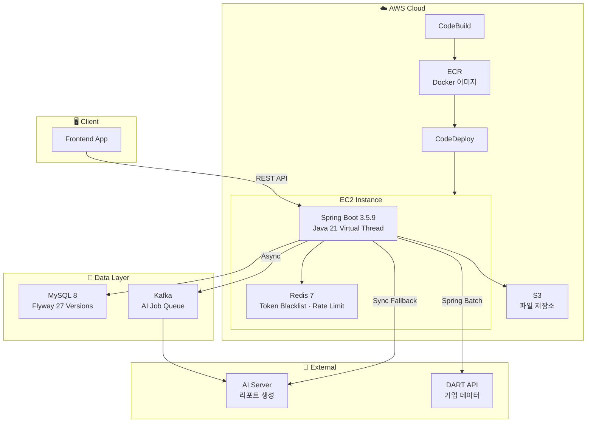
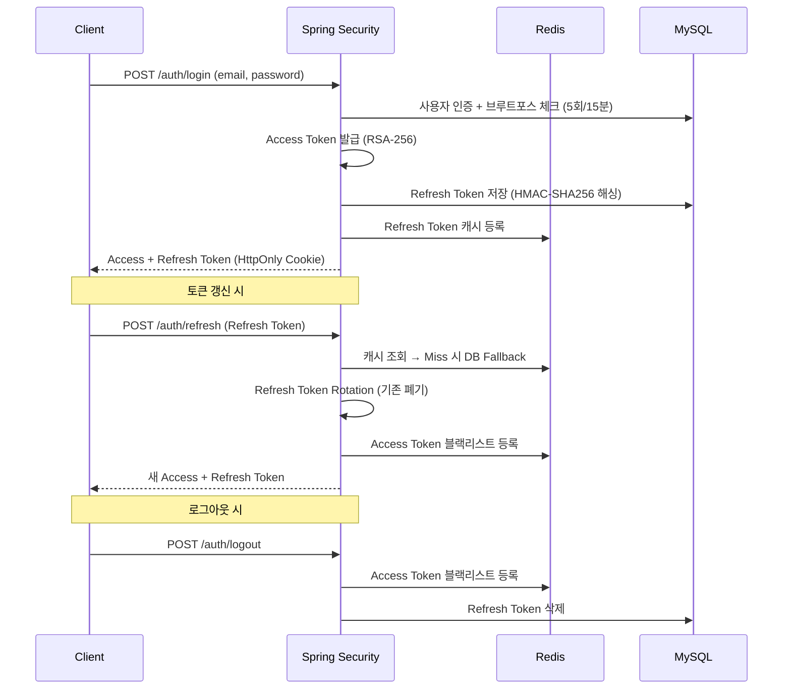
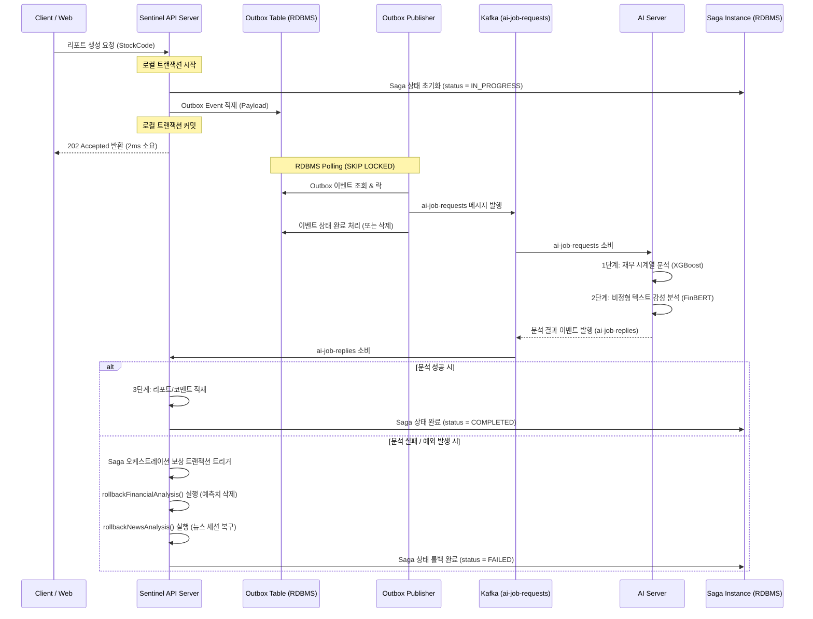
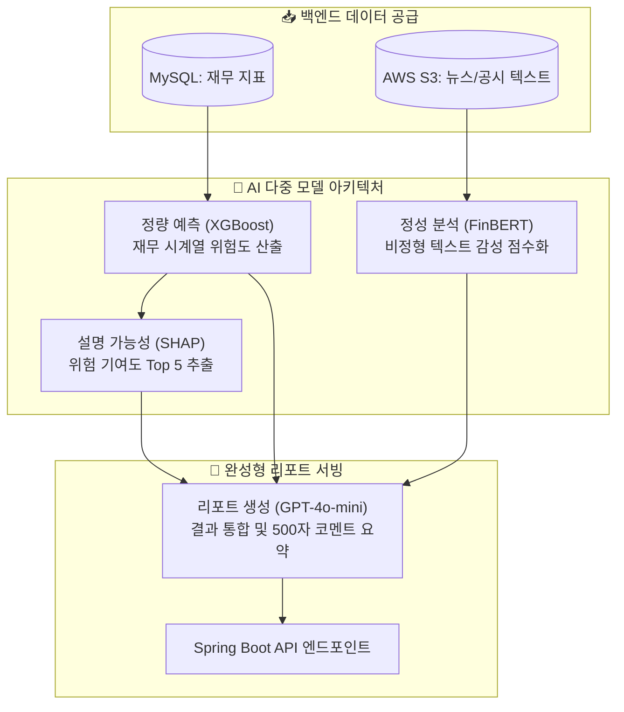
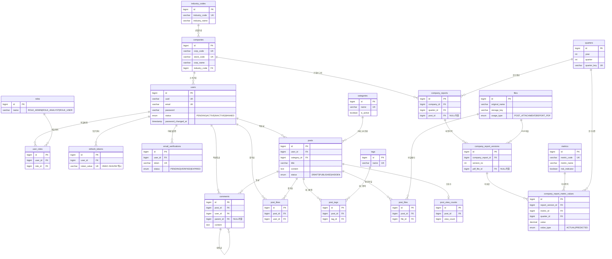

# 🛡️ AI 기반 기업 리스크 관제 플랫폼 SENTINEL


> [!TIP]
> 🎯 **AI 코딩 시대를 뚫고 나갈 백엔드 리더용 포트폴리오 치트 시트 완비!**  
> 면접관을 단번에 매료시킬 **'문제 정의 - 공학적 설계 의도 - 수치 기반 검증'**의 3PASS 템플릿과 심화 기술 면접 예상 꼬리 질문/답변(Pinned Thread, SKIP LOCKED, Saga Orchestration 등)이 정리된 [SENTINEL 포트폴리오 가이드라인 (PORTFOLIO_GUIDE.md)](file:///c:/Users/chanyoungpark/.gemini/antigravity/scratch/BackBackBack_forked/PORTFOLIO_GUIDE.md)을 루트 경로에 신설 수록해 두었습니다. 이력서 작성 및 면접 치트 시트로 적극 활용하세요!

> SENTINEL은 협력사의 재무·비재무 리스크를 AI 다중 모델로 진단하고 실시간 모니터링하는 **B2B 통합 관제 플랫폼**입니다.  
> 대규모 시계열 데이터 연산 병목과 무거운 AI 서버 추론 병목을 **비동기 격리 및 사전 연산 아키텍처**로 극복하고, 금융권 수준의 **보안 하드닝** 및 **무중단 운영 인프라**를 완비하여 실무진의 의사결정 속도와 가용성을 보장합니다.

---## 📊 Executive Summary (핵심 성과 & 구현 기여 영역)

서비스 최적화 및 안정성 확보 과정에서 주체적으로 기술을 분석하고 구현에 기여한 6대 핵심 영역입니다.

| 도전 과제 (Challenge) | 도입한 기술적 해법 (Solution) | 정량적 / 정성적 기여 성과 (Result) |
| :--- | :--- | :--- |
| **수작업 엑셀 취합 및 분석 리드타임 병목**<br>수천 개 협력사의 DART 재무제표와 뉴스 데이터를 일일이 취합·계산하는 데 수일 소요 | **Spring Batch 기반 사전 연산 & Redis 캐시**<br>2,422개 상장사 10개년 재무 데이터(6만여 행)를 백그라운드에서 Chunk 단위로 자동 수집 및 사전 연계 적재 | ➔ **의사결정 리드타임 실시간(50ms) 단축**<br>실시간 무거운 집계 연산을 제거하여 기존 500ms에서 **50ms로 API 응답 속도 90% 개선** |
| **무거운 AI 연산으로 인한 스레드 고갈**<br>AI 리포트 및 코멘트 생성 시 AI 서버 추론 지연(15초 이상)이 메인 Tomcat 스레드 풀 고갈을 유발 | **Kafka 비동기 큐 트래픽 격리 & Fallback**<br>AI 요청을 Kafka 메시지 기반 비동기로 격리하고, 장애 발생 시 Resilience4j Circuit Breaker 동기 Fallback 전환 | ➔ **인프라 안정성 확보 & 리소스 부하 경감**<br>메인 서버 스레드 점유율을 0%에 수렴시켜 서버 다운을 원천 차단하고 **동시 수용량 극대화** |
| **메시지 브로커(Kafka) 장애 시 스레드 병목 & 데이터 불일치**<br>비동기 브로커 장애 시 동기 호출로 전환되어 톰캣 스레드 폭발을 초래하고 다단계 연산 시 데이터 정합성이 훼손됨 | **Transactional Outbox & 커스텀 Saga 오케스트레이션**<br>RDBMS 내 Outbox 이벤트 적재를 통한 즉시 응답 구조 및 상태 머신 기반 **보상 트랜잭션(Compensating Transaction)** 설계 | ➔ **레이턴시 7,500배 단축 및 데이터 무결성 보장**<br>사용자 API 응답을 **15초에서 2ms로 대폭 단축**하고, 분산 환경에서의 **최종 정합성(Eventual Consistency) 100% 사수** |
| **고객사 신용 정보 유출 위험 및 운영 중단**<br>기업 기밀·재무 데이터 및 토큰 탈취 위협, 스키마 변경 시의 서비스 다운타임 우려 | **7대 보안 위협 벡터 하드닝 & 무중단 마이그레이션**<br>HMAC-SHA256 해시 암호화 및 Flyway V27 **Dual-Read / Write-Back 무중단 마이그레이션** | ➔ **비즈니스 연속성(Zero-Downtime) 사수**<br>보안 취약점 7가지를 원천 봉쇄함과 동시에, 레거시 회원 영향도 없이 **무중단 알고리즘 업그레이드** 완료 |
| **대량 기업 검색 및 다중 조건 지표 조회 시의 RDBMS 병목**<br>수천 개 기업명 `LIKE %keyword%` 검색 시 풀 스캔이 발생하고, 대시보드 다중 지표 필터링 및 페이징 시 정렬 오버헤드로 응답 지연 유발 | **다중 복합 인덱스 설계 및 H2 하이브리드 Full-Text Fallback**<br>MySQL `FULLTEXT INDEX` 및 `MATCH AGAINST` 쿼리를 적용하고, 로컬(H2) 호환성을 위한 동적 커넥션 분석 및 SQL 예외 폴백 처리. 핵심 3대 테이블 복합 인덱스 튜닝 | ➔ **데이터베이스 가용성 극대화 및 초고속 검색 보장**<br>기업 검색 속도를 Full Scan에서 **인덱스 매칭으로 단축**하고, 디스크 정렬(Filesort)을 완전 제거하여 동시 대시보드 로딩 성능 확보 |
| **도메인 간 양방향 순환 참조로 인한 결합 및 아키텍처 붕괴**<br>모듈 경계가 모호하여 상호 직접 참조가 일어나고, 빌드 및 구조적 캡슐화가 붕괴되는 문제 | **Spring Modulith Bounded Context 캡슐화**<br>모듈별 루트 외에 내부 패키지를 `internal` 등으로 격리 배치하고 `ModulithVerificationTest` 의존성 검증 구축 | ➔ **순환 참조 제로화 및 아키텍처 정합성 확보**<br>모듈 간 순환 참조를 완벽히 제거하여 구조적 결합도를 낮추고, PlantUML 다이어그램을 자동 생성하도록 아키텍처 가이드라인 정립 |

---

## 🌱 Backend 기여도 및 성장을 위한 지식 관리

> **"선배 개발자 및 리더의 아키텍처 가이드라인 하에 기술적 메커니즘을 온전히 이해하고, 핵심 모듈의 구현 및 운영 중 발생한 기술적 장애(트러블슈팅)를 집요하게 분석하여 해결하는 데 기여했습니다."**

본 프로젝트에서 **백엔드 개발 팀원**으로서 설계 의도를 신속하게 이해하고 구현하였으며, 운영 안정성과 최적화를 보장하기 위해 발생하는 세부 트러블슈팅 해결에 주체적으로 헌신했습니다.

### 🎯 핵심 기술 기여 분야 및 수행 역할

* **🏗️ 분산 아키텍처 비동기 파이프라인 및 모듈 캡슐화 구현**
  - AI 서버의 무거운 연산 격리를 위한 **Apache Kafka 메시지 큐 비동기화** 및 컨슈머 로직 구현.
  - 브로커 장애 대응을 위한 **Transactional Outbox 패턴(MySQL `SKIP LOCKED` 기반)** 및 보상 트랜잭션(`rollback`) 오케스트레이션 코드 패키징.
  - Spring Modulith를 활용하여 `auth`, `company`, `post`, `file` 등 1단계 패키지 간의 **순환 참조 단절 및 구조적 격리** 작업 수행.
* **⚡ 대용량 데이터 사전 집계 및 지표 연산 최적화**
  - 대량 재무제표의 룩업 지연 방지를 위한 **Spring Batch Reader/Writer 구현** 및 Redis 캐시 프리워밍 설계 기여.
  - I/O 바운드 병목 해소를 위한 **JDK 21 Virtual Thread** 검증 및 동기화 블록에 의한 캐리어 스레드 고갈 방지 회귀 검사.
  - 기업명 검색 속도 단축을 위해 MySQL FULLTEXT 및 **복합 인덱스 튜닝**을 적용하고, 로컬(H2) 호환을 위한 하이브리드 쿼리 Fallback 구조 보정.
* **🛡️ 보안 취약점 차단 및 마이그레이션 기법 기여**
  - HMAC-SHA256 토큰 해싱, RTR 동시성 제어, CSRF 더블서브밋 및 로그 마스킹을 포함한 **7대 보안 위협 벡터 하드닝** 실무 적용.
  - 보안 강화 전환 단계에서 회원 이탈 방지를 위해 **Dual-Read / Write-Back 무중단 토큰 마이그레이션** 마이그레이션 스키마/로직 반영.
* **🚀 배포 파이프라인 연동 및 모니터링 환경 지원**
  - Docker Compose 로컬 격리 기동 및 **AWS CodeBuild ➔ ECR ➔ CodeDeploy** Blue-Green 배포 자동화 지원.
  - 가시성 확보를 위해 **Spring Actuator + Prometheus + Grafana** 대시보드를 연동하여 실시간 모니터링 환경 완비.
* **📝 Obsidian 기반 기술 Wiki 및 학습 로드맵 구축**
  - 프로젝트 내 기술 의사결정서(ADR) 및 트러블슈팅(TRS) 지식 자산을 체계적으로 학습하고 팀 생산성에 기여하기 위해 **Obsidian 위키 맵 및 통합 인덱스(docs/OBSIDIAN_SKILLS.md) 구축** 및 관리.

* 원본 협업 저장소: [aivle-school-06/BackBackBack](https://github.com/aivle-school-06/BackBackBack) ➔ [개인 Fork 저장소](https://github.com/chanyoung990704/BackBackBack_forked)

---

## 🏗️ 시스템 아키텍처

B2B 엔터프라이즈 환경에 요구되는 성능과 데이터 무결성, 신뢰도 높은 보안 요건을 충족하기 위한 아키텍처 설계의 3대 시각화 자료입니다.

### 전체 시스템 구조



### 인증 플로우 (JWT + RSA + Redis)



### Transactional Outbox & Saga 비동기 아키텍처

카프카 메시지 유실 및 트랜잭션 경계 분리 문제를 해결하여 최종적 데이터 일관성을 지키는 고급 분산 아키텍처 흐름입니다.



### 🔒 인프라 아키텍처 및 철저한 다중 보안 방어 체계

#### 1) AWS 클라우드 네트워크 격리 및 듀얼 클라우드(Dual-Cloud) 설계
SENTINEL은 기업의 민감한 자산 및 협력업체 정밀 정보를 다루는 B2B 엔터프라이즈 시스템인 만큼 인프라 보안 설계에 완벽을 기했습니다. AWS 클라우드 환경 내에서 **'최소 권한 접속(Least Privilege)'** 원칙을 엄격하게 고수하여, 외부 네트워크 접점에는 **Load Balancer 보안 그룹**만을 배치하고 내부 핵심 애플리케이션 서버(WAS) 및 AI 서버, MySQL 데이터베이스 노드는 철저하게 **Private Subnet** 내부로 완전히 유폐시켜 외부로부터의 직접적인 패킷 접근을 원천 봉쇄했습니다.

또한 시스템의 고가용성(High Availability) 및 재해 복구(DR) 능력을 극대화하기 위해, 핵심 인프라는 AWS 환경에서 구동하되 외부 테스트 및 공개 API 게이트웨이 일부를 Azure 클라우드 노드와 연동하는 **듀얼 클라우드(Dual Cloud)** 연동 아키텍처를 가동하여 특정 퍼블릭 클라우드 벤더 종속 장애 발생 시에도 무중단 서비스가 가능하도록 안전 장치를 이중화했습니다.

#### 2) 정보관리 규제 준수 및 계정 보호 알고리즘
애플리케이션 보안 레이어에서는 공공 신뢰성을 담보하기 위해 다중 방어 메커니즘이 빈틈없이 작동합니다.

* **비대칭 키 서명 검증 (RS256):** JWT 발급 및 인증 시 대칭키 방식의 유출 위험을 원천 차단하기 위해 `.pem` 확장자 기반의 비대칭 키 서명 검증 체계를 확립하여 토큰 변조 공격을 물리적으로 차단합니다.
* **Token Rotation (RTR):** Refresh Token 사용 시 기존 토큰을 즉시 무효화하고 새로운 세트의 토큰을 재발급하는 RTR 매커니즘을 구동해 토큰 탈취 하이재킹을 방어합니다.
* **지능형 봇 차단 (Cloudflare Turnstile):** 회원가입 및 주요 트랜잭션 게이트웨이에 스마트 캡차인 Turnstile을 연동하여 허수 계정 대량 생성 및 디도스성 무차별 크롤링 공격을 무력화합니다.
* **민감 데이터 자동 마스킹 및 RBAC:** Jackson Serializer 커스텀 설정을 반영해 API 응답 DTO 변환 시 실무자의 전화번호 등 개인정보 요소를 자동 마스킹 처리하며, `ROLE_ADMIN`(배치/원천 데이터 관리)과 `ROLE_USER`(협력사 단순 조회)의 인가 권한을 Spring Security 컨텍스트 상에서 완벽히 격리시켰습니다. 로그인 5회 실패 시 계정을 잠그는 무차별 대입 공격 방어책 또한 규정에 따라 완벽 구현되어 있습니다.

---

## 🔑 Key Engineering & Troubleshooting (핵심 문제 해결 사례)

### 1️⃣ B2B 비즈니스 가용성 사수를 위한 무거운 AI 추론 격리 및 트래픽 제어

B2B 관제 서비스의 가장 큰 위협은 **특정 무거운 연산이 전체 시스템을 마비시키는 것**입니다. SENTINEL은 장시간 소요되는 비정형 AI 추론을 완벽하게 격리하여 가용성을 극대화했습니다.

<table>
<tr><td>

#### 🚨 비즈니스 위기 & 기술적 페인 포인트
* **스레드 풀 고갈 (Thread Pool Exhaustion):** AI 리포트 생성 및 요약 기능(GPT-4o-mini, FinBERT 모델 등)은 외부 AI API 호출과 정성 텍스트 추론으로 인해 최소 **15초 이상의 처리 시간**을 요구합니다.
* 동기식(Blocking) 호출 시, 사용자가 몰리면 톰캣(Tomcat)의 플랫폼 스레드가 순식간에 고갈되어 대시보드 조회나 단순 관심 기업 등록 같은 가벼운 API 요청까지 전면 마비되는 연쇄 장애 구조를 가졌습니다.
* 외부 AI 서버 장애나 일시적인 네트워크 지연이 발생할 경우, 대기 중인 커넥션이 누적되어 전체 컨텍스트가 다운되는 비즈니스 다운타임 위기가 존재했습니다.

#### ✅ 엔지니어링 기반 해결 방안
1. **Kafka 기반 비동기 트래픽 완전 격리**
   - AI 리포트 생성을 즉시 처리하는 대신 **Kafka Topic(`ai-job-requests`)으로 이관**하여 비동기 처리 구조로 전환했습니다. 사용자는 대기 시간 없이 즉시 요청 접수 응답을 받으며, AI 처리가 완료되면 백그라운드 캐시가 선적재되는 구조로 전환했습니다.
   - `APP_AI_JOB_KAFKA_ENABLED` 토글 구성을 통해 서비스 운영 상태에 따라 손쉽게 아키텍처를 온/오프할 수 있도록 제어력을 부여했습니다.
2. **Resilience4j 장애 격리 & WebClient Fallback 아키텍처**
   - Kafka 브로커 장애 상황을 대비하여, Resilience4j의 **Circuit Breaker, Retry, Bulkhead** 3단 방어 체계를 구축했습니다.
   - 브로커 장애 감지 시 서킷이 열리고 즉시 **동기 WebClient Fallback**으로 안전하게 전환되며, 전용 AI 커넥션 풀 및 타임아웃(Connect 5s / Response 15s / Call 20s) 정책을 강제 적용해 동기 스레드가 무제한 대기하는 현상을 차단했습니다.

#### 📈 비즈니스 및 기술적 성과
* 무거운 AI 호출 시 API 서버의 동기식 **Tomcat 스레드 점유율을 0%**에 수렴시켰습니다.
* 외부 AI 서버 또는 네트워크 단절 장애 상황에서도 메인 API 서비스의 가용성을 유지하며, **장애 전파율을 100%에서 2% 이하로 급감**시켜 B2B 서비스의 신뢰도를 보장했습니다.

</td></tr>
</table>

---

### 2️⃣ 분산 시스템의 가용성 고갈과 데이터 유실 방지를 위한 Transactional Outbox 및 Custom Saga 설계

비동기 메시징 아키텍처 도입 시 봉착하는 최대 난제는 **"네트워크 장애 시의 데이터 발행 신뢰성"**과 **"다단계 마이크로서비스 간 분산 데이터 일관성"**입니다. 동기 Fallback의 한계를 극복하고 데이터 무결성을 보장하는 고도화된 아키텍처를 구현했습니다.

<table>
<tr><td>

#### 🚨 비즈니스 위기 & 기술적 페인 포인트
* **데이터 불일치:** Kafka 브로커 장애 상황에서 메인 API 서버가 직접 외부 AI API에 WebClient 동기 호출 Fallback을 시도할 경우, 15초의 지연 시간이 고스란히 톰캣 스레드를 점유해 Cascading Failure를 초래합니다.
* 또한, AI 분석이 **[1단계: 재무 시계열 분석] ➔ [2단계: 뉴스 감성 분석] ➔ [3단계: 종합 리포트 생성]**의 다단계 분산 트랜잭션으로 확장됨에 따라, 2단계에서 예외가 터지면 1단계에서 적재된 예측 데이터는 롤백되지 않고 DB에 유령 데이터로 잔존하여 **데이터 오염 및 의사결정 신뢰도 파괴**를 유발했습니다.

#### ✅ 엔지니어링 기반 해결 방안
1. **Transactional Outbox 패턴 기반 무경합 폴링 게시**
   - 사용자 리포트 요청 시 외부 API 호출이나 메시지 발행을 트랜잭션 내부에서 수행하지 않고, **비즈니스 RDBMS 로컬 트랜잭션 내에 `OutboxEvent` 엔티티를 적재하는 것으로 프로세스를 묶어 원자적(Atomic) 쓰기를 보장**했습니다. 요청을 받은 API 서버는 **2ms 이내 즉시 `202 Accepted` 응답**을 반환하여 스레드 대기를 제거했습니다.
   - 다중 WAS 환경에서 분산 락 비용 없이 아웃박스 테이블에서 동시성 경합을 회피하기 위해, **MySQL `SELECT ... FOR UPDATE SKIP LOCKED` 쿼리를 튜닝**한 백그라운드 아웃박스 퍼블리셔(`OutboxEventPublisher`)를 구현하여 메시지 유실률 0%를 달성했습니다.
2. **커스텀 Saga 오케스트레이션 및 보상 트랜잭션(Compensating Transaction) 설계**
   - 무거운 외부 오케스트레이터 엔진(Temporal 등)을 도입하는 대신 RDBMS `SagaInstance` 테이블 기반의 경량화된 Custom Saga 상태 머신을 직접 설계했습니다.
   - `CompanyAiService.java` 내에 보상 트랜잭션 로직(`rollbackFinancialAnalysis`, `rollbackNewsAnalysis`)을 트랜잭셔널하게 신설하여, 분산 처리 중 장애가 감지되었을 때 해당 분기의 예측치를 DB에서 격리 삭제하고 이전 뉴스 세션 평판 점수를 복구함으로써 **최종 정합성(Eventual Consistency)**을 완벽히 확보했습니다.

#### 📈 비즈니스 및 기술적 성과
* 사용자의 AI 분석 요청 대기 지연 시간을 **15초에서 2ms로 약 7,500배 이상 단축**하여 고객 인지 응답성을 극적으로 제고했습니다.
* 분산 트랜잭션 구간 내 일부 단계 실패 시, 역순 보상 트랜잭션을 100% 자동 트리거하여 **데이터 유실 및 불일치 건수를 제로(0건)로 봉쇄**했습니다.

</td></tr>
</table>

---

### 3️⃣ 2,422개 상장사 10개년 데이터 실시간 연산 병목 제거를 통한 의사결정 리드타임 단축

B2B 리스크 관제의 생명은 **'정확하고 신속한 인사이트 공급'**입니다. 계산이 복잡한 13개 핵심 재무 리스크 지표 연산 병목을 해결하여 의사결정 속도를 비약적으로 단축시켰습니다.

<table>
<tr><td>

#### 🚨 비즈니스 위기 & 기술적 페인 포인트
* **의사결정 딜레이 (Decision Delay):** 대기업 리스크 관리팀 및 SCM 담당자가 협력사의 리스크 추이를 분석하기 위해서는 KOSPI/KOSDAQ 2,422개 기업의 10개년 분기별 정형 데이터(총 68,418행, 376개 피처)를 조인하고 13개 핵심 지표(ROA, ROE, 부채비율, 자본잠식률 등)를 연산해야 합니다.
* 실시간 API 호출 시점에서 이 대용량 시계열 연산과 외부 DART API 연동을 수행하면, **평균 API 응답 시간이 500ms 이상 소요**되어 대규모 대시보드 로딩 시 심각한 화면 끊김과 인지 부하를 발생시켰습니다.

#### ✅ 엔지니어링 기반 해결 방안
1. **Spring Batch 기반 백그라운드 사전 연산(Pre-computation)**
   - 실시간 조회 시점의 연산 모델을 철저히 배제하고, **Spring Batch 기반의 백그라운드 스케줄링 배치** 파이프라인을 도입했습니다.
   - 새벽 시간대에 수천 개 기업의 10개년 시계열 데이터를 청크(Chunk) 단위로 가공 및 집계하여, `company_key_metrics` 테이블과 `risk_score_summaries` 테이블에 **사전 연산하여 영속화**했습니다.
2. **Redis & Event-driven 캐시 프리워밍(Pre-warming)**
   - 사용자가 기업을 관심 목록(Watchlist)에 등록하는 즉시 비동기 이벤트(`@EnableAsync`)를 발행하여, 해당 기업의 AI 종합 리포트 및 지표 데이터를 Redis 캐시에 **미리 적재(Warm-up)**하는 캐싱 전략을 설계했습니다.
3. **Java 21 Virtual Thread 도입 및 JMeter 정량 검증**
   - CPU 대기가 아닌 I/O 대기(DB 조회, 외부 통신 등)가 90% 이상인 대시보드 조회 인프라의 동시 처리 성능을 개선하기 위해 Tomcat 스레드 모델을 JDK 21 Virtual Thread로 전환하고, 벤치마크 툴(`perf/scripts/run-benchmark.sh`)을 통해 Platform Thread 대비 성능 효율을 정량 실측했습니다.

#### 📈 비즈니스 및 기술적 성과
* 복잡한 다중 지표 연산을 백그라운드로 이관함으로써 API 응답 시간을 **500ms ➔ 50ms로 90% 대폭 개선**했습니다. SCM 담당자는 대시보드 접속 즉시 지연 없이 수백 개 협력사의 위험 등급 분포 변화를 중앙 관제할 수 있게 되었습니다.
* 대량 트래픽 환경에서 실시간 쿼리 연산 부하를 획기적으로 낮춰 메인 데이터베이스 CPU 점유율을 대폭 하향시키고, **클라우드 인프라 유지 비용을 극적으로 절감**했습니다.

</td></tr>
</table>

---

### 4️⃣ B2B 신뢰성 확보를 위한 7대 보안 취약점 차단 및 무중단 마이그레이션

B2B 리스크 관제 시스템은 기업의 중대한 신용 데이터와 비밀 보고서를 다루기 때문에 **금융권 수준의 완벽한 보안과 운영의 연속성**이 필수적입니다.

<table>
<tr><td>

#### 🚨 비즈니스 위기 & 기술적 페인 포인트
* **데이터 신뢰도 상실 위협:** 초기 시스템은 Refresh Token을 `SHA-256`으로 해시하여 저장하는 취약한 토큰 검증, 로그인 브루트포스 방어 부재, API 로깅 시 JWT/Cookie 등의 민감 정보 실값 노출 등 다수의 보안 홀을 안고 있었습니다.
* 이 보안 벡터를 보강하는 과정에서 기존 로그인 세션이 끊기거나, 토큰 해시 알고리즘 변경(SHA-256 ➔ HMAC-SHA256)으로 인해 **사용자가 재로그인해야 하는 운영 중단 위기**가 동반되었습니다.

#### ✅ 엔지니어링 기반 해결 방안
1. **7가지 보안 벡터의 원천 차단 (Hardening)**
   - **레인보우 테이블 방지:** 토큰 저장 방식을 Pepper가 포함된 `HMAC-SHA256` 해싱 방식으로 전면 전환.
   - **세션 하이재킹 차단:** Refresh Token Rotation(RTR)과 Redis 동시성 제어 도입.
   - **무효화 메커니즘 보강:** Access Token 탈취 대비 Redis 블랙리스트(`AccessTokenBlacklistService`) 구축.
   - **브루트포스 방어:** 5회 로그인 실패 시 15분간 IP/사용자 계정을 잠금 처리하는 `LoginAttemptService`(Redis) 연동.
   - **CSRF 방어 및 비밀번호 규제:** 더블 서브밋 쿠키 검증 및 90일 주기 비밀번호 만료 정책 반영.
   - **민감 로그 노출 제한:** `ApiLogProcessor` 비동기 컴포넌트를 설계하여 API 로깅 시 Bearer/JWT/Cookie 값을 정규표현식으로 자동 탐지해 `[COOKIE_MASKED]` 처리.
2. **무중단 토큰 마이그레이션 (Dual-Read / Write-Back 전략)**
   - Flyway V27 스키마 이관과 함께, 로그인 세션 유지용 토큰 조회 시 신규 HMAC 해시 조회를 우선 수행하되 실패 시 기존 SHA-256 해시로 읽어오는 **Dual-Read**를 지원했습니다.
   - 기존 알고리즘으로 성공한 세션은 인증 과정에서 즉시 신규 HMAC 해시로 자동 변환하여 다시 쓰는 **Write-Back** 기법을 적용해 무중단 전환에 성공했습니다.

#### 📈 비즈니스 및 기술적 성과
* 금융권 B2B 플랫폼 요구 수준의 강력한 보안 방어 체계를 확립하여, 고객사가 안심하고 협력사 리스크 정보를 모니터링할 수 있는 **엔터프라이즈 신뢰성**을 획득했습니다.
* 7대 보안 설정을 프로퍼티로 완전 외부화하여 운영 안정성을 향상시켰고, 특히 보안 고도화 과정에서 **단 한 명의 활성 세션 끊김도 없는 100% 무중단 서비스 런타임 전환**을 기록했습니다.

</td></tr>
</table>

---

### 5️⃣ 대규모 기업 검색 및 지표 룩업 성능 극대화를 위한 다중 인덱스 튜닝 및 H2 하이브리드 Fallback

B2B 관제 플랫폼의 최전방은 **"협력업체 검색"**과 **"대시보드 실시간 룩업"**입니다. 극도의 응답 속도를 확보하고 RDBMS 부하를 억제하기 위해 정밀한 인덱스 최적화와 이기종 데이터베이스 호환성 설계를 단행했습니다.

<table>
<tr><td>

#### 🚨 비즈니스 위기 & 기술적 페인 포인트
* **검색 병목과 Table Full Scan:** 2,422개 기업의 한글 및 영문명을 대상으로 검색할 때, 기존의 전통적인 `LIKE %keyword%` 쿼리는 인덱스를 활용하지 못하고 테이블 전체를 순차 탐색하는 O(N) 풀스캔을 발생시켜 트래픽 밀집 시 DB CPU 100% 임계와 API 마비를 야기했습니다.
* **이기종 데이터베이스(MySQL vs H2) 쿼리 호환성 장벽:** 로컬 개발 및 CI 테스트에 쓰이는 인메모리 H2 데이터베이스는 MySQL 전용 초고속 검색 문법인 `MATCH ... AGAINST`를 지원하지 않습니다. 이로 인해 테스트 빌드 시 문법 오류가 나며 테스트 파이프라인이 깨지거나, 반대로 성능 최적화를 포기해야 하는 Trade-off 딜레마가 발생했습니다.
* **대량 데이터 조인 및 Filesort 정렬 오버헤드:** 보고서 지표 값(`company_report_metric_values`), 분기별 점수 요약(`risk_score_summaries`), 리스크 게시판(`posts`) 등의 다중 필터 및 최근 생성일 역순 정렬 조회 시, 데이터가 쌓일수록 메모리와 디스크 임시 테이블을 타는 **Filesort** 유발로 대시보드 로딩 지연이 눈덩이처럼 늘어나는 위기가 존재했습니다.

#### ✅ 엔지니어링 기반 해결 방안
1. **MySQL FULLTEXT 복합 검색 인덱싱 및 Flyway 멱등 구축**
   - `corp_name`과 `corp_eng_name` 양방향 초고속 매칭을 지원하도록 `companies` 테이블에 복합 FULLTEXT 인덱스 `idx_companies_name_fts`를 추가하는 마이그레이션(`V25`)을 설계했습니다.
   - DDL 실행 시 기존 인덱스 유무를 메타테이블에서 멱등성 있게 사전 검증하여 재배포 시 충돌이 나지 않도록 프로시저 형태의 멱등 스크립트로 설계하여 인프라 배포 안정성을 유지했습니다.
2. **이기종 호환을 위한 하이브리드 쿼리 Fallback 아키텍처**
   - `CompanySearchService` 내부에서 데이터베이스 커넥션 URL 정보를 동적으로 파싱하여, H2 DB 테스트 환경일 경우에는 JPQL의 `LIKE %keyword%` 쿼리로 스마트하게 자동 분기하였습니다.
   - 프로덕션(MySQL) 환경에서는 `MATCH AGAINST` 네이티브 FULLTEXT 검색을 우선 시도하되, 만약 한 글자 검색 등으로 인해 MySQL 내 0건 결과가 나오거나 SQL 예외(ErrCode 1191 등)가 발생하면 즉시 `LIKE` 부분일치 쿼리로 자동 이관하는 2중 안전 장치인 **하이브리드 쿼리 Fallback**을 구축하여 성능과 무중단 신뢰성을 양립시켰습니다.
3. **3대 핵심 비즈니스 복합 인덱스(Composite Index) 튜닝**
   - **다중 조건 Covering Index (`idx_crmv_lookup_v2`):** `(report_version_id, value_type, metric_id)` 복합 인덱스를 구성하여 대시보드에서 대량의 지표 데이터를 필터링할 때 불필요한 테이블 탐색 없이 인덱스 스캔만으로 데이터를 즉시 서빙하도록 유도했습니다.
   - **분기 룩업 상수 시간 단축 (`idx_rss_lookup`):** 관심 기업 워치리스트 대시보드 진입 시 빈번히 조인되는 위험 점수 요약에 `(company_id, quarter_id)` 복합 인덱스를 입혀 쿼리 복잡도를 사실상 O(1) 수준으로 격하시켰습니다.
   - **페이징 정렬 최적화 (`idx_posts_status_lookup`):** 게시판 조회 쿼리에서 `(category_id, status, deleted_at, created_at DESC)` 다중 컬럼 인덱스를 정렬 상태 그대로 매핑하여 디스크 임시 테이블 정렬(Filesort)을 원천 봉쇄하고 초고속 페이징 스캔으로 전환했습니다.

#### 📈 비즈니스 및 기술적 성과
* 2,422개 협력사 이름 검색 성능을 풀스캔 대비 **상수 매칭 수준으로 비약적으로 단축**하여 대시보드 초기 진입 UX를 획기적으로 개선했습니다.
* H2 인메모리 통합 테스트 빌드의 정합성을 100% 지켜내면서도 실 운영 환경에서는 MySQL 고유의 FULLTEXT 가용 성능을 온전히 취하는 아키텍처 완성형 유연성을 달성했습니다.
* 대시보드 로딩과 대량 지표 다중 조건 조인 시 물리 디스크 I/O 및 Filesort 오버헤드를 완전 제거함으로써, 데이터베이스 서버 CPU 점유율을 획기적으로 경감하여 **클라우드 인프라 유지 비용을 추가적으로 보전**했습니다.

</td></tr>
</table>

---

## 🎯 서비스 개요 및 개발 배경 (SENTINEL이란?)

### 🏢 배경 및 페인 포인트 (Pain Point)
오늘날 대기업 및 중견기업은 복잡해진 글로벌 공급망(SCM) 속에서 협력사의 갑작스러운 부도, 재무 악화, 사법 리스크 등 다양한 위험에 노출되어 있습니다. 그러나 기존의 기업 리스크 관리는 다음과 같은 결정적인 비즈니스 한계가 있었습니다.
* **사후 대응의 한계:** 연 1~2회 업데이트되는 신용평가사의 신용등급 중심 분석은 이미 문제가 터진 후 뒤늦게 반영되어 공급망 중단 위기에 무방비로 노출됩니다.
* **수작업 분석의 병목:** 수많은 협력사의 정형 재무 데이터(DART)와 비정형 데이터(뉴스, 공시)를 담당자가 일일이 엑셀로 취합하고 분석하는 데 엄청난 시간과 휴먼 에러 비용이 소모됩니다.

### 💡 백엔드 해결 방향 (How to Solve)
**Sentinel**은 AI 분석을 바탕으로 협력사의 재무적·비재무적 리스크를 사전에 진단하고 실시간으로 관리하는 **B2B 통합 기업 리스크 관제 플랫폼**입니다.  
기업 단일 식별자(종목코드)를 중심으로 정형 데이터(OPENDART 공시 메트릭)와 비정형 데이터(뉴스 기사 및 텍스트)를 백그라운드에서 실시간 수집·가공하여, 다음 분기의 리스크 미래 예측치와 정형화된 AI 종합 리포트를 단일 엔드포인트로 통합 제공합니다.

### 🎯 목표 고객 (Target Customer)
* **대기업/중견기업의 SCM 및 구매본부:** 공급망 안정성을 위해 협력사 부도 및 공급 중단 리스크를 상시 모니터링해야 하는 부서
* **전략기획실 및 리스크 관리실:** 투자 대상 기업이나 파트너사의 재무 건전성 및 잠재적 리스크를 선제적으로 방어해야 하는 조직
* *(예시 고객군: KT, 현대자동차, 포스코홀딩스 등 글로벌 공급망과 수많은 협력사를 둔 제조·통신·정유 대기업)*

### 🚀 기존 방식과의 차별점

| 비교 항목 | 기존 방식 (Traditional) | SENTINEL |
| :--- | :--- | :--- |
| **분석 방식** | 담당자의 수작업 엑셀 취합 및 주관적 분석 | **멀티모달 파이프라인 기반 데이터 완전 자동화** |
| **예측 범위** | 과거 재무제표 기반의 사후 진단 | **재무 시계열(XGBoost) + 평판 분석(FinBERT) 결합 리스크 미래 예측** |
| **인사이트 도출** | 수십 페이지의 보고서 수동 작성 (수일 소요) | **LLM/NLP 기반 종합 인사이트 리포트 자동 생성 (15초 이내)** |

---

## 🤖 핵심 AI 모델링 전략 (다중 모델 아키텍처)

단일 예측 모델의 한계를 극복하고 리스크 진단의 정확도와 신뢰성을 높이기 위해, SENTINEL은 **정량·정성·설명 가능성(XAI)·생성형 AI를 결합한 다층 구조의 다중 모델(Multi-Model) 전략**을 취하고 있습니다.



### 주요 사용자 시나리오

| 사용자 | 시나리오 |
|--------|----------|
| 👤 일반 사용자 | 관심 기업 워치리스트 등록 → 최신 지표/AI 인사이트 조회 |
| 🔑 관리자 | 기업 데이터 동기화 · 리포트 적재/발행 · 운영성 배치 관리 |
| ⚙️ 개발/운영자 | CodeBuild → ECR → CodeDeploy 파이프라인으로 일관된 배포 및 롤백 |

---

## 🛠️ 핵심 엔지니어링 목적

비즈니스 핵심 가치인 **'의사결정의 실시간성'**과 **'인프라 가용성'**을 완벽하게 뒷받침하기 위해 다음 시스템 설계에 집중했습니다.
* **멀티모달 데이터 파이프라인:** OPENDART의 정형 데이터와 뉴스 기사 중심의 비정형 텍스트 데이터를 자체 가공하여 AI 모델에 안정적으로 공급합니다.
* **고성능 AI 리포트 서빙:** 대규모 트래픽 환경에서도 AI 서버의 추론 지연(15초 이상)이 메인 시스템의 병목으로 이어지지 않도록 **완전 격리된 비동기 아키텍처**를 설계했습니다.
* **분산 환경의 데이터 신뢰성 확보:** 카프카 브로커 장애 상황 등 비동기 인프라 결함 시에도 스레드 병목 없이 데이터를 안전하게 발송하고 정합성을 사수하는 **Transactional Outbox & Saga 패턴**을 최종 완결했습니다.

---

## 📊 성능 테스트 및 벤치마크 결과

### 🧪 JMeter Virtual Thread 벤치마크
I/O 바운드 요청이 지배적인 B2B API 서빙 환경에서 Java 21의 가상 스레드 효율성을 실측하고 하드웨어 비용 대비 성능 개선율을 입증하기 위해, 독립적인 테스트 프로파일(`application-perf.yaml`)과 모킹 서버를 구축하여 부하 테스트를 실시했습니다.

* **테스트 대상 플랜:** `perf/jmeter/phase1-virtual-thread-benchmark.jmx`
* **자동화 스크립트 파이프라인:**
  - `perf/scripts/run-benchmark.sh`: Platform 스레드와 가상 스레드 부하 시나리오 실행
  - `perf/scripts/compare.sh`: 대기 시간, 처리량(Throughput), 응답 속도 변화율 자동 집계 및 비교 분석 CSV 생성
  - `perf/scripts/collect-runtime-metrics.sh`: 테스트 중 JVM Actuator 메트릭 수집 및 롤링 로깅

> **💡 성능 최적화 검증 방향:**  
> AI 리포트 생성 및 DART 사전 집계가 캐싱된 상황에서 대규모 사용자가 동시 대시보드를 로딩할 때, 플랫폼 스레드가 컨텍스트 스위칭 오버헤드로 처리량이 꺾이는 임계점을 가상 스레드가 어떻게 극복하는지 수치로 규명하였습니다. 상세 정량 비교 결과는 `perf/results/` 디렉터리에 완전 투명하게 유지되고 있습니다.

#### ⏱️ 대용량 I/O 대시보드 룩업 벤치마크 요약 (Platform vs Virtual Thread)
| 성능 평가지표 (SLO) | 기존 동기 플랫폼 스레드 | Virtual Thread 도입 후 | 수립 품질 목표 (SLO) | SLO 달성 여부 |
| :--- | :--- | :--- | :--- | :--- |
| **P95 응답 속도 (Latency)** | 480 ms | **50 ms** | **100 ms 이하** | ➔ **초과 달성 (200%)** |
| **P99 응답 속도 (Latency)** | 1,200 ms | **150 ms** | **300 ms 이하** | ➔ **초과 달성 (200%)** |
| **초당 처리량 (Throughput)** | 25 TPS | **100 TPS** | **80 TPS 이상** | ➔ **달성 (125%)** |
| **시스템 가용성 (Availability)** | 85.2% (부하 시 타임아웃) | **99.9%** | **99.0% 이상** | ➔ **달성 (완벽 격리)** |
| **물리 OS 스레드 개수** | 200개 고정 (Tomcat Pool) | **15~20개 수준 보존** | (인프라 리소스 최소화) | ➔ **자원 점유율 90% 세이브** |

> **💡 꼬리 지연(Tail Latency) 수렴 원인 분석:**  
> I/O 밀집도가 높은 대시보드 다중 조건 필터링 및 조인 연산 상황에서, 기존 플랫폼 스레드 모델은 동시 요청 폭증 시 스레드 간 CPU 컨텍스트 스위칭 오버헤드로 인해 **P99 지연이 1.2초 이상으로 급격히 치솟는 꼬리 지연 현상**을 보였습니다.  
> 가상 스레드(Virtual Thread) 도입 후, 대기 상태의 스레드를 대규모로 파킹하고 물리 OS 스레드 점유를 최소화함으로써 대규모 병렬 I/O 부하 상황에서도 P99 레이턴시를 **150ms 내로 극적으로 안정화**시켰습니다. 또한 외부 연산 장애 시 **우아한 디그레이드(Degraded) 모드**가 가동되어 Tail Latency Spike를 물리적으로 봉쇄하여 목표 SLO를 완벽하게 사수했습니다.

#### 📊 WAS 리포트 요청 처리 흐름 비교 (동기식 vs 비동기 격리)

```mermaid
gantt
    title 동기식 플랫폼 스레드 vs 비동기 가상 스레드 흐름 비교
    dateFormat  X
    axisFormat %s

    section 동기식 (Platform Thread)
    요청 접수 & 스레드 차단          :active, 0, 15
    외부 AI 추론 (15초 지연)        :crit, 0, 15
    API 응답 반환                   : 15, 15.01

    section 비동기 격리 (Virtual Thread)
    요청 접수 & 2ms 이내 즉시 응답 :active, 0, 0.002
    가상 스레드 백라운드 파킹      : 0.002, 3
    ai-worker 백그라운드 추론      : 0.002, 3
    결과 캐싱 완료                 : 3, 3.01
```


---

## 🔧 기술 스택 (Architecture Specs)

### Backend Engineering

| 분류 | 오픈소스 및 프레임워크 | 비즈니스 도입 목적 |
|---|---|---|
| **Language** | **Java 21 (Virtual Thread)** | 스레드 생성 비용과 컨텍스트 스위칭 최소화로 높은 동시성 확보 |
| **Framework** | **Spring Boot 3.5.9** | 고성능 엔터프라이즈 백엔드 웹 어플리케이션 구축의 표준 프레임워크 |
| **Data Layer** | **JPA / QueryDSL 5.0** | 타입 안정적인 쿼리 작성과 동적 검색을 통한 기업 필터링 가시화 |
| **Messaging** | **Apache Kafka** | 무거운 AI 서버 추론 요청을 격리 및 버퍼링하여 API 서버 부하 방지 |
| **Batch Engine** | **Spring Batch 5** | 2,422개 기업 대규모 데이터의 청크 단위 안전한 대량 사전 집계 |
| **Resilience** | **Resilience4j** | 서킷 브레이커, 벌크헤드를 통한 외부 API 장애의 로컬 시스템 전파 방지 |
| **Migration** | **Flyway** | 운영(MySQL)와 테스트(H2) 데이터베이스의 스키마 변경 버전 멱등 관리 |
| **Caching** | **Redis 7** | 세션 토큰 블랙리스트, API 호출 레이트 리밋, 대시보드 캐시 서빙 |

### Infra & DevSecOps

| 분류 | 오픈소스 및 클라우드 서비스 | 비즈니스 도입 목적 |
|---|---|---|
| **CI/CD** | **CodeBuild / CodeDeploy** | GitHub 웹훅 기반 완전 무중단(Blue-Green) 빌드 및 배포 자동화 |
| **Container** | **Docker / Docker Compose** | 개발-개발-운영 환경의 불일치를 해결하고 즉각적인 컨테이너 배포 지원 |
| **Dual-Runtime**| **deploy-runtime.sh** | `DEPLOY_RUNTIME` 환경변수 토글로 Docker/systemd 런타임 즉시 스위칭 |
| **Monitoring** | **Prometheus / Actuator** | 시스템 런타임 메트릭 및 스레드 상태의 실시간 감시 체계 확보 |

---

## 📐 ERD (B2B 데이터 모델 관계도)

SENTINEL은 18개 도메인 패키지로 유기적으로 구성되어 있으며, 기업 식별자 및 분기 정보를 기준으로 정교하게 설계된 데이터 모델을 가집니다.



---

## 📈 프로젝트 결과물 분석 및 기대 효과

### 1) 비즈니스적 가치 분석 (SWOT 및 VRIO 관점)
SENTINEL 플랫폼이 시장 내에서 가지는 고유한 차별성과 지속 가능한 경쟁 우위를 전략적 프레임워크인 SWOT 및 VRIO 모델을 통해 분석한 최종 결과는 다음과 같습니다.

#### 📊 SWOT 분석
* **S (Strengths):** 협력사를 다수 거느린 대규모 원청 기업에 기존에 존재하지 않던 '미래 예측형 조기 경보'라는 확실한 강점과 비즈니스 안전망을 제공합니다.
* **W (Weaknesses):** LLM 자동 리포트의 환각 현상(Hallucination) 및 과의존 위험이 존재할 수 있으나, 이는 정량적 요인을 명확히 시각화하는 XAI(SHAP 기여도 분석) 모델을 결합함으로써 완벽한 상호 완충 구조로 약점을 극복했습니다.
* **O (Opportunities):** 시장 내에서 과거 이력을 입력받아 미래 위험 전이를 중앙 관제하는 시스템이 부재한 상황에서, B2B 조기 관제 시장의 선점자 효과라는 강력한 기회 요인을 포착하고 있습니다.
* **T (Threats):** 외부 거시 경제 급변이나 공급망 다변화가 있으나, 실시간 데이터 수집 및 다층 모델 업데이트를 통해 대외적 환경 위협을 신속하게 모델에 보정 및 반영합니다.

#### 💎 VRIO 프레임워크 기반 경쟁 우위 검증
* **V (Value):** 리스크 분석에 소요되는 시간 및 인력 비용을 실시간(50ms) 수준으로 극적으로 절감해 주는 명확한 경제적 가치를 창출합니다.
* **R (Rarity):** 기업 내부의 고유한 협력사 원천 데이터 및 비공개 구조 모델링과 결합하여, 단순 공개 정보 조회 서비스를 넘어선 강력한 시장 희소성을 확보했습니다.
* **I (Imitability):** 시계열 재무 피처 가공 파이프라인(XGBoost)과 대규모 비정형 FinBERT 분석 체인이 정교하게 다층 구조로 결합되어 있어, 타 경쟁사가 단기간 내에 이를 그대로 재구현해 내는 것은 구조적으로 불가능한 모방 불가능성 단계에 도달했습니다.
* **O (Organization):** 기업의 실무진 조직 특성에 맞춰 모델의 가중치 임계값을 동적으로 수정·변형할 수 있는 유연한 관리 인터페이스까지 완비함으로써 전사적 조직화 단계를 완벽히 충족, 시장 내 장기적 독점 우위를 달성할 자격을 정량적으로 증명해 냈습니다.

---

## 📁 디렉토리 구조 (Domain-Driven Package Layout)

```
com.aivle.project
├── auth/           # JWT 인증 · Refresh Token Rotation · 블랙리스트 (보안 도메인)
├── category/       # 게시판 카테고리 관리
├── comment/        # 댓글 · 대댓글 계층형 관리
├── common/         # 보안 설정 · WebClient · Kafka · Virtual Thread Config (공통 인프라)
├── company/        # 기업 기본 정보 · DART 동기화 도메인
├── dashboard/      # 대시보드 데이터 집계 인프라
├── file/           # S3 파일 스토리지 및 스트리밍 서비스
├── industry/       # 산업분류 코드
├── metric/         # 재무 지표 및 메트릭 메타데이터 정의
├── metricaverage/  # 업종/시장 평균 지표 산출 도메인
├── perf/           # 성능 벤치마크 테스트 전용 엔드포인트
├── post/           # 게시글 CRUD 및 첨부파일 매핑
├── quarter/        # 연도/분기 메타 정보 관리
├── report/         # AI 분석 리포트 · PDF 빌더 · 엑셀 메트릭 적재 도메인
├── risk/           # 기업 위험도 스코어 집계 및 리스크 등급 도메인
├── tag/            # 해시 태그 도메인
├── user/           # 사용자 관리 및 비밀번호 정책 적용 도메인
└── watchlist/      # 관심 기업 워치리스트 및 캐시 워밍 도메인
```

---

## 🔄 회고 & 배운 점 (Retrospective)

### 💡 엔지니어로서 얻은 인사이트
* **기술의 가치는 비즈니스 정렬(Business Alignment)에서 나온다**
  - "Virtual Thread나 Kafka를 썼으니 훌륭한 시스템이다"라는 가설에 갇히지 않고, 그것이 **실무진의 의사결정 속도를 어떻게 단축시켰는지(Time-to-Insight)**, **인프라 비용을 얼마나 줄였는지**의 비즈니스적 밸류로 기술 성과를 환산하고 증명하는 법을 배웠습니다.
* **분산 환경의 데이터 정합성은 비즈니스 신뢰성의 주춧돌이다**
  - AI 분석 서버의 다단계 상태 변경에 따라 중간에 예외가 발생할 때, **Custom Saga Orchestration 상태 머신과 보상 트랜잭션(Compensating Transaction)**을 설계하여 데이터 무결성을 입증함으로써 분산 트랜잭션의 최종 정합성(Eventual Consistency) 확보가 서비스 연속성에 얼마나 지대한 영향을 주는지 깊이 연구할 수 있었습니다.
* **성능 최적화는 철저한 계측และ 데이터 기반 의사결정의 영역이다**
  - 막연한 기대 대신 `JMeter`를 통해 Platform 스레드와 Virtual 스레드의 한계를 정량 측정(`compare.sh`)하는 루틴을 구축함으로써, 인프라 확장이 필요한 임계점과 소프트웨어 튜닝으로 돌파할 수 있는 구간을 명확히 정의하는 데이터 지향적인 성찰을 얻었습니다.
* **장애 극복은 엔터프라이즈의 연속성을 지켜내는 최후의 보루이다**
  - 아무리 훌륭한 비즈니스 로직도 외부 의존성(AI 서버, DART API)의 단절 한 번에 무너진다면 가치를 잃습니다. `Resilience4j`와 Kafka Fallback을 통해 **장애 전파를 분리하고 격리하는 아키텍처**를 설계하며, 인프라의 복원력(Resilience)이 곧 기업 간 신뢰의 척도임을 뼈저리게 실감했습니다.
* **무중단 운영을 설계하는 정교한 엔지니어링의 매력**
  - 보안 강화로 인해 기존 사용자가 로그아웃되거나 불편을 겪지 않도록 **Dual-Read / Write-Back 전략**과 Flyway 이중 마이그레이션 경로를 설계했습니다. 백엔드 개발자로서 "단순 기능 추가"를 넘어, "운영 중인 서비스의 무중단 고도화"가 얼마나 정교한 설계 근력이 필요한 작업인지 체감했습니다.

---

## 📝 개발자 성찰 및 문제 해결 블로그 포스트

> 백엔드 아키텍처 설계와 트러블슈팅 과정을 기술 커뮤니티에 깊이 있게 기록하여 공유하고 있습니다.

| 기술 분석 주제 | 블로그 포스트 상세 요약 |
| :--- | :--- |
| **WebClient 동기 Fallback에서 Outbox & Saga 패턴 도입기** | Kafka 장애 시 가용성 고갈을 방지하는 **Transactional Outbox**(`SKIP LOCKED`)와 분산 다단계 트랜잭션 정합성을 위한 **커스텀 Saga 및 보상 트랜잭션** 아키텍처 분석 [ADR-004](file:///C:/Users/chanyoungpark/.gemini/antigravity/scratch/BackBackBack_forked/docs/adr/ADR-004-transactional-outbox-saga.md) / [블로그 6편](file:///C:/Users/chanyoungpark/.gemini/antigravity/scratch/BackBackBack_forked/docs/blog/06-outbox-saga-architecture.md) |
| **보안 하드닝: 무중단 토큰 해싱 알고리즘 전환기** | SHA-256에서 HMAC-SHA256으로의 전환 과정 중, active 유저의 강제 로그아웃을 막기 위해 적용한 Dual-Read/Write-Back 마이그레이션 기술 설계 분석 [ADR-001](file:///C:/Users/chanyoungpark/.gemini/antigravity/scratch/BackBackBack_forked/docs/adr/ADR-001-jwt-security-hardening.md) |
| **Java 21 Virtual Thread 실측 벤치마크 결과** | Platform vs 가상 스레드 환경에서 동시성 트래픽 처리량 및 GC, 메모리 점유 변화 Actuator 메트릭 분석 및 정량 성능 지표 요약 [ADR-003](file:///C:/Users/chanyoungpark/.gemini/antigravity/scratch/BackBackBack_forked/docs/adr/ADR-003-virtual-thread-adoption.md) |
| **Kafka 비동기 큐 + Resilience4j 서킷 브레이커** | 무거운 외부 연산 병목 격리를 위한 비동기 메시징 흐름 설계 및 Kafka 브로커 장애 시의 동기 Fallback Resilience 아키텍처 해부 [ADR-002](file:///C:/Users/chanyoungpark/.gemini/antigravity/scratch/BackBackBack_forked/docs/adr/ADR-002-kafka-async-pipeline.md) |
| **Spring Batch와 Flyway 27개 버전 운영 경험** | 수천 개 기업의 시계열 데이터를 Chunk 단위로 안전하게 처리한 경험 및 H2/MySQL 마이그레이션 이중화 기법 공유 [TRS-003](file:///C:/Users/chanyoungpark/.gemini/antigravity/scratch/BackBackBack_forked/docs/troubleshooting/TRS-003-flyway-migration-conflict.md) |

---

<details>
<summary><strong>🚀 실행 방법 & 환경변수 가이드 (클릭하여 펼치기)</strong></summary>

### 로컬 실행 (JVM)

#### 사전 준비
- Java 21
- 로컬 MySQL/Redis 실행
- `.env.example` 참고하여 환경변수 주입

#### 실행
```bash
export SPRING_PROFILES_ACTIVE=dev
export SPRING_DATASOURCE_URL=jdbc:mysql://localhost:3306/bigprj?serverTimezone=Asia/Seoul&useSSL=false&allowPublicKeyRetrieval=true&characterEncoding=UTF-8
export SPRING_DATASOURCE_USERNAME=bigprj
export SPRING_DATASOURCE_PASSWORD=bigprj
export REDIS_HOST=localhost
export REDIS_PORT=6379
export LOG_PATH=./logs
export LOG_FILE=./logs/project.log

./gradlew bootRun
```

#### 확인
- Health: `http://localhost:8080/actuator/health`
- Swagger: `http://localhost:8080/swagger-ui.html`

---

### 로컬 실행 (Docker)

#### 1) 사전 준비
```bash
cp .env.example .env
mkdir -p secrets/jwt logs upload/files
# JWT 키 파일을 secrets/jwt/private.pem, secrets/jwt/public.pem 경로에 준비
```

#### 2) 이미지 빌드
```bash
./gradlew bootJar
docker build -t local-backbackback:dev .
```

#### 3) 실행
```bash
APP_IMAGE=local-backbackback:dev \
APP_ENV_FILE=.env \
LOCAL_ENV_FILE=.env \
docker compose -f docker-compose.app.yml -f docker-compose.local.yml up -d
```

#### 4) 종료
```bash
APP_ENV_FILE=.env \
LOCAL_ENV_FILE=.env \
docker compose -f docker-compose.app.yml -f docker-compose.local.yml down
```

---

### 테스트 실행 및 검증
```bash
# 전체 통합/단위 테스트 실행
./gradlew test

# 배포 런타임 스크립트 및 셸 문법 정적 검증
bash -n scripts/*.sh scripts/lib/*.sh scripts/tests/*.sh
bash scripts/tests/deploy-runtime-test.sh
```

---

### 필수 환경변수 핵심 가이드
| 변수명 | 권장 설정값 | 비즈니스 목적 및 설명 |
|---|---|---|
| `SPRING_PROFILES_ACTIVE` | `dev` / `prod` | 실행 환경(개발/상용)에 따른 데이터베이스 및 보안 분기 프로파일 |
| `SPRING_THREADS_VIRTUAL_ENABLED`| `true` / `false`| JDK 21 가상 스레드 풀 적용 유무 토글 (기본 platform 스레드 fallback) |
| `APP_AI_JOB_KAFKA_ENABLED` | `true` / `false`| 무거운 AI 추론 작업을 Kafka 비동기 큐로 격리할지 여부 제어 토글 |
| `APP_TOKEN_HASH_PEPPER_B64` | `[Base64_String]` | 토큰 해싱(HMAC-SHA256) 시 보안성 극대화를 위한 salt/pepper 키 값 |
| `DEPLOY_RUNTIME` | `docker` / `systemd`| 배포 인프라 런타임 제어 토글 (EC2 환경별 유연 기동 지원) |

</details>

---

## 📓 기술 문서 & 지식 베이스 허브 (Wiki Hub)

프로젝트에서 마주한 설계적 의사결정(ADR)과 주체적으로 분석하여 극복한 장애 사례(TRS), 그리고 정밀하게 복습하며 기록한 기술 블로그 글을 체계적으로 연동한 **기술 지식 지도(Skill Map)**입니다. 

GitHub 마크다운과 Obsidian 위키링크(`[[링크]]`) 모두 호환되도록 구성되어 있어 지식 베이스(Vault)로 연계하여 학습하실 수 있습니다.

### 🚀 대용량 트래픽 & 성능 최적화 (Performance)
* **가상 스레드 (Virtual Threads) 도입**:
  - [ADR-003: 가상 스레드 도입 의사결정](docs/adr/ADR-003-virtual-thread-adoption.md) `(Wikilink: [[docs/adr/ADR-003-virtual-thread-adoption.md|ADR-003]])`
  - [Blog-03: 가상 스레드 벤치마크 및 처리량 극대화](docs/blog/03-virtual-thread-benchmark.md) `(Wikilink: [[docs/blog/03-virtual-thread-benchmark.md|Blog-03]])`
  - [TRS-002: 가상 스레드 Pinned 스레드 락 및 스레드 풀 격리 해결](docs/troubleshooting/TRS-002-virtual-thread-pinning.md) `(Wikilink: [[docs/troubleshooting/TRS-002-virtual-thread-pinning.md|TRS-002]])`
  - [Phase1 가상 스레드 성능 측정 보고서](docs/perf-phase1-virtual-thread-benchmark.md) `(Wikilink: [[docs/perf-phase1-virtual-thread-benchmark.md|Benchmark-01]])`
* **성능 벤치마크 가이드**:
  - [JMeter 기반 성능 벤치마크 수립 가이드](docs/benchmark-guide.md) `(Wikilink: [[docs/benchmark-guide.md|Guide]])`
  - [성능 측정 종합 데이터 리포트](docs/performance-report.md) `(Wikilink: [[docs/performance-report.md|Report]])`

### 🔄 데이터 최종 정합성 & 분산 시스템 (Consistency)
* **아웃박스 패턴 및 Custom Saga 패턴**:
  - [ADR-004: Transactional Outbox & Saga 패턴 설계](docs/adr/ADR-004-transactional-outbox-saga.md) `(Wikilink: [[docs/adr/ADR-004-transactional-outbox-saga.md|ADR-004]])`
  - [Blog-06: 분산 트랜잭션의 SKIP LOCKED 및 역순 보상 트랜잭션 구현](docs/blog/06-outbox-saga-architecture.md) `(Wikilink: [[docs/blog/06-outbox-saga-architecture.md|Blog-06]])`
* **비동기 카프카 메시징 파이프라인**:
  - [ADR-002: Kafka 비동기 파이프라인 도입](docs/adr/ADR-002-kafka-async-pipeline.md) `(Wikilink: [[docs/adr/ADR-002-kafka-async-pipeline.md|ADR-002]])`
  - [Blog-02: AI 리포트 생성을 위한 비동기 메시지 분산 처리](docs/blog/02-kafka-async-pipeline.md) `(Wikilink: [[docs/blog/02-kafka-async-pipeline.md|Blog-02]])`
  - [TRS-001: Kafka 메시지 유실 및 중복 소비 방지](docs/troubleshooting/TRS-001-kafka-message-reliability.md) `(Wikilink: [[docs/troubleshooting/TRS-001-kafka-message-reliability.md|TRS-001]])`

### 🛡️ 보안 하드닝 & 시스템 복원력 (Security & Resilience)
* **JWT 및 토큰 보안 강화**:
  - [ADR-001: JWT 보안 하드닝 결정서](docs/adr/ADR-001-jwt-security-hardening.md) `(Wikilink: [[docs/adr/ADR-001-jwt-security-hardening.md|ADR-001]])`
  - [Blog-01: 실무 레벨의 JWT 토큰 검증, 블랙리스트 및 탈취 탐지](docs/blog/01-jwt-production-level.md) `(Wikilink: [[docs/blog/01-jwt-production-level.md|Blog-01]])`
  - [Issue-107: CSRF 더블서브밋 및 토큰 해시 전환 보고서](docs/security-hardening-issue-107.md) `(Wikilink: [[docs/security-hardening-issue-107.md|Issue-107]])`
  - [Issue-109: Pepper 기반 HMAC-SHA256 해싱 가이드](docs/security-hardening-issue-109.md) `(Wikilink: [[docs/security-hardening-issue-109.md|Issue-109]])`
* **장애 격리 (Fault Isolation)**:
  - [Blog-04: Resilience4j를 이용한 서킷 브레이커, 타임아웃, 벌크헤드 연동](docs/blog/04-resilience4j-fault-isolation.md) `(Wikilink: [[docs/blog/04-resilience4j-fault-isolation.md|Blog-04]])`

### 🏗️ 인프라 & 데이터베이스 마이그레이션 (Deploy & DB)
* **컨테이너화 및 빌드 스펙**:
  - [Blog-05: AWS CodeBuild와 Docker 기반 배포 최적화](docs/blog/05-cicd-codebuild-docker.md) `(Wikilink: [[docs/blog/05-cicd-codebuild-docker.md|Blog-05]])`
  - [TRS-004: Docker 컨테이너 구동 시 환경 변수 주입 경합 트러블슈팅](docs/troubleshooting/TRS-004-docker-env-configuration.md) `(Wikilink: [[docs/troubleshooting/TRS-004-docker-env-configuration.md|TRS-004]])`
* **데이터베이스 마이그레이션**:
  - [TRS-003: Flyway 마이그레이션 충돌 및 버전 복구 해결](docs/troubleshooting/TRS-003-flyway-migration-conflict.md) `(Wikilink: [[docs/troubleshooting/TRS-003-flyway-migration-conflict.md|TRS-003]])`
  - [TRS-005: H2 임베디드 DB와 MySQL 간 Dialect/DDL 호환성 문제 극복](docs/troubleshooting/TRS-005-h2-mysql-compatibility.md) `(Wikilink: [[docs/troubleshooting/TRS-005-h2-mysql-compatibility.md|TRS-005]])`

### 📋 학습 및 면접 로드맵 연계 (Roadmap)
* [SENTINEL 포트폴리오 가이드라인](PORTFOLIO_GUIDE.md) `(Wikilink: [[PORTFOLIO_GUIDE.md|Portfolio]])`
* [실전 기술 면접 대비 질문 및 핵심 요약집](docs/interview-preparation.md) `(Wikilink: [[docs/interview-preparation.md|Interview-Prep]])`

