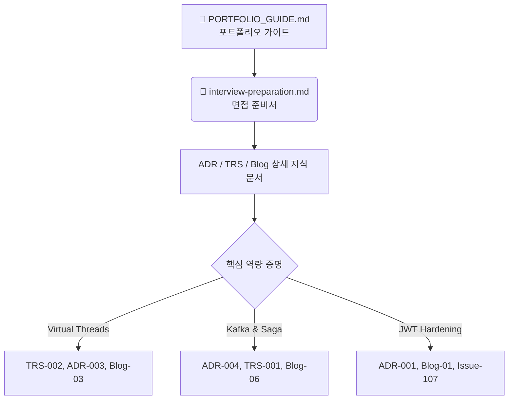

# 📓 BackBackBack 기술 위키 & Obsidian 스킬 맵 (Skill Map & Wiki Hub)

이 문서는 이 프로젝트에 축적된 4대 핵심 아키텍처 결정서(ADR), 5대 트러블슈팅 문서(TRS), 6대 기술 블로그 포스팅, 그리고 각종 성능/면접 가이드 문서를 Obsidian의 **개인 지식 베이스(PKM) 및 포트폴리오 스킬북**으로 활용하기 위한 **통합 인덱스 문서(Wiki Hub)**입니다.

이 레포지토리 루트를 Obsidian Vault로 로드하거나 Markdown 뷰어로 확인할 때, 아래의 위키 링크(`[[링크]]`)를 클릭하여 관련 기술 분석서로 바로 이동할 수 있습니다.

---

## 🗺️ 1. 기술 도메인별 스킬 맵 (Skill Map)

### 🚀 대용량 트래픽 & 성능 최적화 (High Traffic & Performance)
* **가상 스레드 (Virtual Threads) 도입**:
  - `[[docs/adr/ADR-003-virtual-thread-adoption.md|ADR-003: 가상 스레드 도입 의사결정]]`
  - `[[docs/blog/03-virtual-thread-benchmark.md|Blog-03: 가상 스레드 벤치마크 및 처리량 극대화]]`
  - `[[docs/troubleshooting/TRS-002-virtual-thread-pinning.md|TRS-002: 가상 스레드 Pinned 스레드 락 및 스레드 풀 격리 해결]]`
  - `[[docs/perf-phase1-virtual-thread-benchmark.md|Benchmark: Phase1 가상 스레드 성능 측정 보고서]]`
* **성능 벤치마크 가이드**:
  - `[[docs/benchmark-guide.md|JMeter 기반 성능 벤치마크 수립 가이드]]`
  - `[[docs/performance-report.md|성능 측정 종합 데이터 리포트]]`

### 🔄 데이터 최종 정합성 & 분산 시스템 (Data Consistency & Distributed System)
* **아웃박스 패턴 및 Custom Saga 패턴**:
  - `[[docs/adr/ADR-004-transactional-outbox-saga.md|ADR-004: Transactional Outbox & Saga 패턴 설계]]`
  - `[[docs/blog/06-outbox-saga-architecture.md|Blog-06: 분산 트랜잭션의 SKIP LOCKED 및 역순 보상 트랜잭션 구현]]`
* **비동기 카프카 메시징 파이프라인**:
  - `[[docs/adr/ADR-002-kafka-async-pipeline.md|ADR-002: Kafka 비동기 파이프라인 도입]]`
  - `[[docs/blog/02-kafka-async-pipeline.md|Blog-02: AI 리포트 생성을 위한 비동기 메시지 분산 처리]]`
  - `[[docs/troubleshooting/TRS-001-kafka-message-reliability.md|TRS-001: Kafka 메시지 유실 및 중복 소비(Idempotency) 방지]]`

### 🛡️ 보안 하드닝 & 시스템 복원력 (Security Hardening & Resilience)
* **JWT 및 토큰 보안 강화**:
  - `[[docs/adr/ADR-001-jwt-security-hardening.md|ADR-001: JWT 보안 하드닝 결정서 (Pepper, Refresh Token Rotation)]]`
  - `[[docs/blog/01-jwt-production-level.md|Blog-01: 실무 레벨의 JWT 토큰 검증, 블랙리스트 및 탈취 탐지]]`
* **장애 격리 (Fault Isolation)**:
  - `[[docs/blog/04-resilience4j-fault-isolation.md|Blog-04: Resilience4j를 이용한 서킷 브레이커, 타임아웃, 벌크헤드 연동]]`
* **보안 하드닝 이슈 대응 기록**:
  - `[[docs/security-hardening-issue-107.md|Issue-107: CSRF 더블서브밋 및 토큰 해시 전환 보고서]]`
  - `[[docs/security-hardening-issue-109.md|Issue-109: Pepper 기반 HMAC-SHA256 해싱 가이드]]`

### 🏗️ 인프라 & CI/CD 무중단 배포 (Infrastructure & Deploy)
* **컨테이너화 및 빌드 스펙**:
  - `[[docs/blog/05-cicd-codebuild-docker.md|Blog-05: AWS CodeBuild와 Docker 기반 배포 최적화]]`
  - `[[docs/troubleshooting/TRS-004-docker-env-configuration.md|TRS-004: Docker 컨테이너 구동 시 환경 변수 주입 경합 트러블슈팅]]`
* **데이터베이스 마이그레이션**:
  - `[[docs/troubleshooting/TRS-003-flyway-migration-conflict.md|TRS-003: Flyway 마이그레이션 충돌 및 버전 복구 해결]]`
  - `[[docs/troubleshooting/TRS-005-h2-mysql-compatibility.md|TRS-005: H2 임베디드 DB와 MySQL 간 Dialect/DDL 호환성 문제 극복]]`

---

## 📋 2. 포트폴리오 & 면접 연계 맵 (Interview Preparation Hub)

실제 이력서 기여도와 기술 면접 꼬리 질문을 완벽히 연계하여 방어할 수 있도록 설계된 마스터 맵입니다.

* **면접관 최적화 시나리오 대비**:
  - `[[PORTFOLIO_GUIDE.md|포트폴리오 프리미엄 가이드라인 (RPS, SLO, P95/P99 지연 제어)]]`
  - `[[docs/interview-preparation.md|100% 실전 기술 면접 대비 질문집 (가상 스레드 락, Pinned Thread 우회 등)]]`
  - `[[README.MD|프로젝트 종합 리드미 (Executive Summary 및 5대 성능 개선 사례)]]`

---

## 🏷️ 3. Obsidian 활용을 위한 권장 태그 구조

Obsidian에 이 저장소를 로드한 후, 각 문서에 아래 태그를 매핑하여 검색성을 더욱 높이실 수 있습니다.

* `#architecture`: 아키텍처 결정 관련 문서 (`docs/adr/*`)
* `#troubleshooting`: 실무 장애 해결 사례 문서 (`docs/troubleshooting/*`)
* `#performance`: 가상 스레드, JMeter 벤치마크 등 성능 측정 문서 (`docs/*benchmark*`, `docs/*report*`)
* `#security`: JWT Hardening, HMAC Pepper, CSRF 방어 문서 (`docs/security-*`)
* `#blog`: 블로그 게시용 가공 아티클 (`docs/blog/*`)
