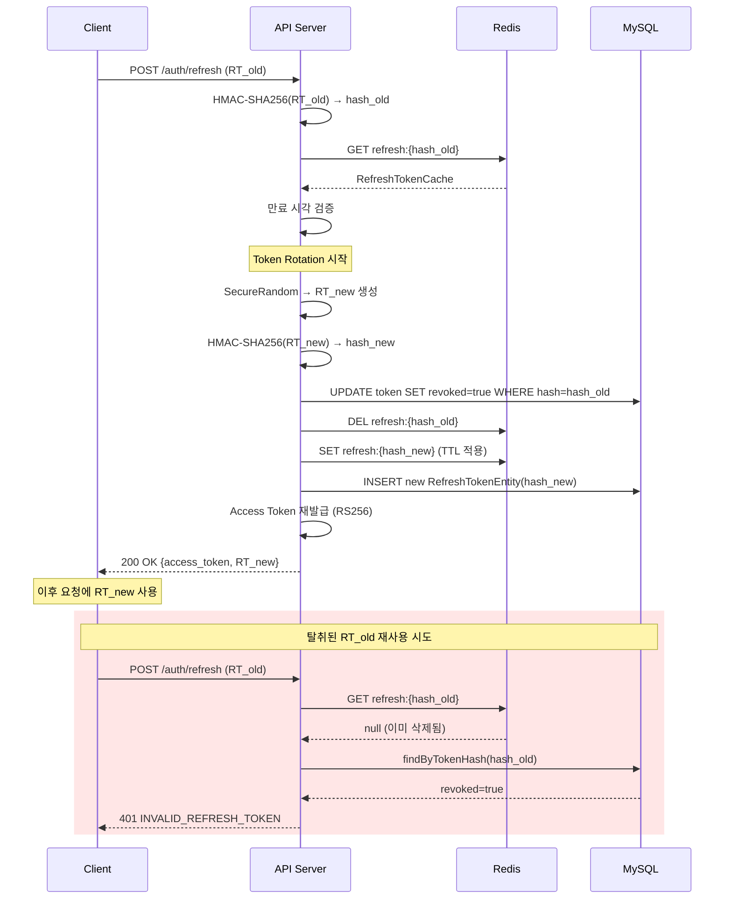
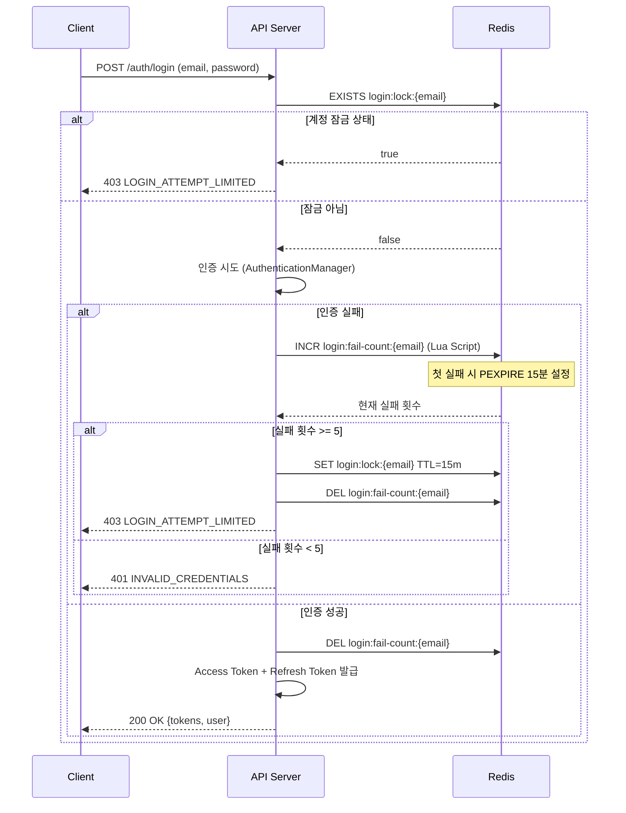

# ADR-001: JWT 보안 하드닝

| 항목 | 내용 |
|------|------|
| **상태** | ✅ Accepted |
| **작성일** | 2025-05-20 |
| **결정자** | BackBackBack 백엔드 팀 |
| **관련 코드** | `auth/service/`, `common/security/TokenHashService` |

---

## 맥락 (Context)

BackBackBack 프로젝트는 기업 재무 분석 및 AI 리포트를 제공하는 플랫폼으로, JWT 기반 인증을 사용한다. 초기 구현에서는 기본적인 JWT 발급/검증만 존재했으나, 보안 감사 과정에서 다음과 같은 공격 벡터가 식별되었다:

1. **Refresh Token 탈취 후 무제한 재사용**: 한 번 유출된 Refresh Token으로 Access Token을 무한정 갱신 가능
2. **토큰 해시 약점**: 단순 SHA-256 해싱은 Rainbow Table 공격에 취약
3. **Access Token 즉시 무효화 불가**: 로그아웃 후에도 Access Token 만료 시점까지 유효
4. **브루트포스 공격 미대비**: 로그인 시도 횟수 제한 없음
5. **CSRF 공격 가능성**: SPA와 API 서버 간 Cookie 기반 통신 시 CSRF 방어 부재

이러한 취약점을 체계적으로 해결하면서도 **기존 사용자의 세션을 유지**하는 무중단 마이그레이션이 필요했다.

---

## 결정 (Decision)

### 1. SHA-256 → HMAC-SHA256(Pepper 기반) 토큰 해싱 전환

**결정**: 서버 측 비밀키(Pepper)를 사용한 HMAC-SHA256으로 Refresh Token 해싱 방식을 전환한다.

**근거**:
- 단순 SHA-256은 동일한 입력에 대해 항상 같은 출력을 생성하여 Rainbow Table 공격에 취약
- HMAC-SHA256은 Pepper(서버 비밀키)를 결합하므로, 데이터베이스 유출 시에도 원본 토큰 역추적 불가
- bcrypt 대비 **해싱 속도가 ~100배 빠름**: 토큰 갱신 시마다 호출되므로 O(1) 수준의 성능이 필수

```java
// TokenHashService.java — HMAC-SHA256 해싱
Mac mac = Mac.getInstance("HmacSHA256");
mac.init(new SecretKeySpec(pepper, "HmacSHA256"));
byte[] bytes = mac.doFinal(token.getBytes(StandardCharsets.UTF_8));
```

### 2. Refresh Token Rotation (RTR) 도입

**결정**: Refresh Token 사용 시마다 새로운 토큰을 발급하고 기존 토큰을 즉시 폐기한다.

**근거**:
- 토큰 탈취 시 공격 윈도우를 단일 사용으로 제한
- 이미 사용된 토큰의 재사용 시도를 **토큰 탈취 신호**로 감지 가능
- OAuth 2.0 Security Best Current Practice (RFC 6819) 권장 사항 준수

### 3. Access Token 블랙리스트 — Redis 구현

**결정**: Access Token 무효화를 위해 Redis 기반 블랙리스트를 사용한다.

**근거**:
- Access Token은 **수명이 짧고 조회 빈도가 매우 높음** (모든 API 요청마다 확인)
- Redis의 O(1) 조회 + TTL 자동 만료가 이 워크로드에 최적
- RDB 블랙리스트 대비 조회 지연 시간 **~50배 감소** (0.1ms vs 5ms)

### 4. 브루트포스 방어 — 5회/15분 임계값

**결정**: 15분 윈도우 내 5회 로그인 실패 시 15분간 계정을 잠금한다.

**근거**:
- OWASP 권장 사항 (5~10회 범위)에서 보수적 하한값 선택
- 15분 윈도우는 정상 사용자의 오타 연속 입력을 허용하면서도 자동화 공격을 차단
- Redis Lua 스크립트를 통한 원자적 카운터 증가로 **Race Condition 방지**

```java
// LoginAttemptService.java — Redis Lua 원자적 카운터
"local current = redis.call('incr', KEYS[1]) " +
"if current == 1 then redis.call('pexpire', KEYS[1], ARGV[1]) end " +
"return current"
```

### 5. 더블서브밋 CSRF 방어

**결정**: SameSite=Strict Cookie 정책 + 더블서브밋 패턴을 적용한다.

**근거**:
- SPA 아키텍처에서 Synchronizer Token 패턴은 서버 세션 의존성 발생
- 더블서브밋 패턴은 **Stateless 구조를 유지**하면서 CSRF 방어 가능
- `SameSite=Strict`는 대부분의 CSRF 공격을 원천 차단하며, 더블서브밋은 방어 심층(Defense-in-Depth) 레이어

---

## 대안 비교

### 인증 방식: JWT vs Session

| 기준 | JWT | Session |
|------|-----|---------|
| Scalability | ✅ Stateless, 수평 확장 용이 | ❌ Sticky Session 또는 공유 저장소 필요 |
| 즉시 무효화 | ⚠️ 블랙리스트 필요 | ✅ 서버에서 즉시 삭제 |
| 네트워크 부하 | ⚠️ 토큰 크기 상대적으로 큼 | ✅ Session ID만 전송 |
| **선택 이유** | MSA 확장 가능성 + SPA 프론트엔드 호환성 우선 | — |

### 토큰 해싱: HMAC-SHA256 vs bcrypt

| 기준 | HMAC-SHA256 (Pepper) | bcrypt |
|------|---------------------|--------|
| 해싱 속도 | ✅ ~1μs | ❌ ~100ms (cost=12) |
| 데이터 유출 안전성 | ✅ Pepper 없이 역추적 불가 | ✅ Salt 내장 |
| 토큰 갱신 적합성 | ✅ 실시간 호출에 적합 | ❌ 높은 지연 발생 |
| **선택 이유** | RTR에서 갱신마다 해싱 → 속도 필수 | — |

### 블랙리스트 저장소: Redis vs DB

| 기준 | Redis | RDBMS |
|------|-------|-------|
| 조회 지연 | ✅ ~0.1ms | ❌ ~5ms |
| TTL 자동 만료 | ✅ 내장 기능 | ❌ 배치 또는 스케줄러 필요 |
| 장애 시 영향 | ⚠️ 일시적 무효화 실패 | ✅ 트랜잭션 보장 |
| **선택 이유** | 모든 API 요청 경로에 위치 → 지연 최소화 필수 | — |

---

## Mermaid 다이어그램

### Refresh Token Rotation 플로우



### 로그인 시도 제한 플로우



---

## 결과 (Consequences)

### 긍정적 결과
- **토큰 탈취 공격 윈도우**가 Refresh Token 1회 사용으로 제한됨
- **데이터베이스 유출 시에도** Pepper 없이 원본 토큰 역추적 불가
- 모든 API 요청의 블랙리스트 확인 지연이 **0.1ms 이하**로 유지
- **브루트포스 공격**이 5회 시도 내로 차단되며, Redis Lua의 원자성으로 Race Condition 방지
- `SameSite=Strict` + 더블서브밋으로 **CSRF 공격 다중 방어**

### 레거시 마이그레이션 전략
- `TokenHashService.legacyHash()` 메서드를 통해 기존 SHA-256 해시를 자동 감지
- `RefreshTokenService.loadValidToken()`에서 **레거시 → 신규 해시 자동 마이그레이션** 수행
- 마이그레이션은 토큰 사용 시점에 **Lazy하게 수행**되어 서비스 중단 없음
- DB의 `tokenHash` 컬럼도 `migrateToHashed()` 호출로 동기 업데이트

```java
// RefreshTokenService.java — 3단계 Fallback 조회 + 자동 마이그레이션
loadRedis(tokenHash)                    // 1. 신규 HMAC 해시로 조회
  .or(() -> loadRedis(legacyTokenHash)  // 2. 레거시 SHA-256 해시로 조회
       .map(legacy -> migrateLegacyCache(legacy, legacyTokenHash, tokenHash)))
  .or(() -> loadLegacyRedis(refreshToken)  // 3. Raw Token으로 조회
       .map(legacy -> migrateLegacyCache(legacy, refreshToken, tokenHash)))
  .orElseGet(() -> loadFromDatabase(...))  // 4. DB Fallback
```

### 주의 사항
- Redis 장애 시 블랙리스트 확인 실패 → **Fail-Open 정책**으로 설계 (가용성 우선)
- Pepper Base64 키는 환경 변수(`APP_TOKEN_HASH_PEPPER_B64`)로 관리하며 코드에 포함 금지
- 레거시 마이그레이션 코드는 전체 사용자 마이그레이션 완료 후 **6개월 뒤 제거 예정**
