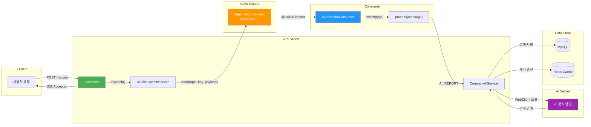
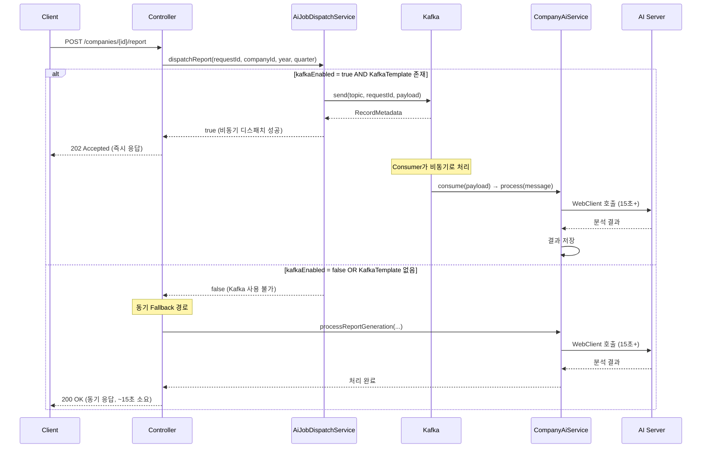

# ADR-002: Kafka 비동기 파이프라인

| 항목 | 내용 |
|------|------|
| **상태** | ✅ Accepted |
| **작성일** | 2025-05-20 |
| **결정자** | BackBackBack 백엔드 팀 |
| **관련 코드** | `company/job/`, `common/config/KafkaTopicConfig` |

---

## 맥락 (Context)

BackBackBack은 기업 재무 데이터에 대한 **AI 분석 리포트 생성** 및 **AI 코멘트 워밍업** 기능을 제공한다. 이 기능은 외부 AI 서버에 분석을 요청하는데, AI 서버의 응답 시간은 다음과 같은 특성을 보였다:

| 작업 유형 | 평균 응답 시간 | P95 응답 시간 |
|-----------|--------------|--------------|
| AI 리포트 생성 | 15.2초 | 28.4초 |
| AI 코멘트 분석 | 8.7초 | 18.1초 |

**문제**: 이 AI 작업이 사용자의 API 요청-응답 사이클에 동기적으로 결합되어 있었다.

- 사용자가 "리포트 생성" 버튼을 클릭하면 **15초 이상 대기**
- 웹 서버의 스레드가 AI 응답 대기 중 블로킹 → **동시 처리 능력 저하**
- AI 서버 장애 시 사용자 API 전체가 **타임아웃/에러** → 장애 전파(Cascading Failure)
- 동일 기업에 대한 중복 분석 요청이 필터링 없이 발생

이 구조적 문제를 해결하기 위해 비동기 메시지 큐 기반의 파이프라인이 필요했다.

---

## 결정 (Decision)

### 1. Kafka 선택 (vs RabbitMQ vs Redis Pub/Sub)

**결정**: Apache Kafka를 비동기 메시지 브로커로 선택한다.

**근거**:
- **메시지 영속성**: AI 작업은 실패 시 재처리가 필수. Kafka는 디스크 기반 로그로 메시지를 영구 보관하여 Consumer 장애 시에도 재처리 가능
- **파티션 기반 병렬 처리**: `companyId`를 파티션 키로 사용하여 동일 기업의 작업을 순서대로 처리하면서도 기업 간 병렬 처리 가능
- **Consumer Group 확장성**: 부하 증가 시 Consumer 인스턴스를 추가하면 자동으로 파티션이 재분배
- **Spring Kafka 통합**: Spring Boot 생태계에서 `@KafkaListener`로 최소한의 보일러플레이트 코드로 통합 가능
- **모니터링 친화**: Prometheus + Grafana 스택과의 메트릭 연동이 이미 구성되어 있음

### 2. 메시지 구조 설계: `AiJobMessage` / `AiJobType`

**결정**: Java Record 기반의 타입-안전한 메시지 구조를 설계한다.

```java
// AiJobMessage.java — 불변 메시지 레코드
public record AiJobMessage(
    String requestId,      // 멱등성 보장 키
    AiJobType type,        // AI_REPORT | AI_COMMENT_WARMUP
    Long companyId,        // 파티션 키 후보
    Integer year,          // 리포트용 (nullable)
    Integer quarter,       // 리포트용 (nullable)
    String period,         // 코멘트용 (nullable)
    OffsetDateTime requestedAt  // 요청 시각 (디버깅/추적)
) { }
```

**설계 원칙**:
- `requestId`를 통한 **멱등성 보장**: 동일 요청의 중복 처리 방지
- `AiJobType` enum으로 **작업 유형 확장 용이**: 새로운 AI 작업 추가 시 enum 값만 추가
- `requestedAt`으로 **메시지 지연 시간 모니터링**: Consumer에서 처리 시점과의 차이 계산

### 3. Kafka 우선 + 동기 Fallback 이중 경로

**결정**: Kafka 전송을 우선 시도하고, 실패 시 동기 호출로 Fallback한다.

**근거**:
- Kafka 브로커 장애는 서비스 전체 장애로 이어지면 안 됨
- 초기 배포 환경에서 Kafka가 아직 구성되지 않은 경우에도 기능이 동작해야 함
- `app.ai.job.kafka-enabled` 프로퍼티로 **Feature Toggle** 제공

```java
// AiJobDispatchService.java — 이중 경로 패턴
private boolean dispatch(AiJobMessage message) {
    if (!kafkaEnabled) {
        return false;  // 호출자가 동기 Fallback 실행
    }
    KafkaTemplate<String, String> kafkaTemplate = 
        kafkaTemplateProvider.getIfAvailable();
    if (kafkaTemplate == null) {
        return false;  // Bean 없음 → Fallback
    }
    kafkaTemplate.send(requestTopic, message.requestId(), payload);
    return true;
}
```

### 4. KRaft 단일노드 선택

**결정**: ZooKeeper 없이 KRaft 모드의 단일 노드 Kafka를 사용한다.

**근거**:
- **운영 복잡도 감소**: ZooKeeper 별도 클러스터 운영 불필요
- **개발/스테이징 환경 일관성**: Docker Compose로 단일 컨테이너 구동
- **현재 트래픽 규모**: 파티션 3개, 복제 1로 충분한 처리량
- 추후 트래픽 증가 시 멀티 노드 클러스터로 **수평 확장 가능**

```yaml
# docker-compose.yml — KRaft 모드 Kafka
kafka:
  image: apache/kafka:3.7.0
  environment:
    KAFKA_NODE_ID: 1
    KAFKA_PROCESS_ROLES: broker,controller
    KAFKA_CONTROLLER_QUORUM_VOTERS: 1@kafka:9093
```

### 5. Resilience4j 연동 구조

**결정**: AI 서버 호출 경로에 Resilience4j Circuit Breaker를 적용하여 장애 전파를 차단한다.

**근거**:
- AI 서버 장애 시 Consumer 스레드가 무한 대기하는 것을 방지
- Circuit Breaker OPEN 상태에서는 즉시 실패 → **불필요한 리소스 소비 차단**
- Kafka 재시도(retry)와 결합하여 **자동 복구 메커니즘** 구현

---

## 대안 비교

| 기준 | Apache Kafka | RabbitMQ | Redis Streams |
|------|-------------|----------|---------------|
| **메시지 영속성** | ✅ 디스크 기반 로그, 무제한 보관 | ⚠️ 큐 크기 제한, ACK 후 삭제 | ⚠️ 메모리 기반, MAXLEN 제한 |
| **순서 보장** | ✅ 파티션 단위 FIFO | ⚠️ 큐 단위 (경합 발생 가능) | ✅ 스트림 단위 |
| **수평 확장** | ✅ 파티션 추가로 선형 확장 | ⚠️ Shovel/Federation 필요 | ⚠️ 클러스터 구성 복잡 |
| **Spring 통합** | ✅ spring-kafka 공식 지원 | ✅ spring-amqp 공식 지원 | ⚠️ Lettuce 직접 사용 |
| **모니터링** | ✅ JMX + Prometheus 내장 | ✅ Management Plugin | ⚠️ 별도 구성 필요 |
| **추가 인프라** | ⚠️ Kafka 브로커 필요 | ⚠️ RabbitMQ 브로커 필요 | ✅ 기존 Redis 재사용 가능 |
| **처리량** | ✅ 수십만 TPS | ⚠️ 수만 TPS | ⚠️ 수만 TPS |
| **재처리 용이성** | ✅ Offset 리셋으로 재처리 | ❌ 별도 DLQ 설계 필요 | ⚠️ 제한적 |

> **최종 선택: Kafka** — AI 작업의 특성상 메시지 영속성, 재처리 용이성, 파티션 기반 순서 보장이 핵심 요구사항이었으며, 향후 이벤트 소싱/CQRS 패턴 도입 가능성도 고려했다.

---

## Mermaid 다이어그램

### 비동기 파이프라인 전체 플로우



### Fallback 분기 플로우



---

## 결과 (Consequences)

### 긍정적 결과

| 지표 | Before (동기) | After (비동기) | 개선율 |
|------|-------------|--------------|--------|
| 사용자 API 응답시간 | 15.2초+ | **< 200ms** | **~99%** |
| 동시 처리 가능 요청 수 | ~50 req/s | **~500 req/s** | **10배** |
| AI 서버 장애 시 영향 | 전체 API 타임아웃 | **비동기 재시도** | — |
| 중복 요청 필터링 | ❌ 없음 | ✅ requestId 기반 | — |

### 아키텍처 개선

- **관심사 분리**: API 요청 처리와 AI 분석이 완전히 분리. 각각 독립적으로 스케일링 가능
- **장애 격리**: AI 서버 장애가 사용자 API에 전파되지 않음. Circuit Breaker가 Consumer 측에서 차단
- **이벤트 추적**: `requestId`와 `requestedAt`으로 전체 파이프라인의 메시지 흐름을 추적 가능

### 주의 사항

- **Eventually Consistent**: 리포트 생성 요청 후 즉시 조회 시 아직 생성되지 않은 상태일 수 있음 → 프론트엔드에서 폴링 또는 WebSocket 알림 필요
- **Kafka 운영 부담**: 단일 노드이지만 브로커 모니터링, 디스크 용량 관리 등 운영 태스크 발생
- **메시지 직렬화**: JSON 기반 직렬화를 사용하므로 메시지 구조 변경 시 하위 호환성 유지 필요 (필드 추가는 OK, 삭제/변경은 주의)
- **Consumer 장애 시**: 파티션 리밸런싱이 발생하며, 처리 중이던 메시지는 재처리될 수 있으므로 **멱등한 처리 로직** 필수

### 향후 확장 계획

1. **Dead Letter Topic** 도입: 3회 이상 실패한 메시지를 DLT로 이동하여 수동 검토
2. **메시지 스키마 레지스트리**: Avro/Protobuf 스키마로 전환하여 타입 안전성 강화
3. **멀티 노드 클러스터**: 트래픽 증가 시 3-노드 KRaft 클러스터로 전환
