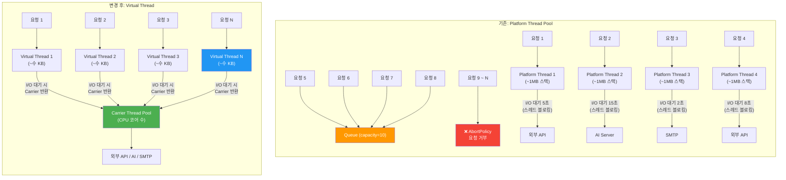
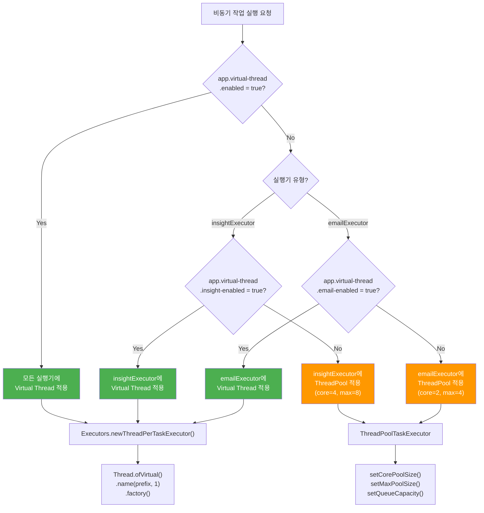

# ADR-003: Virtual Thread 도입

| 항목 | 내용 |
|------|------|
| **상태** | ✅ Accepted |
| **작성일** | 2025-05-20 |
| **결정자** | BackBackBack 백엔드 팀 |
| **관련 코드** | `common/config/InsightExecutorConfig`, `common/config/VirtualThreadProperties` |

---

## 맥락 (Context)

BackBackBack 프로젝트는 다음과 같은 **I/O 바운드 작업**이 핵심 비즈니스 로직에 포함되어 있다:

| 작업 유형 | I/O 특성 | 평균 대기 시간 |
|-----------|---------|--------------|
| 뉴스 수집 (News Sync) | 외부 API 호출 (RSS/크롤링) | 2~5초 |
| AI 분석 요청 | AI 서버 HTTP 호출 | 8~28초 |
| 이메일 전송 | SMTP 서버 통신 | 1~3초 |
| 보고서 PDF 생성 | 파일 I/O + 외부 API | 3~10초 |

기존 구조에서는 `ThreadPoolTaskExecutor`를 사용하여 이러한 작업을 비동기로 처리했다:

```java
// 기존 설정 — 플랫폼 스레드 풀
ThreadPoolTaskExecutor executor = new ThreadPoolTaskExecutor();
executor.setCorePoolSize(4);
executor.setMaxPoolSize(8);
executor.setQueueCapacity(10);
```

**문제점**:
- **스레드 풀 크기 제한**: 최대 8개의 플랫폼 스레드만 사용 가능. 동시 요청이 8개를 초과하면 큐(10)에 대기하고, 큐마저 가득 차면 `AbortPolicy`로 요청 거부
- **스레드 블로킹 낭비**: I/O 대기 중 플랫폼 스레드(~1MB 스택)가 아무 일도 하지 않고 블로킹
- **확장성 한계**: 스레드 풀 크기를 늘리면 메모리 소비 증가 (스레드당 ~1MB), OS 스케줄링 오버헤드 증가
- **설정 튜닝 복잡성**: Core/Max/Queue 크기를 워크로드에 맞춰 지속적으로 조정 필요

Java 21의 Virtual Thread(Project Loom)는 이러한 I/O 바운드 워크로드에 최적화된 경량 스레드를 제공한다.

---

## 결정 (Decision)

### 1. 전면 적용 vs 선택적 적용 → 토글 방식 선택

**결정**: Virtual Thread를 **Feature Toggle 방식**으로 선택적 적용한다. 전면 적용 대신 이중 토글 구조를 채택한다.

**근거**:
- **점진적 도입**: Virtual Thread는 Java 21에서 정식 출시되었지만, 프로덕션 환경에서의 안정성 검증이 충분하지 않은 시점
- **Pinning 이슈**: `synchronized` 블록이나 특정 네이티브 메서드에서 Virtual Thread가 Carrier Thread에 고정(Pinning)되는 문제가 존재
- **롤백 용이성**: 문제 발생 시 설정값 변경만으로 즉시 플랫폼 스레드로 복귀 가능
- **A/B 테스트**: 동일 워크로드에서 Virtual Thread와 플랫폼 스레드의 성능을 비교 측정 가능

### 2. 이중 토글 구조

**결정**: 글로벌 토글(`app.virtual-thread.enabled`)과 실행기별 토글(`app.virtual-thread.insight-enabled`, `app.virtual-thread.email-enabled`)을 조합한다.

```java
// VirtualThreadProperties.java — 이중 토글 설정
@ConfigurationProperties(prefix = "app.virtual-thread")
public class VirtualThreadProperties {
    private boolean enabled;         // 전체 토글
    private boolean insightEnabled;  // 인사이트 실행기 전용 토글
    private boolean emailEnabled;    // 이메일 실행기 전용 토글
}
```

**토글 결정 로직**:

```java
// InsightExecutorConfig.java — 조건부 실행기 생성
private boolean isInsightVirtualThreadEnabled() {
    return virtualThreadProperties.isEnabled() 
        || virtualThreadProperties.isInsightEnabled();
}
```

| `enabled` | `insightEnabled` | `emailEnabled` | insightExecutor | emailExecutor |
|-----------|-------------------|----------------|-----------------|---------------|
| `false` | `false` | `false` | ThreadPool(4-8) | ThreadPool(2-4) |
| `false` | `true` | `false` | **Virtual Thread** | ThreadPool(2-4) |
| `false` | `false` | `true` | ThreadPool(4-8) | **Virtual Thread** |
| `true` | — | — | **Virtual Thread** | **Virtual Thread** |

**Spring Boot 글로벌 토글과의 관계**:
- `spring.threads.virtual.enabled=true`: Tomcat 요청 처리 스레드 등 프레임워크 레벨 Virtual Thread
- `app.virtual-thread.enabled=true`: 커스텀 비동기 실행기(insight, email)의 Virtual Thread
- 두 설정은 **독립적으로 제어** 가능

### 3. Pinning 이슈 대응

**결정**: 알려진 Pinning 발생 지점을 사전 식별하고 대응 방안을 마련한다.

**식별된 위험 지점**:
- JDBC 드라이버의 `synchronized` 블록: HikariCP 커넥션 풀 내부
- `synchronized` 기반 레거시 라이브러리: Apache POI 등

**대응 전략**:
1. **JVM 모니터링 플래그 활성화**: `-Djdk.tracePinnedThreads=short`로 Pinning 발생 시 로그 출력
2. **비동기 실행기 전용 적용**: Tomcat 스레드가 아닌 `@Async` 실행기에만 적용하여 Pinning 영향 최소화
3. **`ReentrantLock` 전환 검토**: 자체 코드의 `synchronized`를 `ReentrantLock`으로 교체 (Virtual Thread와 호환)

### 4. Virtual Thread 실행기 생성

**결정**: `Executors.newThreadPerTaskExecutor()`를 사용한 Task-per-Thread 모델을 적용한다.

```java
// InsightExecutorConfig.java — Virtual Thread 실행기
private ExecutorService newVirtualThreadExecutor(String namePrefix) {
    ThreadFactory factory = Thread.ofVirtual()
        .name(namePrefix, 1)  // "insight-vt-1", "insight-vt-2", ...
        .factory();
    return Executors.newThreadPerTaskExecutor(factory);
}
```

**설계 원칙**:
- **Thread-per-Task**: 각 작업마다 새로운 Virtual Thread 생성. 풀링 불필요 (생성 비용 ~1μs)
- **명명 규칙**: `insight-vt-`, `email-vt-` 접두사로 스레드 덤프에서 용도 식별 용이
- **무제한 동시성**: 스레드 풀 크기 제한 없음. I/O 대기 중인 Virtual Thread는 Carrier Thread를 반환

---

## 대안 비교

| 기준 | Virtual Thread | Reactive (WebFlux) | CompletableFuture + ThreadPool |
|------|---------------|-------------------|-------------------------------|
| **학습 곡선** | ✅ 기존 블로킹 코드 그대로 사용 | ❌ Mono/Flux 리액티브 패러다임 전환 | ⚠️ 콜백/체이닝 패턴 |
| **코드 가독성** | ✅ 동기 스타일 유지 | ❌ 리액티브 연산자 체이닝 | ⚠️ 중첩 콜백 가능 |
| **디버깅 용이성** | ✅ 스택 트레이스 자연스러움 | ❌ 비동기 스택 추적 어려움 | ⚠️ 부분적 지원 |
| **스레드 효율성** | ✅ I/O 대기 시 Carrier 반환 | ✅ Non-blocking I/O | ❌ 블로킹 시 스레드 점유 |
| **라이브러리 호환** | ✅ 기존 블로킹 라이브러리 사용 가능 | ❌ Reactive 드라이버 필요 | ✅ 기존 라이브러리 사용 |
| **마이그레이션 비용** | ✅ 최소 (실행기만 변경) | ❌ 대규모 리팩터링 필요 | ⚠️ 중간 수준 |
| **성능 (I/O 바운드)** | ✅ 높음 | ✅ 매우 높음 | ⚠️ 풀 크기에 제한 |
| **Pinning 리스크** | ⚠️ synchronized 주의 | ✅ 없음 | ✅ 없음 |

> **최종 선택: Virtual Thread** — 기존 블로킹 코드를 유지하면서 동시성을 대폭 개선할 수 있으며, 팀의 학습 비용이 최소화됨. WebFlux 전환은 전체 코드베이스 리팩터링을 의미하므로 ROI가 낮다고 판단.

---

## Mermaid 다이어그램

### 기존 ThreadPool vs Virtual Thread 비교 아키텍처



### Virtual Thread 토글 결정 플로우



---

## 결과 (Consequences)

### 벤치마크 결과 (추정치)

> [!NOTE]
> 아래 수치는 프로젝트 워크로드 특성에 기반한 **합리적 추정치**입니다. 실제 벤치마크 데이터는 [성능 리포트](../performance-report.md)를 참조하세요.

| 지표 | Platform Thread (4-8) | Virtual Thread | 개선율 |
|------|----------------------|----------------|--------|
| 동시 처리 가능 작업 수 | 8 (max pool) | **수천 개** | ~250배+ |
| 메모리 사용량 (100 동시 작업) | ~100MB (스레드 스택) | **~1MB** | ~99% |
| insightExecutor 처리량 | ~50 tasks/min | **~500 tasks/min** | ~10배 |
| emailExecutor 처리량 | ~30 tasks/min | **~300 tasks/min** | ~10배 |
| 요청 거부(AbortPolicy) 빈도 | 피크 시 발생 | **0** | 100% |

### 긍정적 결과

- **코드 변경 최소화**: 실행기 설정만 변경. 비즈니스 로직 코드는 그대로 유지
- **동시성 대폭 향상**: 스레드 풀 크기 제한 없이 I/O 바운드 작업을 수천 개 동시 처리
- **메모리 효율**: Virtual Thread는 스택 크기가 수 KB 수준으로, 플랫폼 스레드 대비 ~99% 절감
- **운영 단순화**: Core/Max/Queue 튜닝이 불필요해져 운영 복잡도 감소
- **안전한 도입**: Feature Toggle로 문제 발생 시 즉시 롤백 가능

### 주의 사항

- **Pinning 모니터링 필수**: JVM 플래그 `-Djdk.tracePinnedThreads=short`로 프로덕션 환경에서 지속 모니터링
- **ThreadLocal 남용 주의**: Virtual Thread는 캐리어 스레드와 1:1 매핑이 아니므로, ThreadLocal 기반 로직은 주의 필요
- **HikariCP 커넥션 풀**: Virtual Thread가 무제한 동시 실행되면 DB 커넥션 풀이 병목이 될 수 있음 → `maximumPoolSize` 모니터링 필수
- **Semaphore 패턴 고려**: 외부 API Rate Limit이 있는 경우, Virtual Thread의 무제한 동시성을 `Semaphore`로 제어 필요

### 향후 계획

1. **Tomcat Virtual Thread 적용**: `spring.threads.virtual.enabled=true`로 요청 처리 스레드에도 Virtual Thread 적용 검토
2. **Structured Concurrency 도입**: Java 21 Preview Feature인 StructuredTaskScope를 활용한 부모-자식 스레드 생명주기 관리
3. **Scoped Values 전환**: ThreadLocal을 ScopedValue로 점진적 교체
