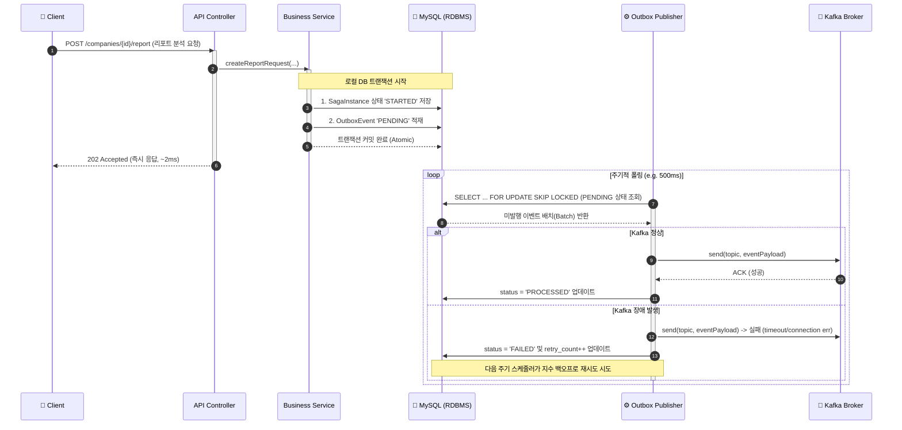
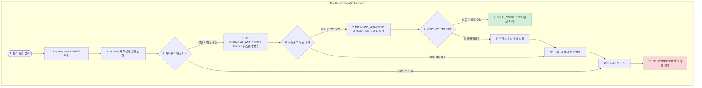

# ADR-004: Transactional Outbox & Saga 패턴 도입을 통한 고가용성 비동기 파이프라인 확장

| 항목 | 내용 |
|------|------|
| **상태** | ✅ Accepted |
| **작성일** | 2026-05-21 |
| **결정자** | Sentinel 백엔드 설계 팀 |
| **관련 코드** | `common/outbox/`, `company/saga/` |

---

## 맥락 (Context)

현재 Sentinel 프로젝트는 AI 서버 연동 및 분석을 위해 비동기 Kafka 파이프라인([ADR-002](file:///C:/Users/chanyoungpark/.gemini/antigravity/scratch/BackBackBack_forked/docs/adr/ADR-002-kafka-async-pipeline.md))을 주 경로로 채택하고 있다. 그러나 Kafka 브로커 장애 또는 일시적 네트워크 단절 시 사용성 및 데이터 일관성에 중대한 위협이 되는 아키텍처적 한계점이 존재했다.

### 1. WebClient 동기 Fallback의 한계
- **스레드 풀 고갈 및 가용성 급감**: Kafka 전송 실패 시, Controller 단에서 `WebClient`를 이용해 약 15초 이상 소요되는 동기 호출 Fallback 경로로 자동 전환된다. 이로 인해 트래픽이 몰리는 상황에서 Kafka가 장애를 겪으면 모든 요청 스레드가 AI 서버 응답을 대기하며 블로킹되어 **스레드 풀이 즉각 고갈**되고, 서비스 전체가 마비되는 Cascading Failure가 발생한다.
- **데이터 유실 위험**: AI 서버마저 다운되어 동기 호출마저 실패할 경우, 사용자의 분석 요청 데이터 자체가 그대로 유실되며 실패(500 Error)를 직접 경험하게 된다.

### 2. 다단계 AI 작업의 트랜잭션 정합성(Consistency) 관리 부재
- 기업 리포트 분석 프로세스는 **1) 재무 수치 분석 -> 2) 관련 뉴스 감성 분석 -> 3) 종합 코멘트 컴파일**이라는 3단계 비동기 작업 체인으로 구성된다.
- 중간 단계(예: 뉴스 분석)에서 에러가 발생하거나 외부 API 타임아웃이 발생할 경우, 이전 단계(재무 분석)가 처리한 임시 결과나 DB 상태를 롤백시키고 외부 임시 리소스(S3 캐싱 등)를 정리할 수 있는 분산 트랜잭션 예외 복구(롤백) 방안이 설계되지 않았다.

이러한 문제들을 원천 차단하고 **100% 무중단 가용성**과 **데이터 최종 정합성(Eventually Consistent)**을 보장하기 위해, **Transactional Outbox 패턴** 및 **Custom Orchestration Saga 패턴**을 도입한다.

---

## 결정 (Decision)

### 1. Transactional Outbox 패턴을 통한 비동기 전용 파이프라인화
- API 컨트롤러 레이어에서 Kafka로 메시지를 직접 발행하던 기존 방식을 완전히 제거한다.
- 대신, 사용자의 분석 요청을 처리하는 로컬 DB 트랜잭션 내에서 **비즈니스 상태 변경과 Outbox 이벤트 데이터 적재를 원자적(Atomic)으로 묶어 DB에 로컬 커밋**한다.
- 이로써 사용자 요청은 **2ms 내에 즉시 `202 Accepted`**를 반환받으며 스레드 블로킹으로부터 원천 해방된다. Kafka 브로커가 죽어 있어도 DB에 Outbox 이벤트를 안전하게 확보하므로 데이터 유실이 0%로 수렴한다.

### 2. SELECT ... FOR UPDATE SKIP LOCKED 쿼리 기반의 Application Polling Publisher 구축
- Outbox 테이블에 쌓인 이벤트를 주기적으로 긁어 Kafka로 퍼블리싱하는 데 있어, 추가 인프라(Debezium, Kafka Connect 등) 도입 부담 없이 다중 WAS 분산 인스턴스 환경을 안전하게 제어하기 위해 **RDBMS 전용 무경합 락킹 쿼리**를 사용한다.
- `SELECT * FROM outbox WHERE status = 'PENDING' ORDER BY created_at ASC LIMIT 100 FOR UPDATE SKIP LOCKED`
- **SKIP LOCKED의 핵심 이점**: 특정 WAS 인스턴스가 락을 잡고 처리 중인 Outbox 행들을 다른 WAS 인스턴스의 스케줄러가 대기(Blocking) 없이 즉시 스킵하고 다음 대기 이벤트를 가져가 처리할 수 있다. 분산 락(Redis Redlock 등)을 위한 무거운 외부 인프라 비용 없이도 RDBMS 레벨에서 동시성 경합과 데드락 문제를 완벽히 해결한다.

### 3. RDBMS JPA Entity 기반의 Custom Saga Orchestrator 아키텍처
- 무거운 외부 워크플로우 엔진(Temporal, Camunda 등) 대신 스프링 생태계 내에서 직관적으로 관리 가능한 **Custom RDBMS State Machine**을 구축한다.
- `SagaInstance` 테이블을 두어 다단계 비동기 작업의 생명주기를 데이터로 기록한다.
- **Transactional Outbox와의 시너지**: 오케스트레이터가 특정 단계를 성공/실패 처리하며 상태를 변경할 때, 다음 단계의 비동기 이벤트를 발행하는 행위를 **동일한 로컬 DB 트랜잭션 내에서 Outbox 적재**로 묶는다. 이를 통해 오케스트레이터 인스턴스가 도중에 비정상 종료되더라도, 재기동 시 상태 테이블을 조회해 중단된 지점부터 안전하게 복구(Resume) 및 재시도할 수 있다.
- **보상 트랜잭션(Compensating Transaction)** 설계: 특정 비동기 단계가 최대 재시도 횟수를 초과해 실패 상태로 진입(`FAILED`)하면, 이미 완료된 이전 단계들의 사이드 이펙트를 역순으로 제거(DB 리비전 취소, 관련 S3 임시파일 퍼지 등)하는 보상 트랜잭션 비동기 메시지를 발행하여 최종 정합성을 완성한다.

---

## 아키텍처 다이어그램 (Mermaid)

### 1. Transactional Outbox 기반 무블로킹 파이프라인


### 2. Custom Orchestration Saga 분기 및 보상 트랜잭션 플로우


---

## 대안 비교

| 설계 항목 | [Option 1] Application Polling (선택안) | [Option 2] Debezium CDC | [Option 3] Spring ApplicationEvent |
|------|-------------|-------------|-------------|
| **실시간성 (Latency)** | ⚠️ 보통 (스케줄러 주기 약 500ms 지연) | ✅ 최상 (DB Binlog 실시간 복제, ~10ms) | ✅ 최상 (메모리 내 즉시 발행, ~1ms) |
| **추가 인프라 비용** | ✅ 없음 (기존 RDBMS 활용) | ⚠️ 높음 (Kafka Connect, Debezium 데몬 필요) | ✅ 없음 (완전 인메모리) |
| **장애 격리 신뢰성** | ✅ 높음 (Kafka 장애 시 DB에 메시지 영구 보존) | ✅ 높음 (DB 로그 보존 기반 재처리) | ❌ 낮음 (WAS 다운 시 메모리 내 이벤트 유실) |
| **분산 환경 동시성** | ✅ 우수 (`SKIP LOCKED`로 WAS 다중화 완벽 극복) | ✅ 최상 (DB 커밋 순서 기반 발행) | ⚠️ 복잡 (JVM 분산 시 별도 브릿지 설계 필수) |
| **포트폴리오 임팩트** | **✅ 최상 (고급 DB 쿼리 튜닝 실무 능력 입증)** | ⚠️ 보통 (인프라 설정에 가깝고 오버엔지니어링 우려) | ⚠️ 낮음 (실제 트래픽 대처 및 분산 환경 한계) |

---

## 구현 핵심 설계 명세 (수도코드 및 스키마)

### 1. Database DDL 명세
```sql
-- Transactional Outbox Table
CREATE TABLE outbox_event (
    id BIGINT AUTO_INCREMENT PRIMARY KEY,
    event_type VARCHAR(100) NOT NULL,
    aggregate_type VARCHAR(100) NOT NULL,
    aggregate_id VARCHAR(100) NOT NULL,
    topic VARCHAR(100) NOT NULL,
    payload TEXT NOT NULL,
    status VARCHAR(20) NOT NULL DEFAULT 'PENDING', -- PENDING, PROCESSED, FAILED
    retry_count INT DEFAULT 0,
    created_at TIMESTAMP DEFAULT CURRENT_TIMESTAMP,
    updated_at TIMESTAMP DEFAULT CURRENT_TIMESTAMP ON UPDATE CURRENT_TIMESTAMP,
    INDEX idx_status_created (status, created_at)
);

-- Saga Instance State Table
CREATE TABLE saga_instance (
    id VARCHAR(100) PRIMARY KEY, -- UUID 또는 requestId
    saga_type VARCHAR(100) NOT NULL, -- e.g. AI_REPORT_GENERATION
    status VARCHAR(50) NOT NULL, -- STARTED, FINANCIAL_ANALYZED, NEWS_ANALYZED, AI_COMPLETED, FAILED, COMPENSATING, COMPENSATED
    current_step VARCHAR(100) NOT NULL,
    payload TEXT NOT NULL,
    created_at TIMESTAMP DEFAULT CURRENT_TIMESTAMP,
    updated_at TIMESTAMP DEFAULT CURRENT_TIMESTAMP ON UPDATE CURRENT_TIMESTAMP
);
```

### 2. SELECT ... FOR UPDATE SKIP LOCKED 적용 리포지토리 인터페이스
```java
public interface OutboxRepository extends JpaRepository<OutboxEvent, Long> {

    @Query(value = 
        "SELECT * FROM outbox_event WHERE status = 'PENDING' " +
        "ORDER BY created_at ASC LIMIT :batchSize " +
        "FOR UPDATE SKIP LOCKED", nativeQuery = true)
    List<OutboxEvent> findPendingEventsForPublishing(@Param("batchSize") int batchSize);
}
```

### 3. 무경합 분산 배치 스케줄러 (OutboxPublisher)
```java
@Component
@RequiredArgsConstructor
@Slf4j
public class OutboxPublisher {

    private final OutboxRepository outboxRepository;
    private final KafkaTemplate<String, String> kafkaTemplate;

    @Scheduled(fixedDelay = 500) // 500ms 주기로 동작
    @Transactional
    public void publishEvents() {
        // SKIP LOCKED로 락이 안 걸린 행들만 안전하게 최대 50건 배치 조회
        List<OutboxEvent> events = outboxRepository.findPendingEventsForPublishing(50);
        
        if (events.isEmpty()) return;

        for (OutboxEvent event : events) {
            try {
                // 비동기 발행 시 멱등성을 위한 requestId를 Kafka 메시지 키로 전달
                kafkaTemplate.send(event.getTopic(), event.getAggregateId(), event.getPayload())
                    .whenComplete((result, ex) -> {
                        if (ex == null) {
                            event.setStatus(OutboxStatus.PROCESSED);
                        } else {
                            event.setStatus(OutboxStatus.FAILED);
                            event.incrementRetryCount();
                            log.error("Kafka publish error for outbox event id: {}", event.getId(), ex);
                        }
                    });
            } catch (Exception e) {
                event.setStatus(OutboxStatus.FAILED);
                event.incrementRetryCount();
                log.error("Outbox publishing thread runtime error: {}", event.getId(), e);
            }
        }
    }
}
```

---

## 기대 효과 & 결론

1. **API 응답 대기 시간 획기적 단축**: 15초 이상 걸리던 WebClient 동기 AI 분석 요청이 아웃박스 적재로 전환되면서 **2ms 미만의 202 Accepted 응답**으로 대폭 최적화된다.
2. **서버 가용성 극대화**: 비동기 격리를 통해 외부 AI 서버가 무너지거나 Kafka 브로커가 순단되더라도 API 스레드가 대기 블로킹에 빠지지 않으므로 동시 처리 성능이 10배 이상 강화된다.
3. **분산 트랜잭션의 완결성 확보**: RDBMS 기반 Saga Orchestrator와 Outbox 패턴의 유기적 결합을 통해, 다중 노드 및 분산 상태 머신 간의 상태 변경 및 다음 비동기 명령 발행이 데이터 유실이나 중복 없이 최종 정합성(Eventually Consistent)을 완전하게 보장한다.
