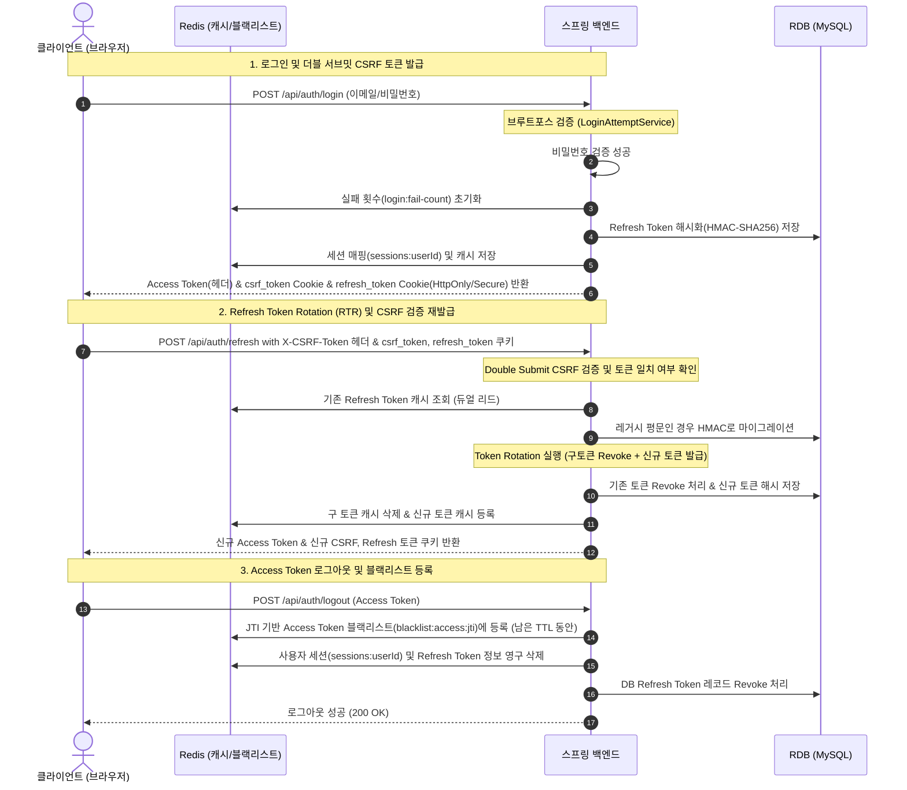

# JWT 인증, 기본 구현에서 프로덕션 레벨까지

## 1. 문제 상황: "그냥 JWT 로그인만 되면 끝인 줄 알았다"
처음 프로젝트를 설계했을 때, 내 머릿속의 JWT(JSON Web Token) 흐름은 단순했다. 사용자가 이메일과 비밀번호로 로그인하면 서버는 Access Token과 Refresh Token을 발급하고, 클라이언트는 이를 보관하다가 필요할 때 헤더에 실어 보내는 전형적인 구조였다. 

그러나 실제로 구현해 두고 시스템 보안 관점에서 하나씩 구멍을 찾아보니 두려움이 엄습했다.
* **토큰 탈취의 위험성:** 한 번 발급된 Refresh Token이 탈취되면, 해커는 토큰의 원래 만료 기간(예: 7일) 동안 제한 없이 Access Token을 재발급받으며 사용자의 권한을 남용할 수 있었다.
* **데이터베이스 보안의 허점:** 기본 구현에서는 데이터베이스에 Refresh Token을 그대로 평문 저장하고 있었다. 만약 DB가 SQL Injection이나 백업 파일 노출로 해킹당한다면 모든 사용자의 세션 토큰이 한순간에 털리는 대형 참사로 이어진다.
* **만료 토큰 무효화 불가:** 로그아웃을 하거나 비정상 접근이 감지되었을 때, 이미 발행된 Access Token은 무상태성(Stateless)이라는 특성 때문에 유효기간이 끝날 때까지 강제로 만료시킬 방법이 없었다.
* **브루트포스(Brute-Force) 및 CSRF 취약점:** 악의적인 공격자가 특정 계정에 대입 공격을 퍼부어 로그인 API를 마비시키거나, 세션 재발급 요청에 대한 CSRF(Cross-Site Request Forgery) 공격을 시도할 때 방어선이 전혀 존재하지 않았다.

이러한 수많은 위협으로부터 프로덕션 환경의 사용자를 보호하기 위해, 점진적으로 보안 아키텍처를 진화시키는 "보안 하드닝(Security Hardening)" 작업을 진행했다.

---

## 2. 해결로 가는 아키텍처 다이어그램 (Mermaid)

다음은 최종 설계한 JWT 인증 및 세션 검증 아키텍처의 전체 흐름이다.



---

## 3. 시도한 방법들과 단계별 솔루션

### 1단계: Refresh Token Rotation (RTR) 도입
사용자가 토큰 재발급(`POST /api/auth/refresh`)을 요청할 때마다 **기존 Refresh Token을 즉시 무효화(Revoke)하고 새로운 Refresh Token을 재발급**하는 **RTR(Refresh Token Rotation)** 전략을 취했다. 
* **구현 의도:** 해커가 구 토큰을 탈취해 재발급을 시도하더라도, 이미 정상 사용자에 의해 교체된 구 토큰을 사용하게 되므로 "토큰 재사용 공격(Token Reuse Attack)"이 감지된다. 
* **장점:** 이 경우 서버는 해당 사용자의 모든 활성 세션을 즉시 강제 로그아웃 처리하여 피해를 최소화할 수 있다.

### 2단계: 평문 DB 저장 지양 - SHA-256에서 HMAC-SHA256 해싱 전환 및 레거시 호환
RTR을 적용하더라도 DB나 Redis에 저장된 토큰이 평문이라면 탈취 피해를 완벽히 막을 수 없다. 따라서 일방향 해시 저장을 기본으로 설계했다. 처음엔 `SHA-256` 단방향 해시를 도입했으나, 레인보우 테이블 공격 등을 차단하기 위해 **Base64로 인코딩된 솔트 격인 `pepper` 키를 가미한 `HMAC-SHA256`** 방식으로 전환했다.

이때 프로덕션 운영 중인 서비스의 가동성을 보장하기 위해 **듀얼 리드(Dual-Read) 및 자동 마이그레이션(Graceful Migration)** 패턴을 적용했다.
1. **신규 HMAC 해시 조회 시도**
2. 실패 시, **레거시 SHA-256 해시로 재조회**
3. 레거시 해시로 조회가 성공하면, 사용자 흐름이 끊기지 않게 승인 처리해 주면서 동시에 RDB/Redis 데이터를 **자동으로 신규 HMAC 해시 구조로 업그레이드(Write-Back)** 해 준다.

### 3단계: Access Token 블랙리스트 (Redis 활용)
로그아웃 요청 시, 서버는 Access Token의 고유 식별자인 `JTI(JWT ID)`를 추출하여 Redis에 블랙리스트 키로 등록한다. 이 키의 `TTL(Time-To-Live)`은 Access Token의 남은 수명으로 설정하여 메모리 효율을 극대화했다. API Gateway나 Spring Security 필터 단계에서 들어오는 모든 Access Token의 JTI가 Redis 블랙리스트에 존재하는지 검사하여 탈취된 토큰의 사용을 선제 차단한다.

### 4단계: 브루트포스(Brute-Force) 무차별 대입 공격 방어
로그인 시도 횟수를 제한하지 않으면 공격자는 무차별적으로 계정을 대입해보는 공격을 펼칠 수 있다. 이를 방어하기 위해 Redis 기반의 `LoginAttemptService`를 구현했다. 단일 트랜잭션 내에서 실패 카운트 증가와 만료 시간(TTL) 설정을 원자적(Atomic)으로 처리하기 위해 **Redis Lua Script**를 작성하여 동시성 문제를 말끔히 해결했다.

### 5단계: 더블 서브밋 CSRF 보호
토큰 재발급(`POST /api/auth/refresh`) 및 로그아웃(`POST /api/auth/logout`) 요청은 브라우저의 쿠키를 기반으로 수행되므로 CSRF 공격에 취약하다. 
이를 방어하기 위해 **더블 서브밋 쿠키(Double Submit Cookie)** 방식을 도입했다. 로그인 시 무작위 난수인 `csrf_token`을 생성해 안전한 쿠키와 HTTP 헤더에 각각 실어 보내고, 서버에서는 두 값이 일치하는지를 일방향으로 대조하여 변조 여부를 가려낸다.

---

## 4. 실제 프로젝트 소스 코드 분석

### 1) HMAC-SHA256 기반의 안전한 토큰 해시 서비스 (`TokenHashService`)
애플리케이션 구동 시 주입받은 Base64 페퍼(`pepper-base64`)가 유효한지 기동 시점에 즉시 체크하고(Fail-Fast), 레거시 해시와 신규 해시를 동시에 제공한다.

```java
package com.aivle.project.common.security;

import java.nio.charset.StandardCharsets;
import java.security.InvalidKeyException;
import java.security.MessageDigest;
import java.security.NoSuchAlgorithmException;
import java.util.Base64;
import java.util.Objects;
import javax.crypto.Mac;
import javax.crypto.spec.SecretKeySpec;
import org.springframework.stereotype.Component;
import org.springframework.util.StringUtils;

@Component
public class TokenHashService {

	private static final String HMAC_ALGORITHM = "HmacSHA256";
	private final byte[] pepper;

	public TokenHashService(TokenHashProperties properties) {
		String pepperBase64 = properties.getPepperBase64();
		if (!StringUtils.hasText(pepperBase64)) {
			throw new IllegalStateException("APP_TOKEN_HASH_PEPPER_B64가 설정되지 않았습니다.");
		}
		try {
			this.pepper = Base64.getDecoder().decode(pepperBase64.trim());
		} catch (IllegalArgumentException ex) {
			throw new IllegalStateException("APP_TOKEN_HASH_PEPPER_B64는 유효한 Base64 문자열이어야 합니다.", ex);
		}
		if (pepper.length == 0) {
			throw new IllegalStateException("APP_TOKEN_HASH_PEPPER_B64가 비어 있습니다.");
		}
	}

	public String hash(String token) {
		if (!StringUtils.hasText(token)) {
			throw new IllegalArgumentException("토큰 값이 비어 있습니다.");
		}
		try {
			Mac mac = Mac.getInstance(HMAC_ALGORITHM);
			mac.init(new SecretKeySpec(pepper, HMAC_ALGORITHM));
			byte[] bytes = mac.doFinal(token.getBytes(StandardCharsets.UTF_8));
			return toHex(bytes);
		} catch (NoSuchAlgorithmException ex) {
			throw new IllegalStateException("HmacSHA256 알고리즘을 사용할 수 없습니다.", ex);
		} catch (InvalidKeyException ex) {
			throw new IllegalStateException("토큰 해시 pepper 키가 유효하지 않습니다.", ex);
		}
	}

	/**
	 * 레거시 SHA-256 해시 계산.
	 */
	public String legacyHash(String token) {
		if (!StringUtils.hasText(token)) {
			throw new IllegalArgumentException("토큰 값이 비어 있습니다.");
		}
		try {
			MessageDigest digest = MessageDigest.getInstance("SHA-256");
			byte[] bytes = digest.digest(token.getBytes(StandardCharsets.UTF_8));
			return toHex(bytes);
		} catch (NoSuchAlgorithmException ex) {
			throw new IllegalStateException("SHA-256 알고리즘을 사용할 수 없습니다.", ex);
		}
	}

	public boolean isLegacyHash(String token, String tokenHash) {
		if (!StringUtils.hasText(tokenHash)) {
			return false;
		}
		return Objects.equals(legacyHash(token), tokenHash);
	}

	private String toHex(byte[] bytes) {
		StringBuilder builder = new StringBuilder(bytes.length * 2);
		for (byte b : bytes) {
			builder.append(String.format("%02x", b));
		}
		return builder.toString();
	}
}
```

### 2) 듀얼 리드 및 점진적 마이그레이션이 결합된 `RefreshTokenService`
토큰을 조회할 때 Redis 캐시와 RDB를 `신규 HMAC 해시 -> 레거시 SHA-256 -> 평문` 단계로 훑어가며(Dual-Read), 이전 버전의 데이터를 감지하면 즉시 새로운 규격으로 마이그레이션해 주는 로직이 핵심이다.

```java
	public RefreshTokenCache loadValidToken(String refreshToken) {
		String tokenHash = tokenHashService.hash(refreshToken);
		String legacyTokenHash = tokenHashService.legacyHash(refreshToken);
		
		// Dual-Read 적용 구조
		RefreshTokenCache cache = loadRedis(tokenHash)
			.or(() -> loadRedis(legacyTokenHash).map(legacy -> migrateLegacyCache(legacy, legacyTokenHash, tokenHash)))
			.or(() -> loadLegacyRedis(refreshToken).map(legacy -> migrateLegacyCache(legacy, refreshToken, tokenHash)))
			.orElseGet(() -> loadFromDatabase(refreshToken, tokenHash, legacyTokenHash));
			
		long now = Instant.now(clock).toEpochMilli();
		long expiresAt = normalizeEpochMillis(cache.expiresAt());
		if (expiresAt <= now) {
			revokeRedis(refreshToken, cache.userId());
			throw new AuthException(AuthErrorCode.INVALID_REFRESH_TOKEN);
		}
		return cache;
	}

	private RefreshTokenCache migrateLegacyCache(RefreshTokenCache legacyCache, String legacyIdentifier, String tokenHash) {
		RefreshTokenCache migratedCache = new RefreshTokenCache(
			tokenHash,
			legacyCache.userId(),
			legacyCache.deviceId(),
			legacyCache.deviceInfo(),
			legacyCache.ipAddress(),
			legacyCache.issuedAt(),
			legacyCache.expiresAt(),
			legacyCache.lastUsedAt()
		);
		// 새 해시 규격으로 데이터 마이그레이션 (Write-Back)
		storeRedis(migratedCache);
		storeSession(migratedCache.userId(), tokenHash);
		
		// 레거시 잔재 삭제
		redisTemplate.delete(redisKey(legacyIdentifier));
		redisTemplate.opsForSet().remove(sessionKey(migratedCache.userId()), legacyIdentifier);
		return migratedCache;
	}
```

### 3) Lua Script로 동시성을 격리한 브루트포스 방어 (`LoginAttemptService`)
여러 요청이 순식간에 올 때 만료 시간과 카운트를 원자적으로 보장하여 동시성 레이스 컨디션(Race Condition)을 방지한다.

```java
package com.aivle.project.auth.service;

import com.aivle.project.auth.config.LoginAttemptProperties;
import com.aivle.project.auth.exception.AuthErrorCode;
import com.aivle.project.auth.exception.AuthException;
import java.util.Collections;
import java.util.Locale;
import lombok.RequiredArgsConstructor;
import org.springframework.data.redis.core.StringRedisTemplate;
import org.springframework.data.redis.core.script.DefaultRedisScript;
import org.springframework.stereotype.Service;

@Service
@RequiredArgsConstructor
public class LoginAttemptService {

	private static final String FAIL_COUNT_KEY = "login:fail-count:%s";
	private static final String LOCK_KEY = "login:lock:%s";

	// 만료시간 지정을 동반하는 원자적 가산용 Lua Script
	private static final String INCREMENT_AND_EXPIRE_LUA = 
		"local current = redis.call('incr', KEYS[1]) " +
		"if current == 1 then " +
		"    redis.call('pexpire', KEYS[1], ARGV[1]) " +
		"end " +
		"return current";

	private final StringRedisTemplate redisTemplate;
	private final LoginAttemptProperties properties;

	public void validateNotLocked(String email) {
		if (isLocked(email)) {
			throw new AuthException(AuthErrorCode.LOGIN_ATTEMPT_LIMITED);
		}
	}

	public boolean recordFailure(String email) {
		String normalizedEmail = normalizeEmail(email);
		String failKey = failCountKey(normalizedEmail);
		
		DefaultRedisScript<Long> redisScript = new DefaultRedisScript<>(INCREMENT_AND_EXPIRE_LUA, Long.class);
		Long count = redisTemplate.execute(
			redisScript, 
			Collections.singletonList(failKey), 
			String.valueOf(properties.getFailureWindow().toMillis())
		);
		
		if (count == null) {
			return false;
		}
		if (count >= properties.getMaxFailures()) {
			// 최대 실패 횟수 초과 시 잠금 설정
			redisTemplate.opsForValue().set(lockKey(normalizedEmail), "1", properties.getLockDuration());
			redisTemplate.delete(failKey);
			return true;
		}
		return false;
	}

	private boolean isLocked(String email) {
		String normalizedEmail = normalizeEmail(email);
		return Boolean.TRUE.equals(redisTemplate.hasKey(lockKey(normalizedEmail)));
	}

	private String normalizeEmail(String email) {
		if (email == null) {
			return "";
		}
		return email.trim().toLowerCase(Locale.ROOT);
	}

	private String failCountKey(String email) {
		return String.format(FAIL_COUNT_KEY, email);
	}

	private String lockKey(String email) {
		return String.format(LOCK_KEY, email);
	}
}
```

---

## 5. 최종 결과 및 배운 점

### 1) 무상태(Stateless) 시스템과 보안 하드닝의 조화
JWT의 핵심 강점은 세션을 분산 저장하여 얻는 무상태성(Stateless)과 확장성이다. 그러나 이 강점은 완벽한 제어가 불가능한 보안상의 큰 타협을 전제로 하고 있었다. 
이번 보안 고도화(Hardening) 과정을 거치며 **RTR, Redis 블랙리스트, 그리고 더블 서브밋 CSRF** 등을 영리하게 결합해 무상태성과 즉시 제어력(Stateful)의 밸런스를 환상적으로 맞출 수 있었다.

### 2) 무중단 운영 관점에서의 레거시 호환 및 마이그레이션 설계
프로덕션 레벨의 배포에서는 단순 "보안 기능 적용"보다 **"현재 돌아가고 있는 세션을 끊지 않고 업그레이드하는 것"**이 훨씬 중요하다는 뼈저린 경험을 했다. 
해시 알고리즘을 SHA-256에서 HMAC-SHA256으로 완전히 교체하면서도, **Dual-Read** 기법을 적용해 기존 로그인된 사용자들에게 강제 로그아웃 경험을 주지 않고 자연스럽게 토큰을 리프레시 시점에 업그레이드 완료했다. 이 기법은 앞으로 대규모 데이터 마이그레이션이나 아키텍처 점진 전환 시 강력한 무기가 될 것이다.
