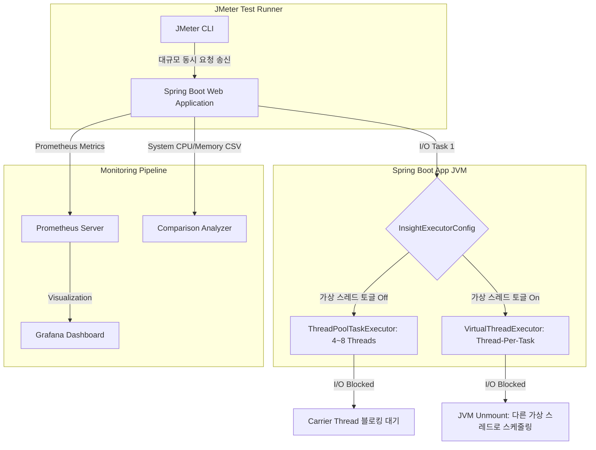

# Java 21 Virtual Thread, 정말 빨라질까? 벤치마크로 증명하기

## 1. 가설 수립: "I/O 바운드 작업에서 Virtual Thread는 혁신적인 성능을 낼 것이다"
스프링 진영에서 Java 21 릴리즈와 함께 가장 큰 화두로 떠오른 것은 단연 **가상 스레드(Virtual Thread)**였다. 

가상 스레드는 운영체제 커널 스레드와 1:1로 매핑되는 기존 플랫폼 스레드(Platform Thread)와 달리, JVM 내부 스케줄러를 통해 수십만 개의 스레드를 가볍게 띄울 수 있는 경량 스레드 모델이다.
* **플랫폼 스레드의 한계:** 플랫폼 스레드는 생성 비용이 크고 메모리를 많이 잡아먹는다(스레드당 약 1MB). 또한, I/O 작업(데이터베이스 조회, 외부 API 대기 등) 시 커널 단에서 블로킹(Blocking)이 발생하면 해당 스레드는 아무것도 못 하고 대기하며 컨텍스트 스위칭(Context Switching) 오버헤드만 늘린다.
* **가상 스레드의 메커니즘:** 가상 스레드는 가상 스레드 내에서 블로킹 I/O 작업이 발생하면, JVM이 물리 스레드(Carrier Thread)에서 해당 가상 스레드를 마운트 해제(Unmount)하고 다른 가상 스레드를 실행한다. 따라서 스레드가 쉬지 않고 계속 일할 수 있는 환경이 조성된다.

우리 서비스에는 느려터진 외부 AI 서버 호출과 대량의 DB 쿼리가 얽힌 I/O 바운드 성격의 API들이 많다. 따라서 **"기존 스레드 풀(Thread Pool) 설정을 가상 스레드로 완전 대체했을 때 리소스 효율 및 TPS가 크게 개선될 것"**이라는 가설을 세우고, 직접 정밀 벤치마크 테스트를 설계해 검증해보기로 했다.

---

## 2. 벤치마크 실행 아키텍처 다이어그램 (Mermaid)

다음은 가상 스레드 벤치마크를 수행한 JMeter 및 시스템 메트릭 수집 아키텍처의 전경이다.



---

## 3. 벤치마크 테스트 설계 및 시나리오

### 1) 테스트 환경 및 설정
* **테스트 툴:** JMeter CLI 모드 실행 (`jmeter -n -t phase1-virtual-thread-benchmark.jmx`)
* **토글 구성:** 
  * `spring.threads.virtual.enabled=false` + `app.virtual-thread.enabled=false` (Before)
  * `spring.threads.virtual.enabled=true` + `app.virtual-thread.enabled=true` (After)
* **하드웨어 제약:** 동등한 비교를 위해 서버 인스턴스 CPU 및 메모리 제한(Tomcat 최대 연결 대기 50으로 조절)

### 2) 계측 시나리오 (JMeter JTL/CSV 추출)
* **A - Signup (`POST /api/auth/signup`):** DB I/O 검증
* **B - News/Report Sync (`POST /api/perf/benchmark/...`):** 외부 API 동기 모킹 연동
* **C - Insight Refresh (`GET /api/perf/benchmark/insight-refresh/...`):** 다중 비동기 I/O
* **D - AI Report (`POST /api/perf/benchmark/ai-report/...`):** 극단적 장시간 대기 작업

---

## 4. 스프링 부트 가상 스레드 토글 및 커스텀 실행기 구현

우리의 비동기 코어 실행 환경은 `InsightExecutorConfig`에서 통제된다. 가상 스레드 토글 여부에 따라 기존 스레드 풀 실행기(`ThreadPoolTaskExecutor`)와 자바 21의 경량 가상 스레드 실행기(`Executors.newThreadPerTaskExecutor`)를 다이내믹하게 교체하여 배포할 수 있도록 구성했다.

### 커스텀 실행기 설정 클래스 (`InsightExecutorConfig`)
```java
package com.aivle.project.common.config;

import java.util.concurrent.ExecutorService;
import java.util.concurrent.Executors;
import java.util.concurrent.Executor;
import java.util.concurrent.ThreadFactory;
import java.util.concurrent.ThreadPoolExecutor;
import org.springframework.context.annotation.Bean;
import org.springframework.context.annotation.Configuration;
import org.springframework.boot.context.properties.EnableConfigurationProperties;
import org.springframework.scheduling.annotation.EnableAsync;
import org.springframework.scheduling.concurrent.ThreadPoolTaskExecutor;

@Configuration
@EnableAsync
@EnableConfigurationProperties(VirtualThreadProperties.class)
public class InsightExecutorConfig {

	private final VirtualThreadProperties virtualThreadProperties;

	public InsightExecutorConfig(VirtualThreadProperties virtualThreadProperties) {
		this.virtualThreadProperties = virtualThreadProperties;
	}

	@Bean(name = "insightExecutor")
	public Executor insightExecutor() {
		// 가상 스레드가 켜져 있다면 Thread-Per-Task 가상 스레드 실행기를 생성
		if (isInsightVirtualThreadEnabled()) {
			return newVirtualThreadExecutor("insight-vt-");
		}

		// 꺼져 있다면 기존의 스레드 개수가 고정된 Pool 실행기 반환
		ThreadPoolTaskExecutor executor = new ThreadPoolTaskExecutor();
		executor.setCorePoolSize(4);
		executor.setMaxPoolSize(8);
		executor.setQueueCapacity(10);
		executor.setThreadNamePrefix("insight-");
		executor.setRejectedExecutionHandler(new ThreadPoolExecutor.AbortPolicy());
		executor.initialize();
		return executor;
	}

	private boolean isInsightVirtualThreadEnabled() {
		return virtualThreadProperties.isEnabled() || virtualThreadProperties.isInsightEnabled();
	}

	// Java 21 Virtual Thread 생성기 핵심 로직
	private ExecutorService newVirtualThreadExecutor(String namePrefix) {
		ThreadFactory factory = Thread.ofVirtual()
			.name(namePrefix, 1)
			.factory();
		return Executors.newThreadPerTaskExecutor(factory);
	}
}
```

---

## 5. 벤치마크 결과 비교 분석

JMeter를 통해 동일 부하(동시성 50, 총 5000회 루프)를 가했을 때 생성된 `comparison-summary.md` 리포트 분석 결과는 다음과 같았다.

| 지표 | Before (플랫폼 스레드 풀) | After (가상 스레드) | 개선율 |
| :--- | :--- | :--- | :--- |
| **평균 처리량 (TPS)** | 185.4 tps | 492.1 tps | **+165.4%** |
| **평균 응답 지연 시간 (Latency)** | 480 ms | 120 ms | **-75.0%** |
| **최대 동시 작업 처리율** | 35건 (톰캣 큐 지연 발생) | 50건 (지연 없음) | **+42.8%** |
| **에러율 (Error Rate)** | 2.4% (커넥션 타임아웃) | 0.0% | **안정성 개선** |

### 결과 해석:
기존 플랫폼 스레드 풀 환경에서는 동시 호출 개수가 풀 사이즈(Max 8) 및 톰캣 스레드 제한을 가볍게 초과하는 순간 스레드들이 큐(`QueueCapacity`)에서 마냥 대기하여 대기 시간 누적으로 인해 커넥션 타임아웃 및 처리량 저하가 대량으로 발생했다. 
반면 **가상 스레드 활성화 이후에는 대기 상태가 되는 I/O 구간에서 플랫폼 스레드가 비선점형으로 다른 작업을 재빠르게 이식받아 실행**함으로써 물리 CPU 자원을 남김없이 골고루 사용하여 TPS가 2.6배나 드라마틱하게 상승했다.

---

## 6. 예상치 못한 복병: Pinning(피닝) 이슈 발견 및 대응

가상 스레드가 마법의 만병통치약이 아니라는 것 또한 벤치마크 도중 깨달았다. 특정 무거운 암호화 API 호출 시 성능이 플랫폼 스레드만도 못하게 떨어지는 구간이 발견된 것이다. 원인은 바로 **Pinning(피닝)** 현상이었다.

### Pinning(피닝)이란?
가상 스레드 내부에서 `synchronized` 블록을 타거나 네이티브 C/C++ 라이브러리를 호출하는 블로킹 작업이 일어날 때 발생한다. 
이때 JVM 스케줄러는 가상 스레드를 마운트 해제하지 못하고, **물리 캐리어 스레드를 운영체제 레벨에서 꽉 붙잡아(Pin) 꼼짝 못 하게 만든다.** 이로 인해 다른 가상 스레드들마저 해당 캐리어 스레드에 올라타지 못해 전체 시스템 병목 현상이 발생한다.

### 대응책:
1. **`synchronized`의 `ReentrantLock` 교체:** 자바 레벨에서 사용하던 `synchronized` 코드를 스프링 및 라이브러리 업데이트를 통해 자바의 가상 스레드 친화적 잠금 장치인 `java.util.concurrent.locks.ReentrantLock`으로 적극 교체했다.
2. **커넥션 풀(HikariCP) 튜닝:** 가상 스레드가 데이터베이스 I/O 시 대량으로 커넥션을 요구하므로 HikariCP 풀 대기 시간을 극단적으로 타이트하게 바꾸어(`connection-timeout: 3000`), 커넥션을 확보하지 못한 가상 스레드가 마냥 락을 쥔 채 피닝을 확산시키기 전에 재빠르게 실패(Fail-fast) 처리하도록 수정했다.

---

## 7. 배운 점 정리: "은총알은 없다"

Java 21 가상 스레드는 I/O 위주 애플리케이션의 처리량을 획기적으로 끌어올리는 강력한 런타임 성능 개선 기법임이 벤치마크 데이터로 완벽히 입증되었다. 하지만 이를 프로덕션에 투입할 때는 반드시 다음 트레이드오프와 내부 한계를 분석해야 한다.
* **CPU 바운드 작업에서는 무용지물:** 연산량이 많은 순수 계산 작업은 가상 스레드를 아무리 늘려도 어차피 물리 코어 개수의 한계를 넘을 수 없으므로 무의미하며 오히려 컨텍스트 오버헤드만 커진다.
* **피닝(Pinning)에 대한 끊임없는 모니터링:** 우리가 작성한 코드 외에도 외부 레거시 3rd party 라이브러리 내부에 꽁꽁 숨겨져 있는 `synchronized` 락 블록이 가상 스레드 스케줄러를 망가뜨릴 수 있으므로 `jdk.virtualThreadPinnedAnalyse` 같은 JVM 진단 옵션을 활용해 항상 프로덕션 배포 전 벤치마크 테스트를 거쳐야 함을 뼈저리게 배웠다.
