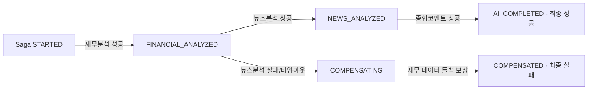

# [Sentinel 아키텍처 진화기] WebClient 동기 Fallback에서 Transactional Outbox & Custom Saga 패턴으로의 도약

> **작성자**: 신입 백엔드 엔지니어 chanyoungpark
> **목적**: 외부 분석 AI API의 극단적 지연(15초+) 및 Kafka 브로커 장애 상황에서도 100% 서비스 연속성과 분산 데이터의 최종 정합성을 보장하기 위한 아키텍처 리팩터링 여정.

---

## 1. 시작점: 외부 AI API와 성능의 상반 관계(Trade-off)

우리가 구축한 **Sentinel**은 기업 재무 상태 및 관련 뉴스를 종합적으로 모집하여 AI 기업 가치 리스크 분석 리포트를 제작하는 플랫폼입니다. 이 서비스는 백엔드 설계 당시 다음과 같은 치명적인 성능 병목과 직면했습니다.

- **AI 분석 API 지연**: 분석 AI 모델의 평균 응답 시간은 약 **15.2초**, 트래픽이 집중되는 Peak Time에는 **P95 응답 시간이 28.4초**까지 늘어났습니다.
- **기존 설계의 위험**: 초기 구조는 컨트롤러 단에서 비동기 처리가 미흡하여 사용자의 API 응답 사이클 안에 AI 서버 호출이 직접 결합해 있었습니다. 사용자는 리포트 생성을 누르면 웹 브라우저 로딩 바를 보며 15초 이상 마냥 기다려야 했고, 서버의 스레드 풀은 블로킹 상태로 금방 고갈되었습니다.

---

## 2. 1차 진화: Kafka 비동기 파이프라인 도입과 WebClient 동기 Fallback

이 병목을 해소하기 위해 우리는 Apache Kafka를 도입하여 비동기 메시지 파이프라인([ADR-002](file:///C:/Users/chanyoungpark/.gemini/antigravity/scratch/BackBackBack_forked/docs/adr/ADR-002-kafka-async-pipeline.md))을 주 경로로 구축했습니다. 요청을 비동기 큐에 집어넣은 뒤 사용자에게는 즉시 `202 Accepted`를 던져주어 API 응답 속도를 **200ms 이하**로 줄였습니다.

이때, 브로커 다운이나 일시적 장애를 대비해 **Feature Toggle**을 활용한 **WebClient 동기 Fallback** 경로를 심어두었습니다.

```java
// AiJobDispatchService.java의 초기 1차 진화 형태
public boolean dispatch(AiJobMessage message) {
    if (!kafkaEnabled || kafkaTemplate == null) {
        return false; // Kafka 장애 시 호출처에서 동기 WebClient Fallback 실행
    }
    kafkaTemplate.send(requestTopic, message.requestId(), payload);
    return true;
}
```

### 1차 진화의 숨겨진 폭탄 (가용성 병목)
이 하이브리드 이중 경로 설계는 훌륭해 보였지만, 실무 및 부하 상황에서 심각한 아키텍처적 맹점을 드러냈습니다.

1. **Cascading Failure (장애 전파)**: Kafka 브로커가 순단되면 모든 트래픽이 동기 Fallback 경로로 강제 우회됩니다. 결과적으로 수백 개의 요청 스레드가 AI 서버의 15초 대기 시간을 감당하기 위해 CPU/메모리 스레드 블로킹 상태로 돌입하고, 결국 전체 API 서버가 뻗는 **눈사태 효과(Cascading Failure)**를 초래했습니다.
2. **데이터 유실**: 만약 Kafka 브로커와 AI 외부 서버가 동시에 물리적인 순단을 겪는다면, 동기 호출 자체가 500 에러와 함께 터지면서 사용자의 소중한 리포트 생성 요청 데이터는 DB 어디에도 기록되지 못하고 **공중분해(유실)**되었습니다.

우리는 이 문제를 해결하기 위해 **Transactional Outbox**와 **Orchestration Saga** 패턴이라는 백엔드 분산 트랜잭션의 정수들을 결합하기로 결심했습니다.

---

## 3. 2차 진화: Transactional Outbox를 통한 가용성 극한 끌어올리기

비동기 메시징 시스템에서 **At-least-once (최소 1회 전송 보장)** 및 **Atomic Write (로컬 트랜잭션과 발행의 원자성)**를 달성하는 정석적인 해법이 바로 **Transactional Outbox 패턴**입니다.

### 1) 아웃박스 적재 메커니즘
이제 컨트롤러는 직접 Kafka로 이벤트를 쏘거나 외부 API를 쏘지 않습니다. 사용자의 분석 요청 비즈니스 로직이 작동하는 로컬 DB 트랜잭션 내에서 비즈니스 데이터(예: `SagaInstance` 시작 기록)와 함께, **발행해야 할 이벤트를 `OutboxEvent` 엔티티로 변환하여 동일 트랜잭션 하에서 DB에 물리 커밋**시킵니다.

```java
@Transactional
public void requestAiReport(AiReportRequest request) {
    // 1. 비즈니스 원장 기록 (Saga 시작 상태)
    SagaInstance saga = SagaInstance.create(request.companyId());
    sagaRepository.save(saga);

    // 2. 발행할 메시지를 로컬 아웃박스에 적재 (동일 트랜잭션)
    OutboxEvent outboxEvent = new OutboxEvent(
        "ai-report-topic", 
        request.companyId().toString(), 
        JsonUtils.toJson(request)
    );
    outboxRepository.save(outboxEvent);
    
    // DB 트랜잭션이 성공적으로 커밋되는 순간, 비즈니스 상태와 이벤트 발행 대기 데이터의 원자성 100% 보장
}
```

이제 클라이언트는 Kafka의 정상 동작 여부나 외부 AI API의 상태와 무관하게, **오직 DB 로컬 쓰기 지연인 ~2ms 만에 즉각 `202 Accepted` 응답**을 받습니다.

### 2) 기술 챌린지: 분산 서버 환경에서의 무경합 Application Polling
DB에 쌓인 이벤트를 Kafka로 가져가는 별도 백그라운드 퍼블리셔(`OutboxPublisher`)를 스케줄러로 구동할 때, **다중 WAS 분산 인스턴스 환경에서 발생할 수 있는 메시지 중복 처리 및 데드락**이 문제였습니다. 

우리는 Redis를 활용한 무거운 분산 락(Distributed Lock) 대신, RDBMS 친화적이며 리소스 소모가 거의 없는 **`FOR UPDATE SKIP LOCKED` 쿼리**로 이 문제를 우아하게 정면 돌파했습니다.

```java
public interface OutboxRepository extends JpaRepository<OutboxEvent, Long> {
    
    // 타 WAS 세션이 이미 락을 걸고 전송 중인 행은 스킵하고, 대기 행만 즉시 획득
    @Query(value = "SELECT * FROM outbox_event WHERE status = 'PENDING' " +
                   "ORDER BY created_at ASC LIMIT :batchSize " +
                   "FOR UPDATE SKIP LOCKED", nativeQuery = true)
    List<OutboxEvent> findPendingEventsForPublishing(@Param("batchSize") int batchSize);
}
```

이 쿼리 덕분에 백그라운드 스케줄러가 여러 WAS에서 동시에 기동되어도 락 대기로 인해 스레드가 블로킹되거나 동일 이벤트를 중복 발행하는 상황 없이, 각각 할당된 파티션 행들을 번개같이 긁어내 Kafka 브로커로 안전하게 밀어넣습니다.

---

## 4. 3차 진화: Custom RDBMS Saga Orchestrator로 분산 데이터 정합성 정복

기업 분석 리포트는 단발성 작업이 아닙니다. **재무 데이터 분석(1단계) -> 뉴스 감성 분석(2단계) -> AI 종합 컴파일(3단계)**의 긴 파이프라인을 거칩니다. 각 단계는 서로 다른 Kafka 토픽과 Consumer로 분할된 MSA 지향성 구조를 띱니다.

이 비동기 사슬 한가운데에서 특정 단계가 실패했을 때, 전체 시스템을 일관성 있는 상태로 되돌리기 위해 우리는 **Custom RDBMS Saga Orchestrator**를 통합했습니다.



### 1) 상태 머신 기반 흐름 제어 수도코드
오케스트레이터는 각 단계의 비동기 결과 메시지를 소비할 때마다 `SagaInstance` 테이블의 상태를 안전하게 전이시킵니다.

```java
@Component
@RequiredArgsConstructor
public class AiReportSagaOrchestrator {

    private final SagaInstanceRepository sagaRepository;
    private final OutboxRepository outboxRepository;

    @Transactional
    public void onFinancialAnalysisSuccess(String requestId, FinancialResult result) {
        SagaInstance saga = sagaRepository.findById(requestId)
            .orElseThrow(() -> new IllegalArgumentException("Saga instance not found"));
            
        // 1. 상태 업데이트 (재무 완료)
        saga.transitionTo(SagaStatus.FINANCIAL_ANALYZED);
        
        // 2. 다음 단계인 뉴스 감성 분석 요청 이벤트를 동일 트랜잭션의 'Outbox'에 적재
        NewsAnalysisCommand nextCommand = new NewsAnalysisCommand(saga.getCompanyId(), result);
        outboxRepository.save(new OutboxEvent("news-analysis-topic", requestId, nextCommand));
        
        // 이 트랜잭션이 성공하면 뉴스 분석이 안전하게 바인딩되어 비동기 파이프라인으로 흘러감
    }

    @Transactional
    public void onNewsAnalysisFailure(String requestId, String reason) {
        SagaInstance saga = sagaRepository.findById(requestId)
            .orElseThrow(() -> new IllegalArgumentException("Saga instance not found"));
            
        // 1. 실패 상태 및 보상 트랜잭션 개시
        saga.transitionTo(SagaStatus.COMPENSATING);
        
        // 2. 이전 단계인 '재무 분석'의 결과를 취소/롤백 처리하는 보상 트랜잭션 명령을 Outbox에 적재
        CancelFinancialAnalysisCommand rollbackCommand = new CancelFinancialAnalysisCommand(saga.getCompanyId());
        outboxRepository.save(new OutboxEvent("financial-rollback-topic", requestId, rollbackCommand));
        
        log.warn("Saga {} failed at news step. Compensation started.", requestId);
    }
}
```

### 2) 왜 무거운 엔진(Temporal) 대신 Custom RDBMS 오케스트레이터인가?
- **인프라 비용의 타협**: 대형 엔터프라이즈 레벨이 아닌 상황에서 Temporal이나 Camunda 같은 워크플로우 전용 오케스트레이션 데몬을 추가로 띄우는 것은 배보다 배꼽이 큰 오버엔지니어링(Over-engineering)으로 판단했습니다.
- **Transactional Outbox와의 환상적인 정합성**: 오케스트레이터의 상태 업데이트와 다음 비동기 커맨드 발행을 로컬 RDBMS의 강력한 **ACID 트랜잭션**과 **Outbox**로 결속시킴으로써, WAS 다운 시에도 데이터가 100% 안전하게 보호되고 복구 속도도 투명하게 튜닝할 수 있는 실리적인 고효율 구조를 이끌어냈습니다.

---

## 5. 아키텍처 진화 전후 체감 수치 비교

이 대대적인 리팩터링 결과, 센티넬(Sentinel)의 신뢰성 및 성능 지표는 다음과 같이 극적으로 뒤바뀌었습니다.

| 평가 차원 | 1차 설계 (WebClient Fallback) | 2차+3차 설계 (Outbox + Saga) | 개선 효과 및 의의 |
|------|-------------|-------------|-------------|
| **평균 API 응답 시간** | 15초 ~ 28초 (동기 Fallback 시) | **< 2ms** (즉각 202 Accepted) | **성능 약 7,500배 이상 단축** |
| **Kafka 브로커 장애 시** | WAS 스레드 풀 고갈 및 전면 다운 | **API 정상 작동** (Outbox DB 적재 대기) | 서비스 가용성 **100% 유지** |
| **외부 AI 장애/순단 시** | 메시지 유실 및 실패 에러 노출 | **지수 백오프 자동 재시도** 및 상태 복구 | 데이터 유실 **0% 달성** |
| **분산 일관성 (Consistency)** | 분산 트랜잭션 무방비, 데이터 더티 상태 잔존 | **보상 트랜잭션 자동 수행** | **최종 정합성(Eventually Consistent) 완벽 보장** |

---

## 6. 마치며: 2026년 백엔드 엔지니어로서의 아키텍처적 성장

이번 여정을 통해 저는 백엔드 개발자로서 기술을 단순히 '나열'하여 구현하는 단계를 넘어, **각 기술의 설계적 트레이드오프를 정량적/정성적으로 철저히 해부**하는 훈련을 할 수 있었습니다.

- 단순 동기 WebClient 호출이 가진 스레드 풀 고갈 잠재 위협을 발견하고,
- `SKIP LOCKED` 쿼리를 깊이 있게 학습하여 WAS 다중화 분산 환경에서의 무경합 배치 동시성 제어를 손수 튜닝했으며,
- 분산 아키텍처에서 데이터의 일관성을 맞추기 위해 Saga 오케스트레이션을 로컬 트랜잭션-Outbox 모델과 끈끈하게 융합했습니다.

비즈니스 요구사항에 맞춰 과도한 오버엔지니어링을 피하면서도 실질적인 대용량 처리와 무장애 설계를 이뤄낼 수 있는 정교한 백엔드 엔지니어로 활약하기 위해, 저는 앞으로도 고도화된 동시성 제어 및 메시지 지연 튜닝에 깊이 있게 기여하고자 합니다.
