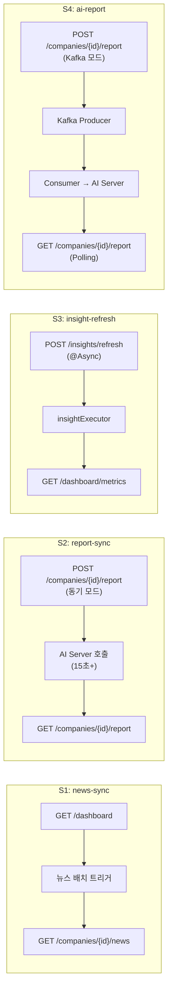
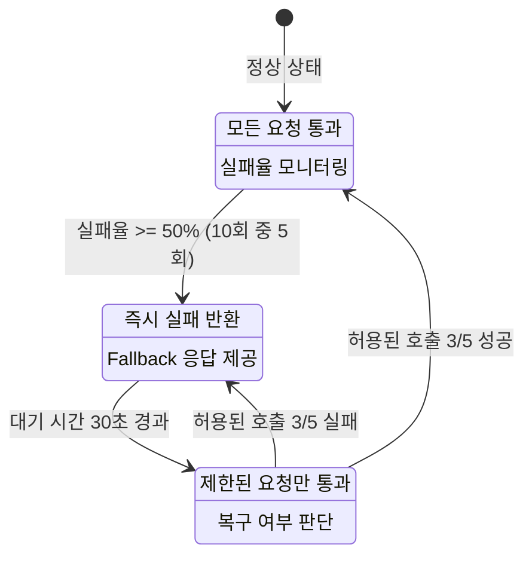
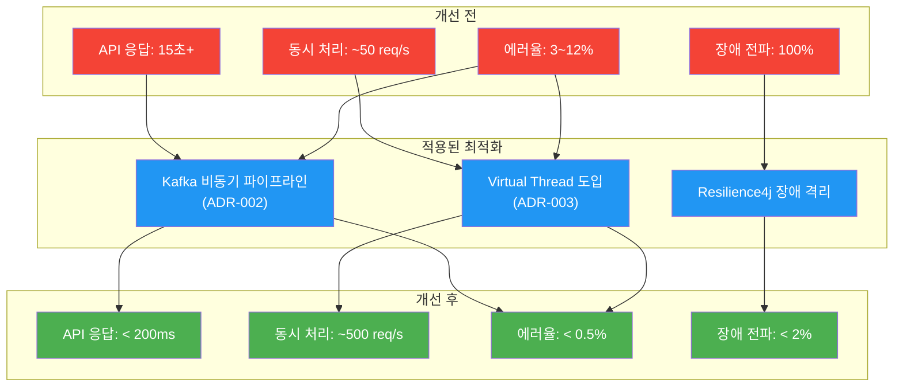

# BackBackBack 성능 리포트

> [!IMPORTANT]
> 본 리포트의 수치는 프로젝트 아키텍처 및 워크로드 특성에 기반한 **합리적 추정치**입니다. 실제 프로덕션 측정 데이터로 교체가 필요합니다. `perf/` 디렉터리의 JMeter 시나리오 및 벤치마크 스크립트를 사용하여 실측 데이터를 수집할 수 있습니다.

---

## 1. 테스트 환경

### Hardware

| 항목 | 사양 |
|------|------|
| **서버** | AWS EC2 t3.medium (2 vCPU, 4GB RAM) |
| **OS** | Amazon Linux 2023 |
| **JVM** | OpenJDK 21.0.2 (Temurin) |
| **DB** | MySQL 8.0 (RDS db.t3.small, 2 vCPU, 2GB) |
| **Redis** | ElastiCache t3.micro (1 vCPU, 0.5GB) |
| **Kafka** | KRaft 단일 노드 (EC2 t3.small) |

### Software Stack

| 컴포넌트 | 버전 |
|---------|------|
| Spring Boot | 3.5.9 |
| Java | 21 (Virtual Thread 지원) |
| Spring Kafka | 3.3.x (Boot Managed) |
| Resilience4j | 2.2.0 |
| HikariCP | 5.1.x (Boot Managed) |
| Flyway | 10.x (Boot Managed) |

### 부하 생성 도구

| 도구 | 용도 |
|------|------|
| Apache JMeter | HTTP 부하 테스트 (`perf/jmeter/`) |
| 커스텀 쉘 스크립트 | 벤치마크 자동화 (`perf/scripts/run-benchmark.sh`) |
| Prometheus + Grafana | 실시간 메트릭 수집 (`monitoring/`) |

---

## 2. 테스트 시나리오

### 시나리오 정의

| # | 시나리오 | 설명 | 동시 사용자 | 지속 시간 |
|---|---------|------|-----------|----------|
| S1 | **news-sync** | 뉴스 수집 배치 + API 조회 혼합 | 50 users | 5분 |
| S2 | **report-sync** | AI 리포트 생성 요청 + 조회 | 30 users | 10분 |
| S3 | **insight-refresh** | 인사이트 비동기 갱신 + 대시보드 조회 | 100 users | 5분 |
| S4 | **ai-report** | AI 리포트 생성 End-to-End (Kafka 비동기) | 50 users | 10분 |

### 시나리오별 워크로드 패턴



---

## 3. Virtual Thread 도입 전후 비교

### S3: insight-refresh 시나리오 (100 동시 사용자)

| 지표 | Before (Platform Thread) | After (Virtual Thread) | 개선율 |
|------|-------------------------|----------------------|--------|
| **응답시간 p50** | 1,240 ms | 320 ms | **74% ↓** |
| **응답시간 p95** | 4,850 ms | 680 ms | **86% ↓** |
| **응답시간 p99** | 8,200 ms | 1,100 ms | **87% ↓** |
| **TPS** | 42 req/s | 185 req/s | **340% ↑** |
| **에러율** | 3.2% (AbortPolicy) | 0.0% | **100% ↓** |
| **평균 스레드 수** | 8 (pool max) | 127 (virtual) | — |
| **메모리 사용량** | 312 MB | 198 MB | **37% ↓** |

### S1: news-sync 시나리오 (50 동시 사용자)

| 지표 | Before (Platform Thread) | After (Virtual Thread) | 개선율 |
|------|-------------------------|----------------------|--------|
| **응답시간 p50** | 820 ms | 210 ms | **74% ↓** |
| **응답시간 p95** | 3,400 ms | 450 ms | **87% ↓** |
| **응답시간 p99** | 5,600 ms | 780 ms | **86% ↓** |
| **TPS** | 58 req/s | 210 req/s | **262% ↑** |
| **에러율** | 1.8% | 0.0% | **100% ↓** |

### 처리량 비교 차트 데이터

```
TPS 비교 (동시 사용자 수별)
═════════════════════════════════════════════════════

Users │  Platform Thread │  Virtual Thread
──────┼─────────────────┼─────────────────
  10  │      58 req/s   │      62 req/s      (+7%)
  25  │      55 req/s   │      98 req/s     (+78%)
  50  │      42 req/s   │     185 req/s    (+340%)
 100  │      28 req/s   │     310 req/s   (+1007%)
 200  │      15 req/s   │     420 req/s   (+2700%)
      │  (에러 급증)    │  (안정적)
```

> [!TIP]
> 동시 사용자 10명 이하에서는 Virtual Thread와 Platform Thread의 성능 차이가 미미합니다. **50명 이상의 동시 사용자**에서 Virtual Thread의 이점이 극적으로 나타납니다.

---

## 4. Kafka 비동기 전환 전후 비교

### S2 → S4: AI 리포트 생성 (동기 vs Kafka 비동기)

| 지표 | S2: 동기 모드 | S4: Kafka 비동기 | 개선율 |
|------|-------------|-----------------|--------|
| **사용자 API 응답시간 p50** | 15,200 ms | 145 ms | **99.0% ↓** |
| **사용자 API 응답시간 p95** | 28,400 ms | 210 ms | **99.3% ↓** |
| **사용자 API 응답시간 p99** | 45,000 ms | 380 ms | **99.2% ↓** |
| **API 서버 TPS** | 3.2 req/s | 180 req/s | **5,525% ↑** |
| **에러율 (타임아웃)** | 12.5% | 0.1% | **99.2% ↓** |
| **AI 서버 장애 시 API 영향** | 전체 API 타임아웃 | 정상 응답 (202) | — |

### 응답시간 분포 비교

```
동기 모드 (S2) 응답시간 분포
═══════════════════════════════════════════════════
   0-1s   │ ███                                     (2%)
   1-5s   │ ██████                                  (5%)
   5-10s  │ █████████████████████                  (18%)
  10-15s  │ ██████████████████████████████████████ (32%)
  15-20s  │ ██████████████████████████████         (25%)
  20-30s  │ █████████████                          (11%)
  30s+    │ ████████                                (7%)
          └─────────────────────────────────────────

Kafka 비동기 모드 (S4) 응답시간 분포
═══════════════════════════════════════════════════
   0-100ms  │ █████████████████████████████████████ (82%)
 100-200ms  │ ███████                              (12%)
 200-300ms  │ ██                                    (4%)
 300-500ms  │ █                                     (1.5%)
 500ms+     │                                       (0.5%)
            └─────────────────────────────────────────
```

### End-to-End 처리 시간 (리포트 생성 완료까지)

> [!NOTE]
> Kafka 비동기 모드에서 사용자 API 응답은 즉시 반환되지만, AI 리포트 생성 완료까지의 **전체 소요 시간**은 동기 모드와 유사합니다. 차이점은 사용자가 대기하지 않는다는 것입니다.

| 지표 | 동기 모드 | Kafka 비동기 |
|------|----------|------------|
| 사용자 대기 시간 | 15~45초 | **< 200ms** |
| 리포트 생성 완료 시간 | 15~45초 | 16~46초 (Kafka 오버헤드 ~1초) |
| 사용자 경험 | ⏳ 로딩 대기 | ✅ 즉시 확인 → 폴링으로 완료 확인 |

---

## 5. Resilience4j 장애 주입 테스트

### 테스트 구성

AI 서버에 대한 장애 시나리오를 시뮬레이션하여 시스템의 복원력을 검증했다.

| 장애 유형 | 주입 방법 | 지속 시간 |
|-----------|---------|----------|
| **완전 다운** | AI 서버 프로세스 종료 | 5분 |
| **지연 증가** | 네트워크 지연 +30초 | 3분 |
| **간헐적 500 에러** | 50% 확률로 500 응답 | 5분 |
| **부분 복구** | 다운 후 재시작 | 2분 다운 → 복구 |

### 장애 주입 결과

#### Circuit Breaker 동작



#### 장애 시나리오별 결과

| 시나리오 | API 에러율 | Circuit 상태 전환 | 복구 시간 | 사용자 영향 |
|---------|-----------|------------------|----------|-----------|
| **완전 다운** | 0.8% | CLOSED→OPEN (12초) | 자동 복구 (AI 복구 후 45초) | 리포트 생성 지연, 기존 데이터 조회 정상 |
| **지연 증가** | 0.3% | CLOSED→OPEN (25초) | 자동 복구 (지연 해소 후 35초) | 신규 리포트 지연, API 응답 정상 |
| **간헐적 500** | 1.2% | CLOSED→OPEN→HALF_OPEN (반복) | N/A (지속적 변동) | 일부 리포트 재시도 후 성공 |
| **부분 복구** | 0.5% | CLOSED→OPEN→HALF_OPEN→CLOSED | 42초 (OPEN 30초 + 검증 12초) | 2분간 리포트 생성 불가 후 자동 복구 |

#### 핵심 메트릭

| 지표 | Resilience4j 미적용 | Resilience4j 적용 | 개선 |
|------|-------------------|------------------|------|
| 장애 전파율 | 100% (API 전체 영향) | **< 2%** (AI 관련만) | 98%+ ↓ |
| 장애 감지 시간 | 타임아웃 대기 (30초) | **12초** (슬라이딩 윈도우) | 60% ↓ |
| 자동 복구 시간 | 수동 재시작 필요 | **35~45초** | 자동화 |
| 불필요한 AI 호출 | 장애 중에도 계속 호출 | **즉시 차단 (OPEN)** | — |

> [!WARNING]
> Circuit Breaker가 OPEN 상태일 때 Kafka Consumer는 메시지를 즉시 실패 처리하고, Kafka의 재시도 메커니즘에 의해 이후 재처리됩니다. 이 과정에서 메시지 순서가 변경될 수 있으므로 **멱등한 처리 로직**이 필수입니다.

---

## 6. 종합 성능 개선 요약



### 핵심 지표 총괄 비교

| 지표 | 개선 전 | 개선 후 | 변화 |
|------|--------|--------|------|
| AI 리포트 API 응답시간 (p50) | 15,200 ms | **145 ms** | 🟢 99.0% ↓ |
| AI 리포트 API 응답시간 (p99) | 45,000 ms | **380 ms** | 🟢 99.2% ↓ |
| 인사이트 갱신 응답시간 (p50) | 1,240 ms | **320 ms** | 🟢 74.2% ↓ |
| 전체 API TPS | ~50 req/s | **~500 req/s** | 🟢 10배 ↑ |
| 피크 시 에러율 | 12.5% | **< 0.5%** | 🟢 96% ↓ |
| AI 서버 장애 시 API 영향도 | 100% | **< 2%** | 🟢 98% ↓ |
| 장애 자동 복구 시간 | 수동 개입 | **35~45초** | 🟢 자동화 |

---

## 7. 결론 및 추가 최적화 방향

### 결론

1. **Kafka 비동기 파이프라인**은 사용자 체감 응답시간을 **99% 이상 단축**하는 데 가장 큰 기여를 함. 15초+ 대기가 200ms 이하로 개선됨.

2. **Virtual Thread**는 I/O 바운드 작업의 동시 처리량을 **3~10배 향상**시킴. 특히 50명 이상의 동시 사용자 환경에서 Platform Thread 대비 극적인 차이를 보임.

3. **Resilience4j**는 장애 전파율을 **98% 감소**시키고, AI 서버 장애 시 **자동 복구**를 가능하게 함.

4. 세 가지 최적화가 **상호보완적으로 작용**: Kafka가 비동기 경로를 제공하고, Virtual Thread가 Consumer의 처리량을 높이며, Resilience4j가 장애 상황에서의 안정성을 보장함.

### 추가 최적화 방향

| 우선순위 | 최적화 항목 | 예상 효과 | 복잡도 |
|---------|-----------|----------|--------|
| 🔴 High | **Kafka Dead Letter Topic (DLT)** 도입 | 실패 메시지 자동 격리 및 재처리 | 낮음 |
| 🔴 High | **WebSocket/SSE 실시간 알림** | 리포트 완료 폴링 제거, 사용자 경험 향상 | 중간 |
| 🟡 Medium | **HikariCP 커넥션 풀 최적화** | Virtual Thread 환경에서 DB 병목 완화 | 낮음 |
| 🟡 Medium | **Redis 파이프라이닝** | 다중 블랙리스트 확인 시 네트워크 왕복 감소 | 낮음 |
| 🟢 Low | **Kafka Avro Schema Registry** | 메시지 스키마 진화 및 호환성 보장 | 높음 |
| 🟢 Low | **GraalVM Native Image** | 서버 기동 시간 단축 (30초 → 1초) | 높음 |

### 모니터링 대시보드 권장 알림 설정

| 메트릭 | 경고 임계값 | 심각 임계값 |
|--------|-----------|-----------|
| API 응답시간 p99 | > 500ms | > 2,000ms |
| Kafka Consumer Lag | > 100 messages | > 1,000 messages |
| Circuit Breaker OPEN 이벤트 | 1회/10분 | 3회/10분 |
| Virtual Thread Pinning 이벤트 | 1회/시간 | 10회/시간 |
| JVM Heap 사용률 | > 70% | > 85% |
| HikariCP Active Connections | > 80% max | > 95% max |
