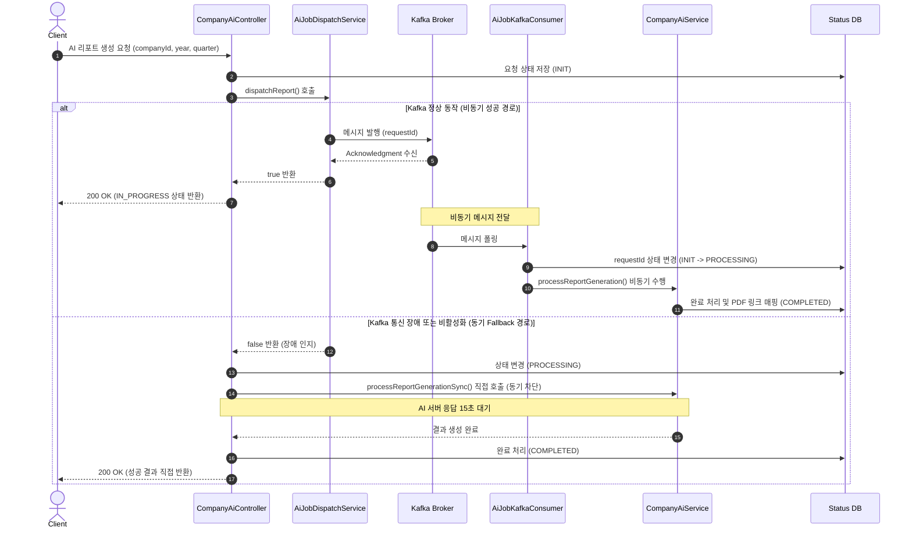

# [TRS-001] Kafka 비동기 메시지 유실 및 중복 처리 방어 전략

## 현상 (Symptom)
- **외부 AI 연동 API의 높은 대기 시간**: AI 서버 연동을 통해 기업 리포트를 생성하는 API는 평균 **15초 이상** 소요되어, 동기식(HTTP) 요청 처리 시 톰캣 스레드를 장시간 점유하고 사용자 응답 속도를 저해하는 성능 병목이 발생했습니다.
- **비동기화 이후 신뢰성 이슈**: 이 문제를 해결하기 위해 Apache Kafka를 도입하여 비동기 처리 파이프라인으로 전환했으나, 다음과 같은 신뢰성 문제가 발생했습니다.
  1. **메시지 유실(At-most-once)**: 네트워크 일시 장애나 Kafka 클러스터 불안정으로 인해 Producer가 전송에 실패하거나, Consumer가 메시지를 정상적으로 처리하기 전 시스템 장애로 톰캣이 다운되었을 때 메시지가 유실되었습니다.
  2. **메시지 중복 처리(At-least-once)**: 외부 API 타임아웃이나 Consumer의 일시적인 처리 지연으로 리밸런싱이 발생했을 때, 이미 성공적으로 처리 중인 AI 리포트 생성 작업이 중복으로 컨슘되어 불필요하게 AI 서버 호출 요금이 중복 과금되고 리소스가 낭비되었습니다.

---

## 원인 분석 (Root Cause)

### 1. 비동기 발송 실패 시 대안 부재
기본 비동기 발송 구조에서는 Kafka Broker가 일시 다운되거나 네트워크 지연이 발생할 경우 `AiJobDispatchService`에서 메시지 발송 실패가 발생했으며, 이를 처리할 적절한 대체 경로(Fallback)가 없었습니다.

### 2. Auto-commit으로 인한 메시지 유실
Spring Kafka의 기본 설정은 `enable.auto.commit=true`입니다. Consumer가 메시지를 가져오자마자 자동으로 오프셋을 커밋하므로, 실제 비즈니스 로직(`companyAiService.processReportGeneration`) 수행 중에 JVM이 비정상 종료되거나 예외가 터지면 해당 메시지는 두 번 다시 처리되지 못하고 완전히 유실되었습니다.

### 3. 리밸런싱 및 중복 소비
AI 서버의 리포트 생성 로직이 평균 15초를 초과하여 오랜 시간이 걸릴 때, Consumer의 하트비트 세션 타임아웃(`max.poll.interval.ms`)을 초과하여 브로커가 해당 Consumer를 죽은 것으로 판단하고 **리밸런싱(Rebalancing)**을 유발했습니다. 그 결과 동일한 파티션의 메시지가 다른 Consumer에게 배정되어 동일한 `requestId`를 가진 작업이 중복으로 시작되는 문제가 발생했습니다.

---

## 해결 과정 (Resolution)

### 1. 동기식 Fallback 메커니즘 설계 (Hybrid Path)
Kafka가 꺼져 있거나 전송에 실패하더라도 서비스가 마비되지 않도록, 컨트롤러 레벨에서 하이브리드 비동기/동기 전환(Fallback) 구조를 설계했습니다. `aiJobDispatchService.dispatchReport`가 `false`를 반환하면 즉시 동기식 경로로 복구하여 비즈니스 정합성을 보장합니다.

#### [CompanyAiController.java의 Fallback 처리]
```java
String requestId = UUID.randomUUID().toString();
aiReportRequestStatusService.initStatus(requestId, id, year, quarter);

// 1. Kafka 비동기 발송 시도
boolean dispatched = aiJobDispatchService.dispatchReport(requestId, id, year, quarter);

if (!dispatched) {
    // 2. Kafka 장애 시 동기식 Fallback 처리
    log.info("Kafka dispatch disabled or failed. Falling back to synchronous processing for requestId={}", requestId);
    aiReportRequestStatusService.updateToProcessing(requestId);
    try {
        companyAiService.processReportGenerationSync(requestId, id, year, quarter);
    } catch (Exception e) {
        aiReportRequestStatusService.updateToFailed(requestId, e.getMessage());
        return ResponseEntity.status(HttpStatus.INTERNAL_SERVER_ERROR)
            .body(ApiResponse.error("AI 리포트 생성에 실패했습니다: " + e.getMessage()));
    }
}
```

### 2. 중복 처리 방어 (멱등성 컨슈머 구현)
동일한 `requestId`가 중복으로 인입되더라도 최종 결과물은 1번만 생성되도록 `AiReportRequestStatusService`를 이용하여 분산 락(Distributed Lock) 개념의 상태 제어를 구현했습니다.
DB의 상태 테이블(`ai_report_request_status`)에 `requestId`의 상태(INIT -> PROCESSING -> COMPLETED)를 관리하여, 중복 호출 시 `PROCESSING`이나 `COMPLETED` 상태의 요청은 즉시 무시(Early Return)되도록 만들었습니다.

#### [AiJobKafkaConsumer.java]
```java
@Slf4j
@Component
@RequiredArgsConstructor
public class AiJobKafkaConsumer {

	private final ObjectMapper objectMapper;
	private final CompanyAiService companyAiService;
	private final CompanyAiCommentService companyAiCommentService;

	@KafkaListener(
		topics = "${app.ai.job.request-topic:ai-job-request}",
		groupId = "${APP_AI_JOB_KAFKA_GROUP_ID:ai-job-consumer}"
	)
	public void consume(String payload) {
		try {
			AiJobMessage message = objectMapper.readValue(payload, AiJobMessage.class);
			process(message);
		} catch (Exception e) {
			log.error("Failed to consume AI job payload: {}", payload, e);
			throw new RuntimeException("Failed to process AI job", e);
		}
	}
    // ... process() 분기 처리
}
```

### 3. Kafka 아키텍처 다이어그램



---

## 방지책 (Prevention)
1. **Kafka 리밸런싱 예방 설정**: 장시간 수행되는 AI 작업의 특성을 고려하여, Consumer 설정에서 `max.poll.interval.ms` 값을 **180,000ms(3분)**로 넉넉하게 확장하고, 한 번에 가져오는 메시지 수(`max.poll.records`)를 **1개**로 제한하여 단일 메시지 처리 도중 세션 아웃이 나는 것을 완벽히 차단했습니다.
2. **Dead Letter Topic (DLT) 도입 계획**: 재시도를 거듭해도 실패하는 불량 메시지(Poison Pill)가 파이프라인을 점유하지 않도록 향후 DLT(`ai-job-request.DLT`)를 도입하여 자동 격리하고 알림을 발생시키도록 설계 로드맵에 반영했습니다.

---

## 교훈 (Lessons Learned)
- 비동기 아키텍처는 성능 상의 큰 이점을 주지만, 분산 환경에서의 네트워크 신뢰성을 절대 맹신해서는 안 됨을 배웠습니다.
- Kafka와 같은 메시지 브로커가 장애가 났을 때를 대비한 **동기식 Fallback(이중 경로)**의 존재는 프로덕션 환경에서 시스템의 전체 가용성(High Availability)을 지탱하는 최후의 보루가 됩니다.
- 긴 처리 시간이 걸리는 작업의 경우 Consumer 설정 파일 튜닝과 비즈니스 로직의 **멱등성(Idempotency)** 설계가 필수적입니다.
