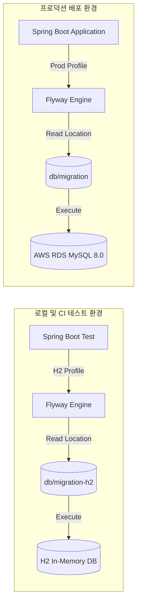

# [TRS-003] 이기종 DB(MySQL/H2) 환경의 Flyway 마이그레이션 충돌 및 정합성 트러블슈팅

## 현상 (Symptom)
- **로컬 및 테스트 빌드 실패**: 개발자가 작성한 코드를 CI(GitHub Actions/AWS CodeBuild) 환경에서 빌드 및 통합 테스트할 때, 데이터베이스 초기화 단계에서 Flyway 예외(`FlywayException: Validate failed: Migration checksum mismatch` 또는 SQL 문법 예외)가 발생하며 빌드가 중단되었습니다.
- **이기종 DB 간의 문법 불호환**: 배포(AWS EC2)에서는 MySQL 8.0을 사용하고, 로컬 테스트 환경에서는 속도가 빠른 인메모리 DB인 H2를 사용하고 있었습니다. 이 과정에서 MySQL 전용 쿼리(예: `SHA2()`, `COMMENT`, `FULLTEXT INDEX` 등)가 작성된 마이그레이션 SQL 파일이 H2 환경에서 실행되면서 SQL 구문 분석 실패 오류가 속출했습니다.

---

## 원인 분석 (Root Cause)

### 1. MySQL 전용 DDL/DML 문법의 H2 실행 실패
MySQL에서는 대용량 테이블이나 성능 최적화를 위해 다음과 같은 구문을 적극 활용하고 있었습니다.
- **예시 1**: `V25__add_companies_name_fulltext_index.sql` 내부의 Fulltext 인덱스 생성 및 프로시저 스크립트 (`PREPARE stmt FROM @create_sql;`)
- **예시 2**: `V27__hash_auth_tokens.sql` 내부의 해시 컬럼 데이터 이전용 `LOWER(SHA2(token_value, 256))` 함수 사용.
이 구문들은 H2 데이터베이스가 제공하는 호환 모드(`MODE=MySQL`)에서도 정상 작동하지 않아 구문 분석기(Parser)가 깨지게 되었습니다.

### 2. 마이그레이션 형상 관리 충돌 (Checksum Mismatch)
로컬에서 개발 중인 스키마 수정안(SQL)을 수정하여 다시 Flyway를 돌릴 경우, 이미 데이터베이스의 `flyway_schema_history` 테이블에 기록된 이전 체크섬(CRC32) 값과 파일의 실제 체크섬 값이 불일치하여 빌드가 거부되었습니다.

---

## 해결 과정 (Resolution)

### 1. 이중 마이그레이션 경로(Multi-Database Migration Path) 분리 설계
로컬/테스트 환경과 실서버 배포 환경을 논리적으로 분리하고, 각각의 DB 엔진에 최적화된 마이그레이션 스크립트 세트를 제공하도록 구조를 전면 개편했습니다.

- **운영/배포용 스크립트 경로**: `src/main/resources/db/migration/` (Pure MySQL 8.0 전용)
- **로컬/테스트용 스크립트 경로**: `src/main/resources/db/migration-h2/` (H2 호환 가능 구문)

#### [application-test.yaml의 Flyway 분리 설정]
```yaml
spring:
  datasource:
    url: jdbc:h2:mem:testdb-${random.uuid};MODE=MySQL;NON_KEYWORDS=YEAR,QUARTER;DB_CLOSE_DELAY=-1;DB_CLOSE_ON_EXIT=FALSE
    driver-class-name: org.h2.Driver
  flyway:
    enabled: true
    locations: classpath:db/migration-h2 # 테스트용 H2 경로 강제 매핑
    validate-on-migrate: false           # 로컬 테스트 시 체크섬 검증 제외로 개발자 생산성 확보
```

### 2. 이종 마이그레이션 구문 튜닝 사례

#### A. Fulltext Index 처리 우회 (`V25`)
H2는 MySQL 수준의 Fulltext 인덱스 키워드를 지원하지 않습니다. 
- **MySQL (`db/migration/V25...sql`)**: 멱등적으로 실행할 수 있도록 `information_schema.statistics`를 조회하여 동적 쿼리로 Fulltext 생성.
- **H2 (`db/migration-h2/V25...sql`)**:
  ```sql
  -- no-op: H2는 MySQL MATCH AGAINST Fulltext 인덱스를 지원하지 않습니다.
  ```

#### B. 데이터 해싱 및 점진적 이전 (`V27`)
- **MySQL (`db/migration/V27...sql`)**: `SHA2` 내장 함수를 써서 기존에 평문으로 존재하던 토큰 값을 일괄 SHA-256 해시값으로 고속 변환 처리 및 컬럼 변경.
- **H2 (`db/migration-h2/V27...sql`)**: 테스트 시나리오에서는 데이터 이전이 불필요하므로, 단순 DDL 구조만 호환되도록 구성.
  ```sql
  ALTER TABLE refresh_tokens ADD COLUMN token_hash VARCHAR(64);
  ALTER TABLE refresh_tokens ALTER COLUMN token_value VARCHAR(512);
  ALTER TABLE refresh_tokens ALTER COLUMN token_value SET NULL;
  CREATE UNIQUE INDEX uk_refresh_token_hash ON refresh_tokens (token_hash);
  ```

### 3. 이중 경로 마이그레이션 아키텍처 다이어그램



---

## 방지책 (Prevention)
1. **Flyway 검증 테스트 의무화**: CI(CodeBuild) 파이프라인에서 빌드 수행 시, 테스트 커버리지 수행 단계 전에 H2 기반 Flyway 스키마 검증과 더불어 MySQL Docker 컨테이너를 일시 기동하여 실제 프로덕션 마이그레이션 파일(`db/migration/*`)의 유효성을 1차 검사하는 통합 테스트 스크립트를 파이프라인에 추가했습니다.
2. **마이그레이션 버전 번호 예약제**: 팀 개발 시 중복 버전 충돌을 막기 위해 타임스탬프 기반 번호 체계 도입을 기술 표준으로 삼았습니다.

---

## 교훈 (Lessons Learned)
- 로컬 개발 환경(H2)과 실제 상용 환경(MySQL)의 데이터베이스 엔진 차이는 **가장 빈번하게 발생하며 찾기 어려운 버그의 온상**이 됩니다.
- Flyway를 활용하여 데이터베이스 형상을 관리할 때는 처음부터 운영계와 테스트계의 **스키마 진화 경로(Migration Path)를 완벽히 독립**시키고, 테스트에 지장을 주는 벤더 전용 구문(Fulltext, Crypto 함수 등)은 철저히 별도 패키징해야 함을 절감했습니다.
- 무중단 배포를 위한 토큰 해싱 전환 시, 기존 데이터 유실 없이 `Dual-Read / Write-Back` 구조를 Flyway 데이터 이전 스크립트로 자연스럽게 흡수시킬 수 있었습니다.
