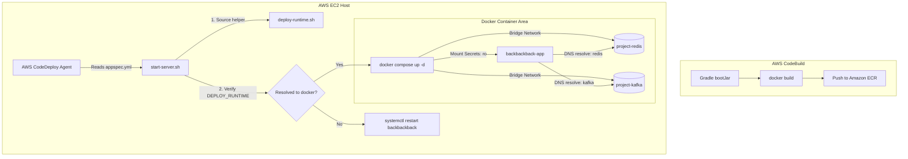

# [TRS-004] 가상화 배포(Docker) 전환 시 환경 변수 격리 및 비대칭키 마운트 트러블슈팅

## 현상 (Symptom)
- **컨테이너 기동 즉시 크래시**: AWS CodeDeploy를 통해 배포 방식을 기존 가상 머신(EC2) 직접 실행(systemd JAR 배포)에서 가상화 컨테이너(Docker Compose) 배포 방식으로 전환한 직후, 애플리케이션 컨테이너가 정상 구동되지 못하고 즉각 크래시되며 종료되는 현상이 발생했습니다.
- **주요 에러 로그**:
  ```
  java.io.FileNotFoundException: /secrets/jwt/private.pem (No such file or directory)
  - Connection refused: localhost:3306 (DB 연결 실패)
  - IllegalArgumentException: Pepper base64 key must not be empty
  ```

---

## 원인 분석 (Root Cause)

### 1. 호스트 ↔ 컨테이너 환경 변수 및 파일 격리 장벽
- **비대칭키 누락**: Spring Security JWT 인증용 비대칭 암호화 키인 `public.pem`, `private.pem` 파일이 EC2 호스트 로컬 디렉터리(`C:\Users...` 혹은 `/etc/backbackback/secrets/jwt`)에는 존재했으나, 컨테이너 내부 파일시스템 공간에는 전송되지 않아 애플리케이션 컨텍스트 초기화 도중 예외가 터졌습니다.
- **네트워킹 단절 (localhost의 의미 차이)**: 호스트 환경변수(`.env`)의 `REDIS_HOST=localhost`, `SPRING_KAFKA_BOOTSTRAP_SERVERS=localhost:9092` 등이 도커 컨테이너 내부로 그대로 주입되었습니다. 컨테이너 내부에서 `localhost`는 호스트 PC가 아닌 **해당 컨테이너 자기 자신**을 의미하므로, 외부 컨테이너나 호스트에 띄워진 Redis/Kafka 서비스 포트에 접속하지 못하고 Connection Refused가 터진 것입니다.

### 2. 배포 스크립트 런타임 분기 및 검증 결여
systemd 런타임과 Docker 런타임의 하이브리드 전환을 위해 작성한 배포 스크립트(`deploy-runtime.sh`)가 존재했으나, 쉘 스크립트 특유의 타입 부재 및 환경변수 파싱 미숙으로 인해 `DEPLOY_RUNTIME`이 대소문자나 유효하지 않은 값(예: `DoCkEr`, `legacy`)으로 지정되었을 때 오동작하여 무작정 systemd 실행 명령을 시도하는 결함이 있었습니다.

---

## 해결 과정 (Resolution)

### 1. 볼륨 마운트 매핑 및 비대칭키 주입 (`docker-compose.app.yml`)
비대칭키의 노출 위험을 막기 위해 디스크 파일은 호스트 영역에 격리해두고, 컨테이너 기동 시에만 특정 마운트 포인트를 설정하되 쓰기가 불가능한 **읽기 전용(`ro`)** 볼륨 설정을 부여했습니다.

```yaml
services:
  app:
    image: ${APP_IMAGE:?APP_IMAGE is required}
    container_name: backbackback-app
    restart: always
    env_file:
      - ${ENV_FILE:-/etc/backbackback/backbackback.env}
    environment:
      SPRING_PROFILES_ACTIVE: ${SPRING_PROFILES_ACTIVE:-prod}
      REDIS_HOST: ${REDIS_HOST_DOCKER:-redis}
      SPRING_KAFKA_BOOTSTRAP_SERVERS: ${SPRING_KAFKA_BOOTSTRAP_SERVERS:-kafka:9092}
      # 앱은 무조건 컨테이너 내부 마운트 경로를 바라봄
      JWT_KEYS_PUBLIC_KEY_PATH: /secrets/jwt/public.pem
      JWT_KEYS_PRIVATE_KEY_PATH: /secrets/jwt/private.pem
    ports:
      - "${SERVER_PORT:-8080}:8080"
    depends_on:
      redis:
        condition: service_healthy
      kafka:
        condition: service_healthy
    volumes:
      # [해결책] 호스트의 키 위치를 컨테이너 내부로 안전하게 읽기 전용 매핑
      - ${JWT_HOST_PATH:?JWT_HOST_PATH is required}:/secrets/jwt:ro
      - ${UPLOAD_HOST_PATH:-/var/app/uploads}:/var/app/uploads
      - ${LOG_HOST_PATH:-/var/log/backbackback}:/var/log/backbackback
```

### 2. 도커 컴포즈 네트워크 도메인 설정 및 격리 (.env)
- 도커 컴포즈 내부에서 모든 서비스(`app`, `redis`, `kafka`)를 동일한 bridge 네트워크 망에 엮어두고, 호스트 컴퓨터가 아닌 컴포즈 **서비스 컨테이너의 논리적 명칭**을 DNS 도메인으로 매핑했습니다.
- 호스트 쉘 환경 변수 오염을 막기 위해 docker compose 구동 시 오직 `--env-file` 옵션만을 바인딩하여 런타임 변수 스코프를 완전히 컴포즈 안으로 가두었습니다.

### 3. 배포 스크립트 모듈화 및 사전 단위 테스트 구축 (`deploy-runtime-test.sh`)
배포 오류 가능성을 원천 차단하기 위해 배포 도우미 함수들을 라이브러리(`deploy-runtime.sh`)로 외재화하고, 이를 빌드 타임에 검증하는 쉘 테스트 유닛을 업계 표준 기법으로 구현했습니다.

#### [deploy-runtime-test.sh]
```bash
#!/usr/bin/env bash
set -euo pipefail

SCRIPT_DIR="$(cd "$(dirname "${BASH_SOURCE[0]}")" && pwd)"
. "${SCRIPT_DIR}/../lib/deploy-runtime.sh"

assert_eq() {
  local expected="$1"
  local actual="$2"
  local message="$3"
  if [ "$expected" != "$actual" ]; then
    echo "[FAIL] ${message} | expected=${expected}, actual=${actual}" >&2
    exit 1
  fi
}

test_resolve_deploy_runtime_docker() {
  DEPLOY_RUNTIME="DoCkEr"
  assert_eq "docker" "$(resolve_deploy_runtime)" "DEPLOY_RUNTIME docker 변환 및 소문자 정규화"
}

test_extract_ecr_region() {
  assert_eq "ap-northeast-2" "$(extract_ecr_region "160885260227.dkr.ecr.ap-northeast-2.amazonaws.com")" "ECR 리전 파싱 성공 검증"
}

main() {
  test_resolve_deploy_runtime_docker
  test_extract_ecr_region
  echo "[PASS] deploy-runtime helper tests completed."
}
main "$@"
```

### 4. 도커 컨테이너 배포 파이프라인 아키텍처 다이어그램



---

## 방지책 (Prevention)
1. **배포 환경 사전 진단**: 배포 에이전트의 `BeforeInstall` 훅에 `ensure-env.sh` 스크립트를 연결하여, 필수 환경변수(`JWT_HOST_PATH`, `APP_IMAGE`) 누락 여부와 호스트 비대칭키 존재 여부를 기동 전에 사전에 체크하고 미충족 시 배포를 Early Fail하도록 안전장치를 이중화했습니다.
2. **Secrets Manager 도입 계획**: 추후 민감 비밀키와 데이터베이스 계정 패스워드를 평문 `.env` 파일로 유포하지 않고, AWS Secrets Manager 또는 HashiCorp Vault API를 애플리케이션 로더 수준에서 컨셉티브하게 댕겨오도록 보완 로드맵을 구성했습니다.

---

## 교훈 (Lessons Learned)
- 호스트의 Native 환경을 컨테이너 이미지화하여 이동할 때, **가장 맹점이 되는 지점은 네트워킹(localhost의 범위 정의)과 물리 파일 경로 바인딩**입니다.
- 인프라를 구동하고 오케스트레이션하는 쉘 스크립트 영역 역시 단순히 순차 명령의 목록이 아닌 **"작성하고 검증해야 할 엄연한 프로그래밍 코드"**이며, 이를 단위 테스트(`deploy-runtime-test.sh`)로 방어해야 배포 시의 불확실성을 완전히 소멸시킬 수 있음을 뼈저리게 통감했습니다.
