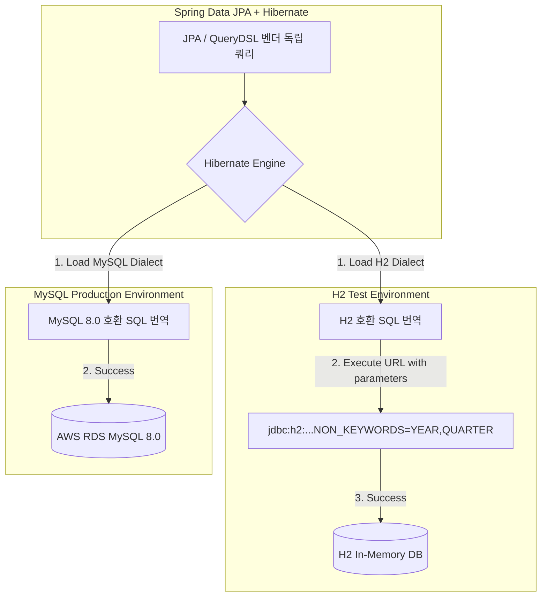

# [TRS-005] H2 인메모리 테스트 환경과 MySQL 프로덕션 간 호환성 트러블슈팅

## 현상 (Symptom)
- **테스트 환경 통과, 실서버 에러**: 로컬 및 CI 환경의 모든 단위/통합 테스트(`gradlew test`)가 100% 그린 라이트를 기록하여 안심하고 프로덕션 환경에 무중단 배포를 완료했습니다. 그러나 실제 운영 환경(MySQL 8.0)에서 특정 기업 리포트 분석 조회 및 데이터 적재 API를 호출할 때 데이터베이스 구문 에러가 터지며 500 Internal Server Error를 유발했습니다.
- **주요 예외 로그 (MySQL 운영)**:
  ```
  org.springframework.dao.InvalidDataAccessResourceUsageException: 
  You have an error in your SQL syntax; check the manual that corresponds to your MySQL server version for the right syntax to use near 'year, quarter...'
  ```
- **H2 로컬 테스트의 에러 (이전 상황)**:
  테스트 환경을 H2로 마이그레이션하는 도중, `quarters` 테이블을 참조하거나 특정 연도/분기 필드를 다루는 쿼리 시 H2 자체 파서가 특정 키워드(예: `YEAR`, `QUARTER`)를 SQL 예약어로 잘못 인식하여 테이블 매핑 예외를 뱉고 기동을 실패하는 이상 현상이 병행되었습니다.

---

## 원인 분석 (Root Cause)

### 1. SQL 예약어(Keywords) 벤더 간의 충돌
우리가 구축한 비즈니스 도메인의 핵심 테이블과 컬럼 중 하나는 **연도(year)**와 **분기(quarter)** 정보를 저장하는 구조입니다.
- **H2 데이터베이스**는 ANSI 표준 및 벤더 고유 예약어 파싱 정책 상 `YEAR`와 `QUARTER`를 내장 함수나 특수 키워드로 취급합니다. 이로 인해 QueryDSL이나 JPA가 Native 성격의 쿼리를 유도하거나 스키마 마이그레이션 DDL을 실행할 때 백틱(`) 없이 일반 토큰으로 전달되면 구문 분석기가 문법적 모순을 일으켰습니다.
- 반면 **MySQL**은 하위 호환 모드가 다르고 백틱 처리가 관대하여, 같은 쿼리 패턴에서도 에러가 나지 않아 두 환경 간의 실행 결과 불일치(Discrepancy)가 발생했습니다.

### 2. 이기종 데이터베이스의 내장 함수 결여
MySQL의 고속 데이터 해싱을 위한 `SHA2(token_value, 256)` 함수나 날짜/시간 포맷 계산 기법이 H2에는 존재하지 않거나 작동 방식이 달랐습니다.

---

## 해결 과정 (Resolution)

### 1. H2 JDBC 연결 문자열 튜닝 및 예약어 해제 설정 (`application-test.yaml`)
H2 기동 시 파서 엔진이 `YEAR`와 `QUARTER` 단어를 일반 테이블명 및 컬럼명 식별자(Identifier)로 올바르게 인지할 수 있도록 `NON_KEYWORDS` 속성을 강제 튜닝 주입했습니다.

```yaml
spring:
  datasource:
    url: jdbc:h2:mem:testdb-${random.uuid};MODE=MySQL;NON_KEYWORDS=YEAR,QUARTER;DB_CLOSE_DELAY=-1;DB_CLOSE_ON_EXIT=FALSE
    username: sa
    password:
    driver-class-name: org.h2.Driver
    hikari:
      connection-timeout: 30000 # 리소스 경합으로 지연 시 타임아웃 넉넉하게 보완
```

### 2. JPA/QueryDSL의 벤더 중립적 설계 전환
QueryDSL을 작성할 때 Native SQL 조각(`Expressions.stringTemplate`)의 비중을 극도로 줄이고, 가급적 **JPA 표준 JPQL 표현식**과 **엔티티 객체 매핑 기반**으로 쿼리를 작성했습니다.
이렇게 설계하면 하이버네이트(Hibernate)의 Dialect(방언) 모듈이 타깃 DB 종류(H2Dialect / MySQL8Dialect)에 맞춰 쿼리를 알아서 컴파일하므로, 개발자가 벤더 의존적인 SQL을 직접 하드코딩하지 않아도 호환성이 100% 보장됩니다.

### 3. 테스트 커버리지 및 DB 이중 경로 구조화 (Flyway H2)
H2와 MySQL의 태생적 차이(Fulltext 인덱스 부재 등)로 인한 DDL 호환성 구멍은, `TRS-003`에서 다룬 **이중 경로 마이그레이션 기법**을 통해 `db/migration-h2` 스크립트를 독립 배치하여 깔끔하게 해소했습니다.



---

## 방지책 (Prevention)
1. **예약어 사용 금지 정책**: 향후 데이터베이스 신규 테이블 및 컬럼 설계 시 SQL-92 표준 예약어 리스트에 포함된 단어(예: `key`, `value`, `order`, `user`, `year` 등)는 테이블명이나 컬럼명으로 직접 사용하지 않고, 접두사를 붙이거나 구체적인 명칭(예: `report_year`, `report_quarter`)으로 작명하도록 코딩 표준서에 반영했습니다.
2. **Testcontainers 확장 검토**: H2 호환성 옵션으로도 잡히지 않는 심도 깊은 인덱스나 벤더 고유 구문 테스트를 위해, 개발/테스트 가용 메모리가 허용되는 조건 내에서 실제 운영 MySQL과 동일한 도커 컨테이너를 가상으로 띄워 테스트하는 **`Testcontainers`**의 적용 로드맵을 확정했습니다.

---

## 교훈 (Lessons Learned)
- *"내 로컬 컴퓨터와 테스트에서는 잘 돌아가는데요"* 라는 말이 프로덕션 환경의 실서버 장애를 막아주는 보증수서가 될 수 없음을 다시 한 번 실감했습니다.
- 테스트 환경의 생산성 향상을 위해 가볍고 빠른 인메모리 H2 데이터베이스를 쓰는 것은 좋으나, 반드시 실제 타깃 운영 DB와의 **예약어 충돌, 네이티브 함수 결여** 가능성을 사전 파악하고 **JDBC URL 파라미터 수준까지 정밀 튜닝**하는 능력이 프로덕션급 백엔드 개발자에게 절실히 필요함을 절감했습니다.
